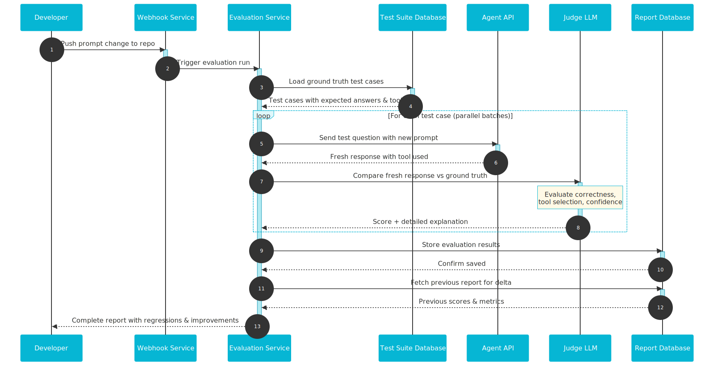

# Ship Faster Without Breaking Your Agent

*A simple evaluation system that catches prompt drift and tool bugs before your users do*

---

Every time I changed the system prompt or a tool description in our agentic chatbot, something else broke. Tool B would finally start working, but then Tool A would hallucinate responses that were perfectly fine before. I'd check the logs, compare prompts, roll back changes in git, and manually test a dozen use cases. It was a nightmare that made development painfully slow.

When you're building an AI agent with multiple tools, you craft this big, careful system prompt that explains which tool to use when and how to use each one. Change one sentence, and the whole thing can shift in ways you don't expect. The complexity comes from these emergent behaviors. LLMs don't follow strict logic. They're probabilistic. A small wording change in your prompt can make the llm act in weird ways.

This problem slowed us down so much that I had to solve it. I needed something that could check hundreds of use cases in minutes instead of hours, something that would tell me exactly what broke and why.

<!-- more -->

## Why Agent Systems Are So Fragile

Here's the thing about agentic systems. You're not just calling an LLM with a simple prompt anymore. You've got multiple tools, each with its own description. You've got a system prompt that's trying to orchestrate everything. You've got tool parameters, validation rules, and fallback behaviors. And all of this needs to work together seamlessly.

Change one piece, and you're stuck in an endless cycle of fixes. You update a tool description to fix one edge case, and suddenly the agent stops using that tool entirely. You reword the system prompt to be more direct, and now the agent picks the wrong tool for a different use case.

The worst part? You don't know what broke until a user reports it or you happen to test that specific scenario. Manual testing helps, but it's slow and incomplete. You can't realistically test every single use case every single time you make a change. So things go undetected.

We were stuck in this loop. Make a change. Break something else. Discover it days later. Roll back. Try again. The development cycle was brutal, and we couldn't ship fast enough.

## The Solution: Ground Truth and LLM-as-Judge

I came up with a solution that turned this around completely. An evaluation system that could automatically verify our agent was working as expected, every single time we changed something. Something that would catch regressions in about a minute instead of hours of manual testing.

The core idea is simple. I built a microservice that runs a fixed test suite whenever we change the prompt. It compares the agent's fresh responses against a ground truth baseline, and uses another LLM to judge whether the responses are still correct.

### The Complete Evaluation Flow

Here's a detailed view of how each component interacts during a single evaluation run:

Here's how it works. We maintain a ground truth database with realistic questions and their expected answers. Each test case includes the question, what the correct answer should be, and which tool the agent should use to answer it. These aren't toy examples. They're real questions from actual users, edge cases we've seen break before, and scenarios that stress-test the agent's reasoning.

When someone pushes a prompt change, a webhook triggers the evaluation service. The service fires off all the test questions to our live agent API with the new prompt. Now we have two things: the fresh responses from the modified agent, and the baseline ground truth we defined.

This is where it gets interesting. We feed both into another LLM that acts as a judge. We give it a carefully crafted rubric and ask it to score several metrics. Did the agent answer correctly? Did it pick the right tool? How confident is it in the response? The judge LLM returns a score and, most importantly, a short explanation of what went wrong if something failed.

That explanation is what makes this practical. It doesn't just say "this test failed." It tells you the agent picked the wrong tool when it should have used the search tool, or it hallucinated a fact that wasn't in the retrieved context, or it misunderstood the user's intent because of how you worded the system prompt. The feedback points you directly to the fix.

## Why LLM-as-Judge Actually Works

Using an LLM to judge another LLM's output might sound weird at first. Why trust one model to evaluate another? But in practice, it works really well for this use case.

The judge model isn't trying to be perfect. It's comparing the agent's response against a reference answer we already know is correct. It's checking whether the right tool was called. It's looking for obvious hallucinations or off-topic responses. These are tasks where LLMs excel, especially when you give them clear criteria.

The alternative is writing rule-based validation, which becomes complicated quickly. How do you write rules that handle different phrasings of the same correct answer? What about responses that are technically correct but incomplete? An LLM judge handles these naturally. It understands semantic similarity, can spot when answers are equivalent but worded differently, and can evaluate the quality of reasoning in a way that rigid rules can't.

We use a different model for judging than we do for the agent itself. That separation matters. The judge model isn't affected by the prompt changes we're testing. It's stable and consistent, which means the scores we get are reliable over time.

## The Technical Flow

The execution happens in parallel batches, which is why it's so fast. When the webhook triggers, the service doesn't process tests one by one. It fires off dozens at once using async HTTP calls with `httpx`. Each test goes through the same flow: send question to agent, get response, fetch supporting reference snippets if needed, send everything to the judge model.

The service is built on Python 3.11 with FastAPI. It uses dependency injection to keep the orchestration logic clean and testable. The agent client, search API client, and judge LLM client are all swappable adapters. If we change AI providers or switch agents, we just swap out the adapter implementation. The core evaluation logic doesn't change.

All the outbound API calls use OAuth2 client-credentials flow with token caching, so we're not constantly re-authenticating. Logs are structured JSON with request IDs, which makes tracing a specific failed test case really easy. Secrets get redacted automatically so nothing sensitive shows up in logs.

Results get stored in Postgres. We keep full reports for each evaluation run with detailed breakdowns of every test case. We also maintain a weekly aggregated view that shows trends over time. Are we regressing? Are certain types of questions getting worse? The dashboard surfaces all of this immediately.

When I want real-time feedback, the API supports streaming responses in newline-delimited JSON. I can watch scores come in as tests complete. When I want to review history, I can pull up the latest report and compare it against previous runs to see deltas.

The whole thing runs in a container. I can deploy it anywhere. Docker Compose for local development. Kubernetes for production. It's a normal microservice with standard deployment patterns. Nothing unusual.

## What Gets Measured

The evaluation tracks a few key metrics that catch the most common failure modes:

**Answer correctness.** Is the response accurate compared to the reference? Does it include the key information? Is it hallucinating facts?

**Tool selection.** Did the agent pick the right tool? If it was supposed to search for information, did it actually call the search tool? Or did it try to answer from memory and get it wrong?

**Confidence.** How sure is the judge that this response is good or bad? Low confidence scores might mean the test case itself is ambiguous and needs refinement.

Each test case gets a score for these dimensions, plus a natural language explanation. That explanation is what I actually read when something fails. It tells me whether the problem is with the prompt wording, the tool descriptions, or the agent's reasoning strategy.

Over time, we can spot patterns. Maybe the agent consistently struggles with a certain type of question. Maybe a recent prompt change improved tool selection but hurt answer quality. The metrics give us concrete numbers to track these trade-offs.

## The Impact: From Hours to Minutes

Before this system, testing a prompt change meant manually running through a checklist of scenarios. I'd open the chat interface, type in questions, check the responses, verify the right tools were called, and repeat for maybe 10-15 test cases. Each pass took 20-30 minutes. And I'd still miss things.

Now? I push a change, the webhook fires, and in about a minute I've got results for over 300 test cases. The report tells me exactly what improved, what regressed, and why. I can make a decision immediately. Merge the change, or tweak it and run again.

This unlocked faster iteration. I'm not afraid to experiment with prompt wording anymore because I know I'll catch regressions right away. I can refactor tool descriptions without worrying I'll break existing functionality. I can swap models or adjust temperature settings and see the impact across the entire test suite instantly.

The system has caught real bugs before they reached users. Tools that stopped working. Edge cases where the agent would give a confident but wrong answer. Regressions where a prompt change improved one scenario but broke three others. All of this got flagged automatically instead of discovered by frustrated users.

Beyond bug prevention, it's changed how we approach development. We write test cases for new features before we build them. We add test cases whenever we fix a bug, so we know that bug can't slip back in. The test suite becomes living documentation of what the agent is supposed to do.

## When You Actually Need This

Not every AI project needs an automated evaluation system. If you're building a simple chatbot with one or two tools and a small prompt, manual testing might be fine. If you're still in early prototyping and the requirements are shifting daily, automated evals can be overkill.

But you probably need something like this if:

**You have multiple tools.** The more tools your agent can use, the more complex the orchestration gets. More places for things to break.

**You're changing prompts frequently.** If you're iterating on the system prompt or tool descriptions regularly, you need fast feedback loops. Manual testing becomes a bottleneck.

**You've been burned by regressions.** If you've had that experience where you change one thing and break something else, automated evals prevent that from happening again.

**You're working on a team.** When multiple people are changing prompts and tools, you need a shared source of truth for what correct behavior looks like. The test suite becomes that shared understanding.

**You're shipping to users.** Once real users depend on your agent, you can't afford to ship broken changes. Automated evals give you confidence before you deploy.

The system doesn't need to be complex to be useful. Start with 20-30 critical test cases. Build a simple script that runs them and checks the results. As you grow, add more cases and automate the whole flow. The core pattern works at any scale.

## Lessons from Building This

A few things I learned along the way that might save you time:

**Start with good test cases.** Your evaluation is only as good as your ground truth. Spend time upfront writing realistic, diverse test cases. Include happy paths, edge cases, and scenarios you've seen fail before. Bad test cases give you false confidence.

**Make the judge rubric clear.** The prompt you give your judge LLM matters a lot. Be specific about what you're checking for. Give examples of good vs bad responses. The clearer your rubric, the more consistent your scores will be.

**Track trends, not just pass/fail.** A single regression isn't always a deal-breaker. Maybe you accept a small drop in one metric because you got a big improvement elsewhere. Looking at trends over time helps you make these trade-offs consciously.

**Keep the feedback loop tight.** The faster you can run evals, the more useful they are. Optimize for speed. Use async execution. Cache what you can. Stream results. If running the suite takes 10 minutes, you won't run it as often.

**Version everything.** Store the exact prompt, tool descriptions, and model settings for each evaluation run. When you look back at a report from last week, you need to know exactly what you were testing. This makes debugging way easier.

## The Bottom Line

Shipping changes to an AI agent doesn't have to be scary. You don't have to choose between moving fast and breaking things or moving slow to stay safe.

Build a ground truth test suite. Run it automatically on every change. Use an LLM judge to score responses and explain failures. Track the results over time. This simple pattern turns uncertainty into understanding exactly what changed.

The evaluation system I built saves hours of manual testing on every change. It catches bugs before users see them. It gives me confidence to refactor and experiment. And it makes the whole team faster because we have a shared, automated definition of correct behavior.

If you're building agents with multiple tools and you're still testing manually, this slows down development. Treat your agent like production code. Create a test suite. Automate the validation. Ship with confidence.

---

**Want to implement something similar?** The pattern is straightforward: ground truth test cases, automated agent queries, LLM-as-judge scoring, and trend tracking. Start with a simple script and grow from there. Your future self will thank you the first time it catches a regression you would have missed.
