# How I Build Python Projects (My Way, Simple & Solid)

*An opinionated, scalable way to structure Python projects using hexagonal architecture, SOLID, and practical DDD.*

A friend asked me: *“What’s the proper way to build a Python project?”* Here’s my take.

<!-- more -->

---

It’s what I use for clients and at my 9 to 5. I like SOLID and Domain‑Driven Design, but I don’t chase perfection. I just want code that stays tidy when the app grows.

Python is flexible. That’s great until the codebase gets big and files start calling each other in weird ways. In compiled worlds like Java, the compiler blocks some messes before they spread. In Python, you can ship those messes. So I add a few small rules that make good habits the default.

**Biggest mistakes I see:**

* No boundaries: business logic mixed with HTTP, DB, or SDK calls.
* God modules: one file does everything.
* Hidden globals: config sprinkled everywhere; hard to test.
* Dynamic typing without discipline: runtime errors far from the source.

## My rule of thumb

If I’ll spend more than three days on a project, I shape it with hexagonal architecture (my rule of thumb, hahaha). Not the textbook kind,just enough to keep options open. The core idea is simple: business rules in the center, tools at the edges, and small contracts between them.



*Inbound adapters → Application (use cases) → Domain (entities, value objects, simple rules). Outbound ports from Application point to adapters in Infrastructure (DB, cache, vector store, LLM, email). Calls flow left to right; dependencies point inward.*

## The three folders that do most of the work

* **domain** — the people, things, and rules. Entities and value objects. Ports live here.
* **application** — the actions. Use cases coordinate work using the domain and ports. No tech details.
* **infrastructure** — the details. Adapters for HTTP, DB, queues, vector stores, and LLMs.

Think of it like this: domain = actors and rules. Application = what those actors do. Infrastructure = how it actually happens. Direction matters. An inbound adapter (REST, CLI, queue) calls a use case. The use case uses the domain. When it needs the outside world, it talks to a port that an adapter implements.

### Ports and adapters in plain words

A **port** is a promise the core makes: “this is what I need from the outside.” An **adapter** is a concrete tool that keeps that promise. Same port, many adapters (Postgres, a vector DB, a fake for tests). The use case does not care which one you plug in.

### A clear RAG ingestion flow (end‑to‑end)

Think of one REST endpoint: `POST /ingest`.

**Step 1 – Controller (inbound adapter).** The API gets a JSON body like `{ id, source_type, location, metadata }`. The controller validates it and turns it into a simple DTO. Then it calls the **IngestDocument** use case.

**Step 2 – Use case (application).** The use case coordinates the work using **ports**:

* `LoaderPort` – loads raw text from a source (local file, S3, URL).
* `SplitterPort` – splits text into chunks.
* `EmbedderPort` – turns chunks into vectors.
* `DocumentStorePort` / `VectorStorePort` – saves the document/chunks/vectors.

**Step 3 – Domain (center).** We keep a `Document` entity with `id`, `text` (or `chunks`), and maybe `metadata`. Simple rules live here (e.g., max chunk size, allowed file types).

**Step 4 – Adapters (infrastructure).** Each port gets a matching adapter: a filesystem or S3 loader, a specific splitter, an OpenAI or local embedder, a Postgres or vector‑DB store. You can swap these per environment without touching the use case.

**Result.** The use case returns something like `{ ingested: true, chunk_count: N }`. The controller maps that to an HTTP response. Same flow on every deploy; only the adapters change.

## Minimal, practical deps

I use **uv** for dependency management because it’s fast. For config and secrets I stick to a `.env` plus **Pydantic Settings**. It’s boring and it works.

I also use a tiny factory for environments—`DEV`, `STAGE`, `PROD`—controlled by env vars. Flip a flag and the app builds the right adapters: local Postgres vs cloud, OpenAI vs another LLM, in‑memory cache vs Redis. At startup I wire everything with a small dependency injector so use cases get ports, not concrete classes.

## A tiny slice of the pattern (one file, conceptual)

Here’s a short sketch that shows a port, an adapter, a use case, and simple wiring.

```python
from dataclasses import dataclass
from typing import Protocol

# DOMAIN (port)
class DocumentStorePort(Protocol):
    def save(self, doc_id: str, text: str) -> None: ...

# APPLICATION (use case)
@dataclass
class IngestDocument:
    store: DocumentStorePort
    def __call__(self, doc_id: str, text: str) -> None:
        # business rules would live here (validation, splitting, etc.)
        self.store.save(doc_id, text)

# INFRASTRUCTURE (adapter)
class PostgresDocumentStore:
    def __init__(self, conn):
        self.conn = conn
    def save(self, doc_id: str, text: str) -> None:
        # pretend SQL; in real code use a repo/ORM
        self.conn.execute("INSERT INTO docs(id, body) VALUES (%s, %s)", (doc_id, text))

# WIRING (bootstrap)
conn = object()  # replace with real connection
store = PostgresDocumentStore(conn)
use_case = IngestDocument(store)
use_case("doc-123", "Hello, hexagon.")
```

The use case is blind to Postgres. Swap `PostgresDocumentStore` for a vector store or a fake for tests and nothing breaks.

## DTOs, schemas, and errors

Keep **DTOs** and **Pydantic schemas** at the edges where data crosses a boundary: HTTP handlers, message consumers, or DB mappers. Convert them to plain domain objects early. Do the reverse on the way out. For errors, define a few domain types (`DomainError`, `NotFound`, `RuleViolation`) and map them to HTTP codes or queue retry logic in the inbound adapters.

**Tiny mapping example (edge ↔ domain).** A controller receives `IngestRequestDTO`, maps it to a `Document` entity, calls the use case, then maps the result back to an `IngestResponseDTO`.

```python
# DTOs at the edge
from pydantic import BaseModel
class IngestRequestDTO(BaseModel):
    id: str; source_type: str; location: str; metadata: dict | None = None
class IngestResponseDTO(BaseModel):
    ingested: bool; chunk_count: int

# Domain entity
class Document(BaseModel):
    id: str; text: str; metadata: dict | None = None

# Simple mappers
def to_domain(dto: IngestRequestDTO, loader) -> Document:
    text = loader.load(dto.source_type, dto.location)  # calls a LoaderPort
    return Document(id=dto.id, text=text, metadata=dto.metadata)


def to_dto(result) -> IngestResponseDTO:
    return IngestResponseDTO(ingested=result.ok, chunk_count=result.chunks)
```

The DTOs are for I/O. The domain stays plain and focused on rules. Mappers keep the boundary clean.

## Logging I can live with

Log at the edges, not in every method. Inbound adapters log request IDs, actor IDs, and use case names. Outbound adapters log calls to external systems and durations. Use structured logs so search is easy. Pass the request ID along with context vars.

## The Gold Path, quick and clear

Layers go Inbound → Application → Domain → Outbound. Config lives in `.env` plus Pydantic Settings. DI wires ports to adapters at startup. Map errors once at the edge. Keep DTOs and schemas at boundaries. Ship default adapters for DB, cache, queue or email if you need them, a vector store, and an LLM client. For ops, expose `/health` for liveness and `/ready` for checks like DB ping, cache ping, and LLM token checks.

## Folder sketch that scales

My trees match the screenshot. `domain` holds `model` (entities, value objects) and `ports`. `application` holds `use_cases` and sometimes mappers. `infrastructure` has `adapters/input` for REST or queues and `adapters/output` for DB, cache, vector, email, and LLM. A small `config` area wires settings and DI. Names stay boring on purpose.

Here’s a fuller tree you can copy when you want a production‑ready layout:

```
code/
├─ application/                     # Orchestrates use cases; thin coordination layer
│  ├─ mappers/                      # Transforms DTOs ⇆ domain models
│  └─ use_cases/                    # Application services (imperative workflows)
│
├─ domain/                          # Pure business/core; framework-free
│  ├─ model/
│  │  ├─ dtos/                      # Inbound/outbound data shapes (no behavior)
│  │  ├─ entities/                  # Stateful domain objects with identity
│  │  └─ value_objects/             # Immutable types (no identity)
│  ├─ ports/                        # Interfaces the core expects/exports
│  └─ use_cases/                    # Use case definitions (interfaces/contracts)
│
├─ infrastructure/                  # Adapters implementing ports; I/O details live here
│  └─ adapters/
│     ├─ input/                     # Driving adapters (call into the app)
│     │  └─ rest/                   # HTTP controllers, routing, request parsing
│     │     ├─ mappers/             # REST ↔ DTO mappers
│     └─ output/                    # Driven adapters (called by the app)
│        ├─ graph/                  # Langgraph / Pydantic AI
│        ├─ llm/                    # LLM providers/clients (OpenAI, etc.)
│        ├─ mcp/                    # MCP (Model Context Protocol) integrations
│        ├─ memory/                 # Vector store / cache / session memory
│        ├─ data/                            # Persistence layer specifics
│        │  ├─ models/                       # ORM/DB models + DTOs for storage
│        │  └─ repositories/                 # Repo implementations (DB access)
│
├─ config/              # Project-wide configuration      
│  ├─ bootstrap/        # Composition root (Dependency Injector + app start)
│
└─ __init__.py (scattered)          # Package markers
```

## What “good” feels like day to day

I swap providers by changing an env var, not by rewriting a use case. New features start as a new use case, not a new top‑level folder. Tests don’t fake the universe; they swap adapters. And my domain files never import Flask, SQLAlchemy, or any vendor SDK.

## When to bend the rules

Don’t build a cathedral for a weekend script. If a project won’t outgrow a single file, let it be a single file. If there’s only one outbound dependency, keep it inline until it hurts. You can extract a port later.

The goal is just enough structure to move fast without painting yourself into a corner.

## Takeaway

Use a light hexagonal shape: domain in the center, use cases around it, adapters at the edges. Define ports in the domain, implement them in infrastructure, and wire them at startup. With uv, Pydantic Settings, and a tiny DI container, switching envs and providers becomes a flag flip.


That’s it. Simple on purpose. Strong enough for big projects, light enough for fast delivery.


