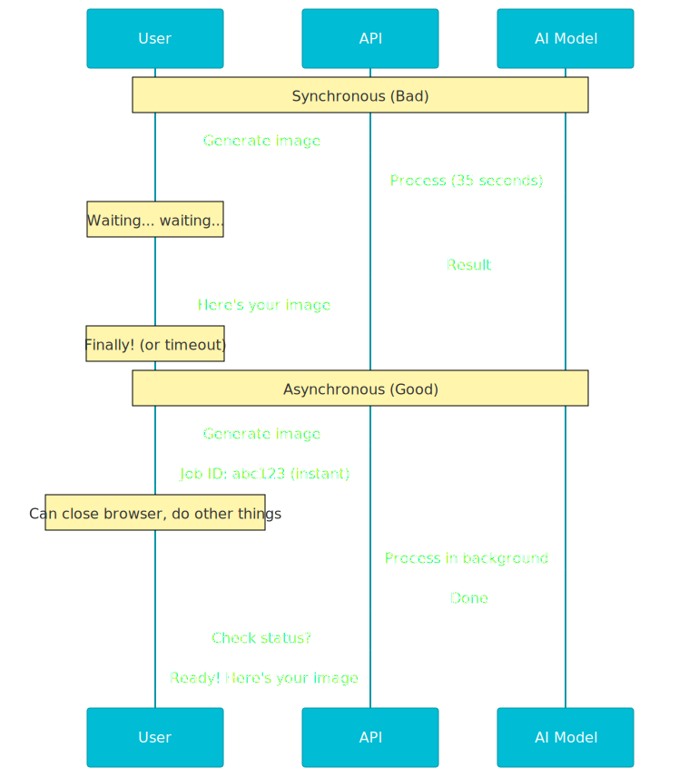

# Why Your GenAI App Needs a Task Queue (And How Celery Solves It)

*Building reliable AI applications means handling slow, expensive operations without making users wait*

---

You've built a GenAI application. Users send requests, your code calls an LLM or generates images, and returns results. Simple enough. Until reality hits.

Your image generation model takes 35 seconds to run. Your agentic workflow makes six separate LLM calls, each taking 3-8 seconds. A user submits a request, and their browser times out waiting. Or worse, they refresh the page halfway through, and you've just burned through $2 in API credits for nothing.

This is the problem every GenAI developer hits eventually. AI operations are slow. They're expensive. They fail randomly when APIs have problems. And you can't make users sit there staring at a loading spinner for 40 seconds. You need a better way.

<!-- more -->

## The Real Problem with Synchronous AI Operations

When you process AI tasks inside your API request, everything waits. Your web server holds a connection open. Your user's browser freezes. Your database connections pile up. If the AI model takes too long, the request times out and fails completely.

But it gets worse. AI operations fail all the time. OpenAI's API returns an error. Google's Imagen service hits rate limits. Your model runs out of memory. With synchronous processing, each failure means a lost request and an angry user.

And scaling is a nightmare. Your web server can handle 100 requests at once easily. But your AI models? Maybe 10 at a time before your GPU maxes out or you hit API limits. You need to scale these things separately.




## Enter Task Queues

A task queue separates "receiving work" from "doing work." When a user makes a request, your API responds right away with "Got it, we're processing this in the background." Then the actual AI processing happens somewhere else, in worker processes that can retry, scale, and fail on their own.

Think of it like a restaurant. The waiter (your API) takes your order and gives you a number right away. The kitchen (your workers) prepares the food when they're ready. You don't stand at the kitchen door waiting. You sit down, relax, and check back when it's done.

This setup solves three big problems. First, users get quick feedback and can close their browser or do something else. Second, you can retry failed tasks automatically with longer waits between each try. Third, you can scale workers separately from your API servers, running more workers when you need more AI processing power.

## Why Celery for GenAI Applications

Celery is a distributed task queue for Python. It's been around since 2009 and powers production systems at companies like Instagram and Mozilla. For GenAI applications specifically, it offers exactly what you need.

The core concept is dead simple. You define tasks as Python functions. You send tasks to a queue (usually Redis or RabbitMQ). Worker processes pick up tasks from the queue and execute them. Results get stored so you can retrieve them later.

Here's what a task looks like:

```python
@celery_app.task(max_retries=3, default_retry_delay=60)
def generate_image(job_id, prompt, iterations):
    # Call your AI model here
    result = imagen_api.generate(prompt, n=iterations)
    return result
```

When a user makes a request, you don't call this function directly. You send it to the queue:

```python
# In your API endpoint
task = generate_image.apply_async(
    kwargs={"job_id": "abc123", "prompt": user_prompt, "iterations": 4},
    priority=5
)
return {"job_id": "abc123", "status": "pending"}
```

The task goes to Redis. A worker picks it up within milliseconds. Your API returns immediately. The user can check the status later by polling an endpoint.

## The Architecture: Four Moving Parts

A Celery system has four components working together. Understanding each one helps you see how the whole thing works.

**The Broker** stores task messages. When your API says "generate this image," that task goes into the broker as a message. Redis works great here because it's fast (in-memory) and simple to set up. The broker is just a Redis list under the hood.

**The Workers** are separate Python processes that run tasks. They keep pulling tasks from the broker, run them, and store the results. You can run as many workers as you need. Need to process more AI requests? Start more workers. Each worker can handle multiple tasks at the same time.

**The Result Backend** stores task results. When a worker finishes a task, it saves the result here (usually Redis again, in a different database). Your API can then get these results when users ask "is my image ready yet?"

**The Client** is your API application. It sends tasks to the queue and gets results back. Your actual FastAPI or Django app is the client. It never runs AI operations directly anymore.


## How It Works in Practice

Let's walk through a real request. A user wants to generate four versions of a logo design using an AI model.

The user hits your API: `POST /generate-design?async_mode=true`. Your API creates a job ID like `job-xyz789`, saves a status record to Redis marking it as "pending," and sends a task to the Celery queue with all the details. It responds right away with the job ID. Total time: 50 milliseconds.

Meanwhile, a worker process picks up the task from Redis. It updates the status to "in progress" and calls your AI model. The model takes 35 seconds to generate four high-quality images. The worker adds logos to each image, uploads them to storage, and saves the final results to Redis with status "completed." If any step fails, Celery automatically retries up to three times with longer waits between each try.

The user checks `GET /jobs/job-xyz789/status` every few seconds from their browser. After 40 seconds, they get back the completed results with image URLs. No timeouts. No lost work. No wasted API credits.


## Why This Matters for Agentic Workflows

Agentic AI workflows make the problem even bigger. Instead of one AI call, you might have a chain of 10 operations. Each one depends on the previous one's output. Some operations take 2 seconds, others take 30 seconds.

With Celery, you can connect tasks together. Run task A, then automatically start task B with A's output, then start task C with B's output. If task B fails, retry just that step without running A again. You can even split work into parallel tasks and wait for all of them to finish.

Here's a simple chain:

```python
# Three steps in order
chain(
    analyze_prompt.s(user_input),
    generate_images.s(),  # Gets analyze_prompt's result
    post_process.s()      # Gets generate_images's result  
).apply_async()
```

This is key for complex AI applications. Your prompt analyzer calls Claude to break down what the user wants (3 seconds). Then four workers at the same time call Imagen to generate images (35 seconds each, but all at once). Then a final worker picks the best result based on rules (5 seconds). Total time: 43 seconds instead of 147 seconds if you did it one by one.


## Built for Reliability and Scale

Celery handles all the messy edge cases. A worker crashes in the middle of a task? The task gets added back to the queue automatically. Redis goes down for a minute? Tasks wait in memory and save when it comes back. You need to handle 10 times more work? Deploy more workers and they all pull from the same queue.

You can set up retry rules for each task. Image generation should retry three times with 60-second waits. Quick text work should fail fast after one retry. Database operations should use longer waits between tries to avoid hitting a busy database too hard.

Priorities matter too. A paying customer's request gets priority 9. A free user gets priority 3. Workers always process high-priority tasks first. This keeps your service level promises during busy times.

Resource separation is another big win. Your web servers run on small, cheap containers. Your AI workers run on GPU machines or servers with 16GB RAM for image work. You scale each layer on its own based on load. During the day when users make lots of requests, you run more workers. At night, you scale down to save money.

## Monitoring and Debugging

Celery comes with Flower, a live web dashboard. You can see every task running, how long they're taking, which workers are busy, and how many tasks are waiting. When something goes wrong, you can see exactly which task failed and why.

You can also track business numbers. How many images generated per hour? What's the average processing time? Which tasks are hitting retry limits? All of this is available through Celery's API or Flower's web interface.

## Keeping Your Code Clean

Here's something important: your main business code shouldn't know about Celery. If you're building your app right, the core code that generates images or calls LLMs should work exactly the same whether it's running in a Celery task, a serverless function, or a plain Python script.

This is where the port and adapter pattern helps. You create an interface for "send a job to the queue." Your main code calls that interface. Celery is just one way to implement it. Tomorrow you might swap it for AWS SQS or Google Pub/Sub. Your main code never changes.

```python
# Domain code depends on this interface
class QueueProtocol:
    def send_message(self, message: dict) -> str:
        ...

# Celery implements it
class CeleryQueueAdapter:
    def send_message(self, message: dict) -> str:
        task_result = my_task.apply_async(kwargs=message)
        return task_result.id
```

Your dependency injection container connects everything together. In tests, you use a fake queue. In production, you use Celery. Your main business logic never knows the difference.

## When You Actually Need This

Not every GenAI app needs Celery. If your AI operations take under 5 seconds and rarely fail, you can probably get away with running them directly. If you're building a test version or first product, start simple.

But once you hit any of these problems, it's time to add a task queue. Your AI operations take over 10 seconds. You're hitting rate limits on AI APIs. Users are seeing timeouts. You need to retry failed operations automatically. You want to scale AI processing separately from your API.

The good news is Celery is pretty simple to add. You need Redis running (you probably already have it for caching). You need to define your tasks and set up some options. You need to run worker processes. With Docker Compose or Kubernetes, this takes a few hours to set up.

## The Bottom Line

GenAI applications are very different from regular web apps. AI operations are slow, expensive, and fail often. Task queues like Celery let you handle this reality in a better way.

Users get quick responses. Your system retries failures automatically. You scale workers on their own based on load. Your code stays clean and testable. Your costs stay predictable because you're not burning resources on failed direct requests.

If you're building any serious GenAI application with LLMs, image generation, or agentic workflows, you need this pattern. Celery is a solid, tested option that works well with Python's AI tools.

---

**Ready to add background processing to your AI app?** Check out the [Celery documentation](https://docs.celeryproject.org/) to get started, or drop your questions in the comments below.
