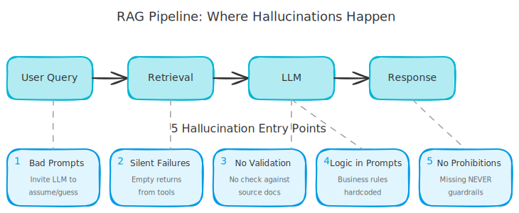
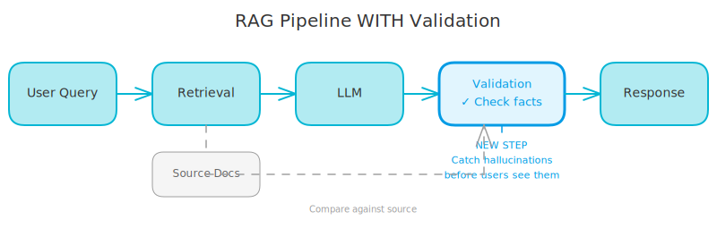

# 5 Mistakes That Make Your RAG App Hallucinate

*The problem isn't that RAG doesn't work. It's the small gaps we leave open.*

---

You built a RAG system. You connected your LLM to your knowledge base. Users ask questions, documents get retrieved, answers get generated. Everything works... until your chatbot confidently tells a customer the price is \$29.99 instead of \$49.99.

Welcome to the world of RAG hallucinations.

The problem isn't that RAG doesn't work. There are small mistakes in how we build these systems that leave the door wide open for the LLM to make things up. Here are the five most common ones.

<!-- more -->

## 1. Prompts That Invite the LLM to Assume

This is the silent killer. Somewhere in your prompt, you probably have something like:

```
If the tool doesn't return relevant information, provide a helpful response based on general knowledge.
```

Or worse:

```
If no pricing data is available, assume standard pricing applies.
```

You just gave your LLM permission to hallucinate. When retrieval fails, instead of saying "I don't know," it'll helpfully make something up.

**The fix:** Be explicit. Tell your LLM what to do when it doesn't have information:

```
If you cannot find the specific information in the provided context,
say "I don't have that information" and offer to help with something else.
Do NOT guess or provide approximate answers.
```

## 2. Silent Failures in Your Tools

Your retrieval tool searches the database and finds nothing. What does it return? An empty string.

The LLM sees an empty context and thinks: "No information available. But the user asked a question, and I'm supposed to be helpful..." You can guess what happens next.

Empty strings are ambiguous. They could mean:

- No results found
- The search failed
- The service timed out
- The query was malformed

The LLM can't tell the difference. It defaults to being "helpful."


**The fix:** Return explicit, structured responses:

```python
# Bad
if not results:
    return ""

# Good
if not results:
    return "NO_RESULTS: No documents found matching the query."
```

Now the LLM knows exactly what happened and can respond appropriately.

## 3. No Validation Layer

Here's the typical RAG flow:

<!-- excalidraw:diagram
id: rag-hallucination-flow
title: Typical RAG Flow Without Validation
type: ai-pipeline
components:
  - name: "User Query"
    type: user
    technologies: []
    position: left
  - name: "Retrieval"
    type: backend
    technologies: ["Vector DB"]
    position: center
  - name: "LLM"
    type: ai
    technologies: ["GPT-4", "Claude"]
    position: center
  - name: "Response"
    type: external
    technologies: []
    position: right
connections:
  - from: "User Query"
    to: "Retrieval"
    label: "search"
  - from: "Retrieval"
    to: "LLM"
    label: "documents + query"
  - from: "LLM"
    to: "Response"
    label: "answer (unvalidated!)"
description: |
  The typical RAG flow goes straight from LLM to user without any validation step.
  This is where hallucinations slip through undetected.
excalidraw:diagram-end -->



1. Retrieve documents from your knowledge base
2. Send documents + query to the LLM
3. Return the LLM's response to the user

Notice what's missing? There's no check to verify that the response actually comes from the retrieved documents.

The LLM might cite a price that doesn't appear anywhere in the context. It might mention a feature your product doesn't have. Without validation, these hallucinations go straight to your users.

**The fix:** Add a validation step before returning responses:

- Check that any numbers/dates/prices mentioned appear in the source documents
- Require citations and verify they exist
- For critical information (pricing, policies), consider a second LLM call to fact-check

This adds latency, but it's worth it for high-stakes applications.



## 4. Business Logic Hardcoded in Prompts

You need your chatbot to know that "children under 3 get in free" and "seniors get 20% off." So you add these rules to your system prompt. Then you add more rules. And more.

Before you know it, you have 200 lines of business logic embedded in a prompt string.

Problems:

- **Drift:** Your actual policies change, but the prompt doesn't get updated
- **Untestable:** You can't write unit tests for prompt strings
- **Hallucination risk:** The LLM might mix up rules or apply them incorrectly

**The fix:** Business logic belongs in code, not prompts. Let your RAG system retrieve current policies from your knowledge base. If you need complex calculations (like pricing), do them in code and give the LLM the result.

```python
# Bad: Rules in prompt
# "Seniors (65+) get 20% off, children under 3 are free..."

# Good: Logic in code
discount = calculate_discount(visitor_age, visitor_type)
# Then tell the LLM: "The calculated discount is {discount}"
```

## 5. No Explicit Prohibitions

LLMs are trained to be helpful. Without explicit guardrails, they'll try to help even when they shouldn't.

Ask about pricing without the data? They'll estimate based on "typical" prices.
Ask about hours when the venue is closed? They'll guess based on "usual" operating hours.

The LLM doesn't know it's doing something wrong. It thinks it's being helpful.

**The fix:** Add explicit prohibitions to your system prompt:

```
IMPORTANT:
- NEVER invent or estimate prices, dates, or schedules
- NEVER provide information that isn't explicitly in the retrieved documents
- If asked about something not in the context, say you don't have that information
```

Be specific about what can't be invented. Generic "be accurate" instructions don't work.

## The Bottom Line

RAG is about grounding your LLM in real data. Every gap in that grounding is an opportunity for hallucination.

Before shipping your RAG app, run through this checklist:

- [ ] Prompts explicitly handle "no information" cases
- [ ] Tools return explicit errors, not empty strings
- [ ] Critical responses are validated against source documents
- [ ] Business rules are in code, not prompts
- [ ] System prompt has explicit "NEVER invent" prohibitions

Close the gaps. Your users and your reputation will thank you.

---

**Building a RAG system?** Start with these guardrails in place. It's much easier to build with them from the start than to retrofit them after your chatbot has already told a customer the wrong price.
