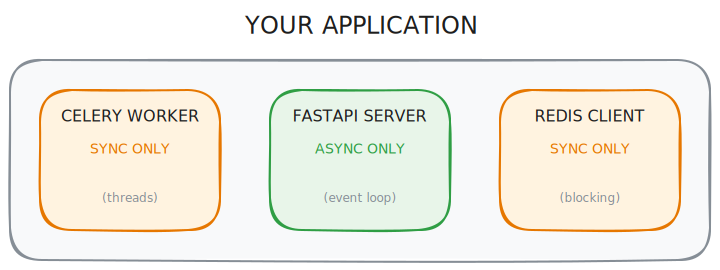
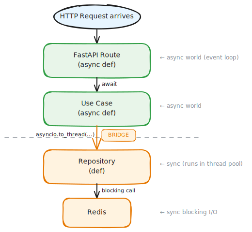
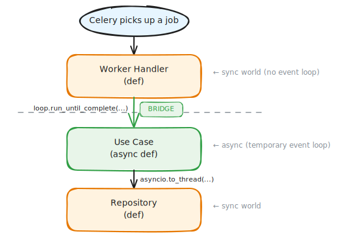

# The Two Bridges: Understanding Async and Sync in Python

**When your code lives in two different worlds, you need to know how to cross between them.**

---

I get asked about this pattern all the time. Someone's staring at their codebase, looking at `asyncio.to_thread()` in one place and `loop.run_until_complete()` somewhere else. They work. But why are they different? When do you use which?

<!-- more -->

Before we get there, let's make sure we're on the same page about what sync and async actually mean.

## What Are Sync and Async Anyway?

Imagine you're at a coffee shop. You order a latte. Now you have two choices.

**Sync (synchronous)** is like standing at the counter and waiting. You don't move. You don't check your phone. You just stand there until your latte is ready. Only then do you walk away and do something else.

**Async (asynchronous)** is like giving your name, stepping aside, and reading a book while you wait. The barista calls your name when it's ready. In the meantime, you're free to do other things.

In code, sync means your program waits for each task to finish before moving to the next line. If you're reading a file, nothing else happens until that file is fully read.

Async means your program can start a task, set it aside, and work on other things while waiting. When the task finishes, it picks up where it left off.

Here's what sync code looks like:

```python
def get_user_data():
    user = database.fetch_user(user_id)  # Program waits here
    # Nothing else runs until fetch_user returns
    return user
```

And here's the async version:

```python
async def get_user_data():
    user = await database.fetch_user(user_id)  # Program can do other work while waiting
    # Other tasks can run during the wait
    return user
```

That `await` keyword is the magic. It tells Python: "This might take a while. Feel free to handle other stuff. Come back to me when it's done."

## The Event Loop: Who's In Charge?

For async to work, something needs to keep track of all those waiting tasks. That's the event loop.

Think of a to-do list. You start task A, but it needs to wait for a download. Instead of staring at the screen, you move to task B. When the download finishes, you go back to A. The event loop is the thing that remembers what's waiting and what's ready.

Here's the key point:

- **Sync code** doesn't have an event loop. It doesn't need one. Tasks run one after another, in order.
- **Async code** needs an event loop. Without it, there's nothing to switch between tasks.

This difference is where all the confusion starts. And it's why we need bridges.

## Two Worlds, One Application

Modern Python applications often live in two different worlds at once. Some parts run async. Some parts run sync. And you need bridges to cross between them.

Let me show you what I mean.

## Your Application Has Three Worlds

Most backend systems I see have pieces that don't naturally talk to each other. Let me explain what each one does:

**FastAPI** is a web framework. When a user hits your API, FastAPI handles the request. It's built for speed - it can handle thousands of requests at the same time using async.

**Celery** is a task queue. When you have slow work (sending emails, processing images, calling AI models), you don't want users waiting. You push the job to Celery and it runs in the background.

**Redis** is a fast data store. It lives in memory, so it's quick. People use it for caching, storing sessions, and as the message broker between your app and Celery.

Here's the problem: these three tools don't speak the same language.



Celery workers are sync. They pick up a task, run it, and move on. No event loop.

FastAPI runs async. It handles thousands of requests at once using an event loop. Everything inside uses `async` and `await`.

Your Redis client (like `redis-py`) is sync by default. When you call `redis.get()`, the whole thread waits until Redis responds.

Now imagine you have a use case class that's written as `async def`. Maybe it talks to external APIs. Maybe it does concurrent I/O. The async style makes sense for it.

But you need to call that use case from two places.

From FastAPI, it's easy. FastAPI is async. You just `await use_case.execute(command)` and you're done.

From Celery, you have a problem. Celery is sync. There's no event loop running. You can't just `await` something in sync code.

This is where the bridges come in.

## Bridge One: Sync Code Calling Async Code

When you're in a sync function and need to call an async function, you create a temporary event loop:

```python
loop = asyncio.new_event_loop()
asyncio.set_event_loop(loop)
try:
    result = loop.run_until_complete(use_case.execute(command))
finally:
    loop.close()
```

Think of it this way: you're standing in the sync world. You need to make one trip into the async world, wait for the result, and come back. The event loop is your vehicle. You create it, drive into async land, get your answer, and park it when you're done.

This pattern shows up in Celery workers, CLI scripts, and anywhere else that starts as regular Python code but needs to run async functions.

## Bridge Two: Async Code Calling Sync Code

The other direction is trickier. You're inside an async function. You have an event loop running. Now you need to call a sync function that blocks, like a database query or a Redis call.

If you call it directly, you freeze the entire event loop. Nothing else can run until that blocking call finishes. Bad.

The solution is `asyncio.to_thread()`:

```python
design = await asyncio.to_thread(
    self.print_design_repository.get, design_id
)
```

This runs your blocking function in a thread pool. The event loop stays free. Other async tasks keep running. When the blocking call finishes, you get the result back.

Think of it as delegation. You're in async land running the show. A blocking task comes in. Instead of stopping everything to handle it yourself, you hand it to a background worker and keep going. When the worker finishes, they hand you the result.

## The Full Picture

Here's what happens when a request comes through FastAPI:



And here's what happens when Celery picks up a job:



Notice how the use case is the same in both flows. It's async. But the entry point is different. FastAPI already has an event loop. Celery doesn't. So the bridge you use depends on where you're starting from.

## Why Not Just Pick One Style?

You might wonder why we don't just make everything sync. Or everything async.

If everything were sync, FastAPI would block on every I/O operation. One slow database query stops all other requests. Terrible for a web API.

If everything were async, you'd need async versions of every library. Celery doesn't support async tasks natively. Many libraries are sync only. Debugging gets harder.

The bridges let you use async where it helps and sync where it's simpler. Web APIs get concurrency. Background workers stay simple. You connect them when needed.

## The Mental Model

Here's the rule I keep in my head:

| Where you are | What you need to call | Use this |
|---------------|----------------------|----------|
| `async def` | sync blocking function | `await asyncio.to_thread(func, args)` |
| regular `def` | `async def` function | `loop.run_until_complete(coro)` |

Two situations. Two bridges. That's it.

The deeper principle is simpler: never block an event loop, and never await without an event loop.

If you're async and you call blocking code directly, you freeze everything. Use `asyncio.to_thread()`.

If you're sync and you try to await something, there's no event loop to run it. Create one with `run_until_complete()`.

## The Takeaway

Async and sync aren't enemies. They're different tools for different jobs. The bridges exist because real applications need both.

When you see `asyncio.to_thread()`, you're looking at async code protecting itself from a blocking call.

When you see `loop.run_until_complete()`, you're looking at sync code making a controlled trip into async land.

Once you see them as bridges between two worlds, the patterns make sense. You'll know which one to reach for because you'll know which world you're starting in and which one you need to visit.
