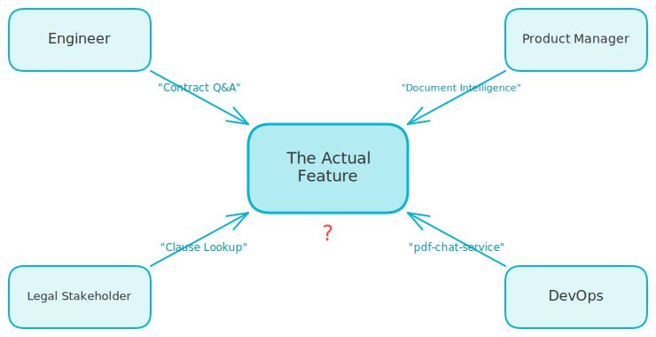
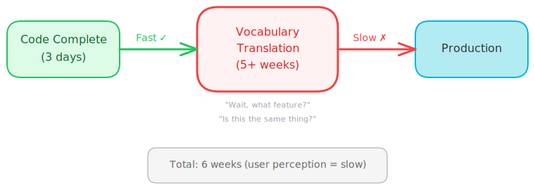

# Vocabulary Drift: The Naming Problem Slowing Down Your AI Projects

*Your deployment pipeline is only as fast as your slowest miscommunication.*

---

Last quarter I was leading the architecture for a GenAI document processing system.

The technical work was fast. We had RAG pipelines running in days. Prototypes that impressed stakeholders. A team that could iterate quickly.

But something was broken. Users felt like we were moving at a really slow pace. Stakeholders were frustrated. Every meeting felt like we were speaking different languages.

The problem wasn't our code. It was our words.

<!-- more -->

## The Feature That Had Four Names

We built a capability that let users ask questions about uploaded contracts and get cited answers. Simple enough.

Except:

- I called it "Contract Q&A"
- The product manager called it "Document Intelligence"
- The legal stakeholder called it "Clause Lookup"
- DevOps had it in their pipeline as "pdf-chat-service"

Same feature. Four names. Zero alignment.

<!-- excalidraw:diagram
id: vocab-drift-four-names
title: One Feature, Four Names
type: custom
components:
  - name: "The Feature"
    type: backend
    technologies: []
    position: center
  - name: "Engineer"
    type: user
    technologies: []
    position: left
  - name: "Product Manager"
    type: user
    technologies: []
    position: right
  - name: "Legal Stakeholder"
    type: user
    technologies: []
    position: left
  - name: "DevOps"
    type: devops
    technologies: []
    position: right
connections:
  - from: "Engineer"
    to: "The Feature"
    label: "Contract Q&A"
  - from: "Product Manager"
    to: "The Feature"
    label: "Document Intelligence"
  - from: "Legal Stakeholder"
    to: "The Feature"
    label: "Clause Lookup"
  - from: "DevOps"
    to: "The Feature"
    label: "pdf-chat-service"
description: |
  The same feature gets different names from each stakeholder,
  creating confusion and misalignment across teams.
excalidraw:diagram-end -->

When legal asked "how's Clause Lookup going?" and I said "Contract Q&A ships Friday," they didn't connect the dots. They assumed their feature was delayed.

When I told DevOps to deploy "Document Intelligence," they couldn't find it. Because in their world it was "pdf-chat-service."

Every handoff created confusion. Every meeting needed 10 minutes of "wait, are we talking about the same thing?"

## The Real Cost of Vocabulary Drift

Here's what this actually looked like in practice:

| Week | What Happened                                                                                     |
|------|---------------------------------------------------------------------------------------------------|
| Week 1 | Feature built and tested locally                                                                  |
| Week 2 | Waiting for deployment, DevOps thought it was a different service                                 |
| Week 3 | Deployed to staging, stakeholder gave feedback using different terminology, requiring translation |
| Week 4 | Changes made, ticket logged under wrong feature name, QA tested the wrong thing                   |
| Week 5 | Hotfix and redeploy                                                                               |
| Week 6 | Finally in production                                                                             |

Six weeks. For a feature that took three days to build.

The user doesn't care that your code was done in 48 hours. They care when they can use it. And from their perspective, we were slow.

<!-- excalidraw:diagram
id: vocab-drift-pipeline-bottleneck
title: Where the Real Bottleneck Lives
type: custom
components:
  - name: "Code Complete"
    type: backend
    technologies: []
    position: left
  - name: "Vocabulary Translation"
    type: external
    technologies: []
    position: center
  - name: "Production"
    type: cloud
    technologies: []
    position: right
connections:
  - from: "Code Complete"
    to: "Vocabulary Translation"
    label: "3 days"
  - from: "Vocabulary Translation"
    to: "Production"
    label: "5+ weeks"
description: |
  The technical work is fast. The communication overhead
  creates the real delay in getting features to production.
excalidraw:diagram-end -->

## What the Architecture Books Call This

In software architecture, we call this the problem of "ubiquitous language", a term from Domain-Driven Design.

But it's broader than that.

When architects talk about measuring characteristics like "agility" or "deployability," they're not just measuring technical capabilities. They're measuring how well the entire system - humans included - can move together.

You can have:

- A modular codebase (agility checked)
- Fast CI/CD pipelines (deployability checked)
- Good test coverage (testability checked)

And still be slow. Because the humans aren't synchronized.

## What We Changed

After that project, I implemented three rules:

### 1. One Name, Documented on Day One

Every feature gets exactly one canonical name. It goes in a shared glossary before any code is written.

If a stakeholder wants to call it something else in their mind, fine but all systems, tickets, pipelines, and documentation use the canonical name.

### 2. The "Say It Back" Rule

At the end of every cross-team meeting, someone summarizes:

> "So we're talking about [feature name], which does [one sentence], and the next step is [action]."

If anyone looks confused, we haven't aligned.

### 3. Name the Deployment Unit Early

Before I write code, I tell DevOps: "This will be called X in your pipeline. Here's what it needs."

They see it coming. No surprises at deployment.

## The Architecture Lesson

"Agility" isn't just about your code being modular.

It's about:

- Can you rename a service and have everyone know instantly?
- Can you deploy without a game of telephone?
- Can you measure progress without translating between five vocabularies?

Composite characteristics break down into human factors, not just technical ones.

**Fast prototyping + slow communication = slow delivery.**

## The Bottom Line

If you're building AI products (or any complex system), you're not just architecting code. You're architecting how people talk to each other.

A shared vocabulary isn't bureaucracy. It's infrastructure.

Your deployment pipeline is only as fast as your slowest miscommunication.

---

**Building a GenAI system with multiple stakeholders?** Define your vocabulary before you write your first line of code. Your future self will thank you when deployment day comes.
