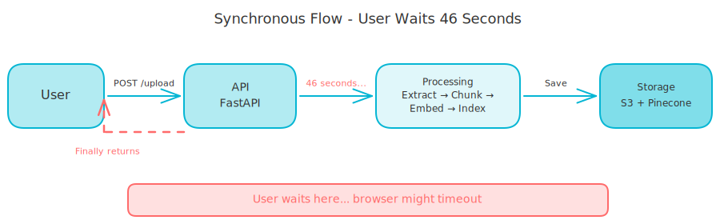
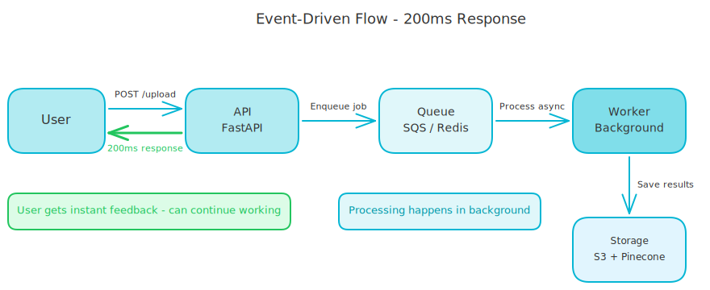
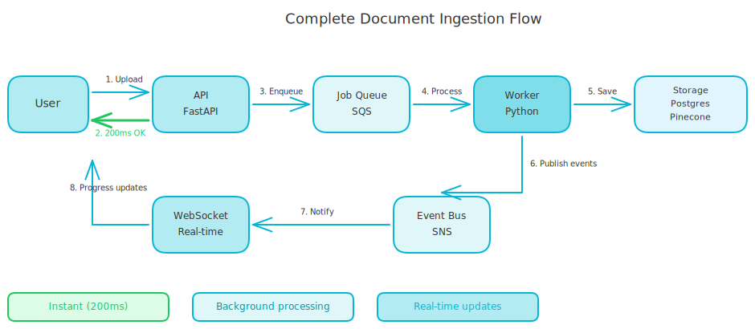

# Event-Driven Architecture: From 46-Second Waits to Instant Responses

My document upload took 46 seconds to complete. Upload the file, extract text, chunk it, generate embeddings, index the vectors - all while the user stared at a spinning loader. Sometimes the request timed out before finishing.

The solution wasn't faster code. It was different architecture. Instead of making each step run quicker, I changed *when* the work happened.

<!-- more -->

## The Problem with Doing Everything Now

Here's what synchronous code looks like:

```python
@router.post("/upload")
async def upload_document(file):
    # Upload file - 100ms
    document = await save_to_storage(file)

    # Extract text - 5 seconds for a PDF
    text = await extract_content(file)

    # Chunk content - 1 second
    chunks = await chunk_text(text)

    # Generate embeddings - 30 seconds for 1000 chunks
    embeddings = await generate_embeddings(chunks)

    # Index vectors - 10 seconds
    await index_to_pinecone(embeddings)

    return {"status": "completed"}
```

The user waits 46 seconds for that response. But the problems go deeper than just slow responses.

Many HTTP clients give up after 30 seconds, so requests time out before finishing. If the server crashes during embedding, you start from scratch. You can't process multiple documents at once because the API is blocked. And users think the app is broken when they see a spinner for that long.

The code works. The experience is terrible.

<!-- excalidraw:diagram
id: event-driven-sync-flow
title: Synchronous Flow - User Waits 46 Seconds
type: system-overview
components:
  - name: "User"
    type: user
    technologies: []
    position: left
  - name: "API"
    type: backend
    technologies: ["FastAPI"]
    position: center
  - name: "Processing"
    type: backend
    technologies: ["Extract", "Chunk", "Embed", "Index"]
    position: center
  - name: "Storage"
    type: database
    technologies: ["S3", "Pinecone"]
    position: right
connections:
  - from: "User"
    to: "API"
    label: "POST /upload"
  - from: "API"
    to: "Processing"
    label: "46 seconds..."
  - from: "Processing"
    to: "Storage"
    label: "Save"
  - from: "API"
    to: "User"
    label: "Finally returns"
description: |
  Shows the synchronous flow where the user waits for all processing
  steps to complete before getting a response. Total wait: 46 seconds.
excalidraw:diagram-end -->



## Acknowledge Fast, Process Later

Here's the same flow, redesigned:

```python
@router.post("/upload")
async def upload_document(file):
    # Save file quickly
    document = await save_to_storage(file)

    # Publish event (fire-and-forget)
    await event_publisher.publish(
        DocumentUploadedEvent(document_id=document.id)
    )

    # Enqueue background job
    job_id = await job_queue.enqueue(
        "ingest_document",
        {"document_id": document.id}
    )

    # Return immediately - 200ms total
    return {
        "document_id": document.id,
        "job_id": job_id,
        "status": "pending"
    }
```

Response time drops to 200ms. The heavy work happens in a separate worker process:

```python
async def process_ingestion_job(message):
    document_id = message["document_id"]

    # Now do the slow work
    await ingest_document_use_case.execute(document_id)

    # Publish completion event
    await event_publisher.publish(
        IngestionCompletedEvent(document_id=document_id)
    )
```

The user gets instant feedback, the processing happens in the background, and everybody wins.

<!-- excalidraw:diagram
id: event-driven-async-flow
title: Event-Driven Flow - 200ms Response
type: system-overview
components:
  - name: "User"
    type: user
    technologies: []
    position: left
  - name: "API"
    type: backend
    technologies: ["FastAPI"]
    position: center
  - name: "Queue"
    type: cloud
    technologies: ["SQS", "Redis"]
    position: center
  - name: "Worker"
    type: backend
    technologies: ["Background Process"]
    position: right
  - name: "Storage"
    type: database
    technologies: ["S3", "Pinecone"]
    position: right
connections:
  - from: "User"
    to: "API"
    label: "POST /upload"
  - from: "API"
    to: "User"
    label: "200ms response"
  - from: "API"
    to: "Queue"
    label: "Enqueue job"
  - from: "Queue"
    to: "Worker"
    label: "Process async"
  - from: "Worker"
    to: "Storage"
    label: "Save results"
description: |
  Shows the event-driven flow where the API responds immediately
  and processing happens in the background. Response time: 200ms.
excalidraw:diagram-end -->



## Why This Pattern Works

The benefits stack up quickly. Users know their upload worked immediately because the response comes back in 200ms. You can spin up more workers to handle more documents without slowing down the API. If a worker crashes, the job stays in the queue and another worker picks it up - no lost work. You can publish events at each stage to show users real-time progress. And the API doesn't need to know how ingestion works, just that it should happen.

Each benefit builds on the others. Fast responses mean happy users. Scalability means you can handle growth. Resilience means 3am bugs become rare.

## Events Are Not Just Messages

I made a mistake early on - I treated events like simple messages. "Job started." "Job finished." Production taught me better. Here's what a real event looks like:

```python
class IngestionCompletedEvent:
    event_id: str          # Unique identifier
    event_type: str        # "rag.ingestion.completed"
    correlation_id: str    # Traces this document's journey
    tenant_id: str         # Multi-tenant support
    idempotency_key: str   # Prevents double processing
    timestamp: datetime    # When it happened
    document_id: str       # What completed
    chunks_created: int    # Result data
    processing_time_ms: int
```

Three fields matter most. The `correlation_id` links all events for one document. When debugging, filter by this ID and you'll see the complete journey from upload to completion. The `idempotency_key` prevents double processing, which matters because networks fail and events sometimes get published twice. And `tenant_id` gives every event the context it needs in multi-tenant systems, so you know which customer's data you're handling.

These fields seem like overhead until you're debugging production at midnight. Then they're lifesavers.

## Commands vs Events: A Mental Model

This distinction helped me design better systems. Commands are requests - they're imperative, like "Ingest this document." Events are facts - they're past tense, like "Document ingested." Commands can fail because the system might refuse them. Events have already happened, so they're notifications rather than requests.

In code:

```python
# Command - a request to do something
class IngestDocumentCommand:
    document_id: str
    collection_id: str

# Event - notification that something happened
class IngestionCompletedEvent:
    document_id: str
    chunks_created: int
```

The API receives commands, workers emit events, and consumers react to events. This separation keeps systems decoupled - the uploader doesn't need to know what happens after upload. It just publishes a command and everything else follows.

## The Ports and Adapters Pattern

Here's how I keep event code clean. Start by defining an interface (port):

```python
class EventPublisher(Protocol):
    async def publish(self, event: Any) -> None:
        """Publish a domain event."""
```

Create adapters for different environments:

```python
# For testing
class InMemoryEventPublisher:
    def __init__(self):
        self._events = []

    async def publish(self, event):
        self._events.append(event)

# For production
class SQSEventPublisher:
    async def publish(self, event):
        await self._sqs.send_message(...)
```

Your business logic uses the interface and doesn't know if events go to memory, SQS, Kafka, or anywhere else. This matters for testing (use in-memory publisher and assert events were published), local dev (skip real AWS and avoid costs), and swappability (switch from SQS to Kafka without changing use case code). The pattern is simple but the flexibility is huge.

## What's in a Job Queue?

Events tell you something happened. Job queues tell workers what to do. Here's my job queue interface:

```python
class JobQueue(Protocol):
    async def enqueue(
        self,
        job_type: str,
        payload: dict,
        delay_seconds: int = 0
    ) -> str:
        """Enqueue a background job."""
```

For AWS, this maps to SQS:

```python
class SQSQueue:
    async def enqueue(self, job_type, payload, delay_seconds=0):
        response = self._sqs.send_message(
            QueueUrl=self._queue_url,
            MessageBody=json.dumps({
                "job_type": job_type,
                "payload": payload
            }),
            DelaySeconds=delay_seconds
        )
        return response["MessageId"]
```

The delay parameter is useful - want to retry a failed job in 60 seconds? Just use `enqueue(..., delay_seconds=60)`.

## The Complete Flow

Let me walk through a document ingestion from start to finish. First, the user uploads a document and the API saves the file, enqueues a job, and returns immediately. A worker picks up the job from the queue and starts processing. As it moves through each stage - extracting, chunking, embedding - it updates the document status and publishes progress events. When processing finishes, a final completion event is published and the document is ready for search. Optionally, a WebSocket consumer can push these updates to the browser in real time.

The user sees instant upload confirmation, then real-time progress, then completion - all without blocking the HTTP request for 46 seconds.

<!-- excalidraw:diagram
id: event-driven-complete-flow
title: Complete Document Ingestion Flow
type: system-overview
components:
  - name: "User"
    type: user
    technologies: []
    position: left
  - name: "API"
    type: backend
    technologies: ["FastAPI"]
    position: center
  - name: "Job Queue"
    type: cloud
    technologies: ["SQS"]
    position: center
  - name: "Worker"
    type: backend
    technologies: ["Python"]
    position: center
  - name: "Event Bus"
    type: cloud
    technologies: ["SNS", "EventBridge"]
    position: center
  - name: "Storage"
    type: database
    technologies: ["Postgres", "Pinecone"]
    position: right
  - name: "WebSocket"
    type: backend
    technologies: ["Real-time Updates"]
    position: left
connections:
  - from: "User"
    to: "API"
    label: "1. Upload"
  - from: "API"
    to: "User"
    label: "2. 200ms OK"
  - from: "API"
    to: "Job Queue"
    label: "3. Enqueue"
  - from: "Job Queue"
    to: "Worker"
    label: "4. Process"
  - from: "Worker"
    to: "Storage"
    label: "5. Save"
  - from: "Worker"
    to: "Event Bus"
    label: "6. Publish events"
  - from: "Event Bus"
    to: "WebSocket"
    label: "7. Notify"
  - from: "WebSocket"
    to: "User"
    label: "8. Progress updates"
description: |
  Complete flow showing user upload, instant API response, background
  processing, and real-time progress updates via WebSocket.
excalidraw:diagram-end -->



## When to Use This Pattern

Event-driven architecture adds complexity, so it's not always worth it. Use it when operations take more than a few seconds, when you need to scale processing independently, when crash recovery matters, or when multiple systems need to react to the same event. Skip it when operations are fast (under 1 second), when you're building a simple CRUD app, or when the added complexity isn't justified yet.

I start synchronous. When I hit the pain - timeouts, scaling issues, user complaints - I refactor to events. Don't over-engineer early, but do recognize when it's time.

## Wrapping Up

46 seconds became 200 milliseconds - not because I made the code faster, but because I changed when the work happened. The patterns aren't complicated: acknowledge fast, queue heavy work, process in the background, and notify when done. Each piece is straightforward, but together they transform user experience.

Event-driven architecture isn't just for big companies. It's for anyone tired of timeout errors and spinning loaders. Give it a try and your users will thank you.
