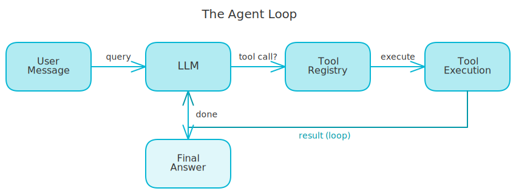
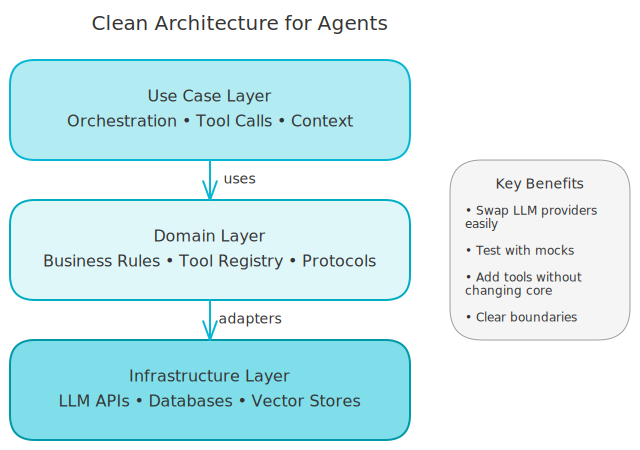

# How AI Agents Really Work: A Practical Guide to Tool Calling

Most developers think AI agents are magic. They're not - they're while loops with guardrails. I recently built the core orchestration logic for an AI assistant with tool-calling capabilities, and the code wasn't complex. But understanding the pattern took time. Let me show you what's really happening under the hood.

<!-- more -->

## The Agent Loop: Surprisingly Simple

Here's what every AI agent does: get the user message, call the LLM with available tools, execute any tool the LLM wants to use, feed the result back, and repeat until the LLM gives a final answer. That's it - a while loop that keeps running until the AI decides it has enough information.

The "intelligence" isn't in the loop. It's in the LLM deciding when to use tools and when to answer.

<!-- excalidraw:diagram
id: agent-loop-flow
title: The Agent Loop
type: ai-pipeline
components:
  - name: "User Message"
    type: user
    technologies: []
    position: left
  - name: "LLM"
    type: ai
    technologies: ["GPT-4", "Claude"]
    position: center
  - name: "Tool Registry"
    type: backend
    technologies: ["Python"]
    position: center
  - name: "Tool Execution"
    type: backend
    technologies: ["RAG", "APIs"]
    position: center
  - name: "Final Answer"
    type: external
    technologies: []
    position: right
connections:
  - from: "User Message"
    to: "LLM"
    label: "query"
  - from: "LLM"
    to: "Tool Registry"
    label: "tool call?"
  - from: "Tool Registry"
    to: "Tool Execution"
    label: "execute"
  - from: "Tool Execution"
    to: "LLM"
    label: "result (loop)"
  - from: "LLM"
    to: "Final Answer"
    label: "done"
description: |
  The agent loop: LLM decides to call tools or respond.
  Tool results feed back into the LLM until it has enough info.
excalidraw:diagram-end -->



Here's the flow in action:

```
User: "What documents mention Python?"
    ↓
LLM thinks: "I should search the documents"
    ↓
LLM calls: rag_search(query="Python")
    ↓
Tool returns: [Document A, Document B, ...]
    ↓
LLM thinks: "Now I can answer"
    ↓
LLM responds: "I found 3 documents that mention Python..."
```

Each step is a normal function call. The magic is letting the LLM decide what to call and when.

## The Guardrails That Matter

A naive agent loop is dangerous. Without limits, an AI could call tools forever, crash your system with a bad tool call, or run up massive API bills. Three guardrails make it production-ready.

### 1. Maximum Iterations

Set a hard limit - my default is 5 iterations. If the agent hasn't found an answer after 5 tool calls, something's wrong. Return what you have and let the user ask a follow-up. This prevents infinite loops and runaway costs.

### 2. Tool Timeouts

Every tool call gets a timeout, and mine is 30 seconds. Tools call external services like databases, APIs, and search engines, and any of these can hang. A single stuck tool call shouldn't freeze your entire system.

```python
result = await asyncio.wait_for(
    tool.execute(call, context),
    timeout=30  # seconds
)
```

If a tool times out, return an error message to the LLM. Let it decide whether to retry or give up.

### 3. Graceful Degradation

Tools will fail - networks go down, APIs return errors, databases timeout. The question isn't "if" but "how do you handle it?" My approach is to convert failures to messages. Instead of crashing, the tool returns something like "Search failed: connection timeout." The LLM sees this and can explain it to the user: "I couldn't search the documents right now. Try again in a moment." Much better than a stack trace.

## Context Window Management

Here's something that trips up new agent builders. The conversation grows with every turn - user message, tool call, tool result, assistant message, and repeat. Your context window fills up fast.

The fix is simple: limit how much history you keep. I default to the last 10 conversation turns where old messages get dropped and recent ones stay. This works because most questions don't need the full history - the user's current question plus recent context is usually enough.

For long conversations, you can get smarter by summarizing old messages or storing them in a vector database. But for most apps, a simple sliding window works fine.

## The Tool Registry Pattern

How does the agent know what tools exist? You register them. A tool registry is just a dictionary mapping tool names to their code:

```python
registry = {
    "rag_search": RagSearchTool(),
    "document_status": DocumentStatusTool(),
    "list_documents": ListDocumentsTool(),
}
```

When the LLM asks to use "rag_search", the registry looks it up and executes it. This pattern helps with discovery (the LLM gets a list of available tools), isolation (each tool is independent), and testing (swap real tools for mocks). Want to add a new capability? Register a new tool and the rest of the system stays unchanged.

## Clean Architecture for AI Code

AI code gets messy fast. You start with a simple script, then add error handling, then logging, then metrics, then timeouts, then retries. Suddenly your 50-line prototype is 500 lines of spaghetti.

The fix is the same pattern that works for any complex code: separate concerns.

<!-- excalidraw:diagram
id: agent-architecture-layers
title: Clean Architecture for Agents
type: layered
components:
  - name: "Use Case Layer"
    type: backend
    technologies: ["Orchestration", "Tool Calls"]
    position: left
  - name: "Domain Layer"
    type: backend
    technologies: ["Business Rules", "Tool Registry"]
    position: center
  - name: "Infrastructure Layer"
    type: backend
    technologies: ["LLM APIs", "Databases", "Vector Stores"]
    position: right
connections:
  - from: "Use Case Layer"
    to: "Domain Layer"
    label: "uses"
  - from: "Domain Layer"
    to: "Infrastructure Layer"
    label: "adapters"
description: |
  Three layers keep AI code clean.
  Use cases orchestrate, domain defines rules, infrastructure connects to external systems.
excalidraw:diagram-end -->



The **Use Case Layer** handles orchestration logic - calling the LLM, executing tools, and managing context. The **Domain Layer** holds business rules like what tools exist and what constitutes valid input. The **Infrastructure Layer** manages external connections to LLM APIs, databases, and vector stores.

Each layer has one job, so changes in one don't ripple through the others. When I need to switch LLM providers, I change one adapter and the use case stays identical. When I add a new tool, I register it and the orchestration code doesn't change. This isn't over-engineering, it's survival.

## The System Prompt: Setting the Rules

One thing I glossed over: how does the LLM know what to do? The system prompt. This is your chance to set behavior rules before the conversation starts.

Mine says something like: always use the search tool before answering questions, only answer based on document content, say so if you can't find information, and cite your sources. Without this, the LLM might make things up or answer from its training data instead of your documents. The system prompt is your first line of defense against hallucination.

## Putting It All Together

Here's the complete flow. The user sends a message, and you validate it and check the conversation exists. You build context from the system prompt, recent messages, and available tools. You call the LLM with this context and check if it wants to use any tools. If so, execute them, add the outputs to context, and call the LLM again. Repeat until the LLM gives a final answer or you hit max iterations. Then save the conversation and return the response.

Each step is straightforward. The power comes from combining them.

## Wrapping Up

AI agents aren't complicated - they're disciplined. The same engineering principles that make any system reliable work here too: timeouts prevent hangs, error handling prevents crashes, limits prevent runaway costs, and clean separation prevents spaghetti. The "AI" part is just the LLM deciding what to do. Everything else is regular programming.

If you can build a web app with API calls, you can build an AI agent. The patterns are the same, the tools are just smarter. Start simple, add guardrails, ship it, then iterate.

---

**Building your first AI agent?** Start with the while loop and add one tool. Make it work, then add the guardrails. You'll be surprised how far this simple pattern takes you.
