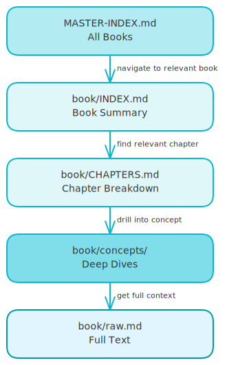
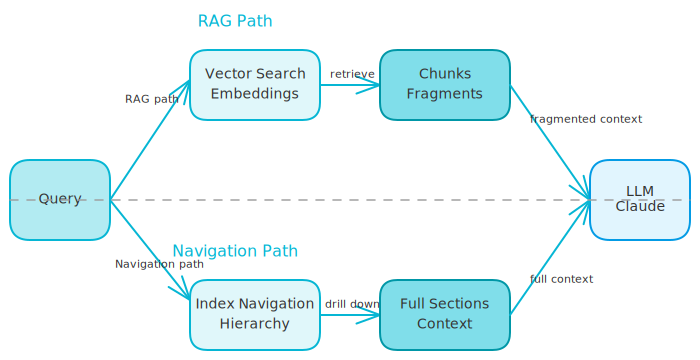

# Do I Need RAG for My Knowledge Base?

*When structured navigation beats vector search.*

---

"How do I chat with my documents?" The default answer is always RAG. Chunk your content, embed it, store vectors, retrieve similar chunks, send to LLM. Everyone does it this way.

But should they?

I'm building a personal knowledge base for my day-to-day work. Business books with frameworks, mental models, and actionable ideas. When I need to build an offer or make a decision, I want to pull from this accumulated knowledge, not start from scratch or ask a generic AI.

Here's the surprising part: I chose *not* to use RAG. And it's working better than I expected.

<!-- more -->

## The Project I'm Building

The goal is simple: ask my AI coding agent things like "help me build an offer for my coaching service" and have it reference specific frameworks from specific books. Real depth, not shallow summaries.

**What I want:**

- Deep understanding of 10-30 curated books
- Conceptual queries ("how should I structure an offer?")
- Full context when pulling from a source
- Markdown outputs I can keep and refine

**What I don't want:**

- A "summarize this book" chatbot
- Disconnected chunks that lose context
- Infrastructure to maintain
- Shallow search across hundreds of documents

The scope is intentionally small: 10-30 books I've personally selected. Business and self-improvement content. Personal use only.

## The Architecture I Chose

Instead of vectors and embeddings, I went with structured markdown:

<!-- excalidraw:diagram
id: knowledge-base-hierarchy
title: Knowledge Base Navigation Hierarchy
type: layered
components:
  - name: "MASTER-INDEX.md"
    type: backend
    technologies: ["All Books"]
    position: top
  - name: "book/INDEX.md"
    type: backend
    technologies: ["Book Summary"]
    position: center
  - name: "book/CHAPTERS.md"
    type: backend
    technologies: ["Chapter Breakdown"]
    position: center
  - name: "book/concepts/"
    type: backend
    technologies: ["Deep Dives"]
    position: center
  - name: "book/raw.md"
    type: database
    technologies: ["Full Text"]
    position: bottom
connections:
  - from: "MASTER-INDEX.md"
    to: "book/INDEX.md"
    label: "navigate to relevant book"
  - from: "book/INDEX.md"
    to: "book/CHAPTERS.md"
    label: "find relevant chapter"
  - from: "book/CHAPTERS.md"
    to: "book/concepts/"
    label: "drill into concept"
  - from: "book/concepts/"
    to: "book/raw.md"
    label: "get full context"
description: |
  The agent navigates top-down through the hierarchy.
  It reads indexes first, then drills into only what's relevant.
excalidraw:diagram-end -->

The hierarchy works like this:

- **MASTER-INDEX.md** tells the agent what books exist and when to use each
- **book/INDEX.md** summarizes a specific book and its key frameworks
- **book/CHAPTERS.md** breaks down each chapter
- **book/concepts/** contains deep dives on specific frameworks
- **book/raw.md** has the full extracted text

The agent navigates top-down. It doesn't read everything - it reads the index, decides what's relevant, and drills into only what it needs.

**The key insight:** Python does extraction (dumb, fast). The LLM does thinking (smart, flexible). Markdown files sit in the middle as the interface.

## What RAG Actually Does

RAG (Retrieval Augmented Generation) solves one specific problem: finding relevant content when there's too much to read.

Here's the process:

1. Your content gets split into chunks
2. Each chunk becomes a vector (numbers representing meaning)
3. Vectors go into a database
4. When you ask a question, your question becomes a vector
5. Database finds chunks with similar vectors
6. Those chunks get sent to the LLM as context

That's it. RAG is a search system that finds relevant pieces before the LLM sees anything.

## Structured Navigation vs RAG

<!-- excalidraw:diagram
id: rag-vs-navigation-flow
title: RAG vs Structured Navigation
type: system-overview
components:
  - name: "Query"
    type: user
    technologies: []
    position: left
  - name: "Vector Search"
    type: ai
    technologies: ["Embeddings"]
    position: center-top
  - name: "Chunks"
    type: database
    technologies: ["Fragments"]
    position: center-top
  - name: "Index Navigation"
    type: backend
    technologies: ["Hierarchy"]
    position: center-bottom
  - name: "Full Sections"
    type: database
    technologies: ["Context"]
    position: center-bottom
  - name: "LLM"
    type: ai
    technologies: ["Claude"]
    position: right
connections:
  - from: "Query"
    to: "Vector Search"
    label: "RAG path"
  - from: "Vector Search"
    to: "Chunks"
    label: "retrieve"
  - from: "Chunks"
    to: "LLM"
    label: "fragmented context"
  - from: "Query"
    to: "Index Navigation"
    label: "Navigation path"
  - from: "Index Navigation"
    to: "Full Sections"
    label: "drill down"
  - from: "Full Sections"
    to: "LLM"
    label: "full context"
description: |
  Two different approaches to the same problem.
  RAG retrieves chunks. Navigation reads full sections.
excalidraw:diagram-end -->

Here's how the two approaches compare:

| Aspect | Structured Navigation | RAG |
|--------|----------------------|-----|
| Context | Agent reads full sections | Agent sees disconnected chunks |
| Information | Nothing lost between sections | Chunks may split important ideas |
| Structure | Agent understands document hierarchy | Agent has no sense of structure |
| Infrastructure | Zero - just markdown files | Vector DB + embeddings + chunking |
| Behavior | Deterministic (same query, same files) | Probabilistic (retrieval can miss) |
| Best for | Depth with fewer documents | Breadth across many documents |

## When RAG Becomes Necessary

RAG solves problems I don't have yet:

### Problem 1: Too Much Content

**Without RAG:** Claude can read maybe 50-100k tokens in one session. If I ask about "pricing psychology" and have 10 books, it can read all 10 INDEX.md files (~500 tokens each = 5k tokens), then drill into 2-3 relevant chapters. Plenty of room.

**With RAG:** If I had 500 books, reading 500 INDEX.md files would be 250k tokens. Impossible. RAG would find the 10 most relevant books instantly.

**My situation:** I'll have 10-30 books. Structured navigation works fine.

### Problem 2: Unknown Location

**Without RAG:** If I ask "what does Hormozi say about scarcity?", Claude reads the book's INDEX.md, sees "scarcity" isn't a listed concept, reads CHAPTERS.md, finds it mentioned in Chapter 7, reads that section.

**With RAG:** Instantly retrieves the exact paragraphs mentioning scarcity.

**My situation:** The hierarchical structure handles this. It's 2-3 file reads, not a problem.

### Problem 3: Cross-Document Patterns

**Without RAG:** If I ask "which books mention anchoring?", Claude would need to search every raw.md file. Slow and expensive.

**With RAG:** Instant search across all content.

**My situation:** I rarely need keyword search. I need conceptual understanding. If I want anchoring, I know it's in psychology/persuasion books. I check those indexes.

## Why I'm Not Using RAG (For Now)

Five reasons:

1. **I don't have enough content.** 10-30 books fit easily in a navigable structure.

2. **My queries are conceptual.** I ask "how should I structure an offer?" not "find all mentions of the word offer."

3. **I want full context.** When I pull from a book, I want Claude to understand the surrounding ideas, not just a 500-token fragment.

4. **Simplicity has value.** Markdown files in folders work everywhere. No database to maintain, no embeddings to regenerate, no chunking strategy to tune.

5. **The bottleneck isn't retrieval.** I'd rather have 10 deeply-processed books with good summaries than 100 poorly-indexed books with RAG search.

## When I'd Add RAG

I'd reconsider if:

- Vault grows beyond 50+ books
- I need to search across hundreds of documents
- I'm adding content I haven't personally curated (bulk imports)
- I need keyword search ("find everywhere X is mentioned")
- Query patterns become more breadth-focused than depth-focused

At that point, RAG would layer on top of the same markdown files. The structure doesn't change - I'd just add a retrieval layer.

## The Bottom Line

RAG is a solution to a scale problem I don't have.

For a personal knowledge base of curated books that I want to deeply understand and apply, structured markdown with good indexes gives me:

- **Better context** - full sections, not chunks
- **Better navigation** - hierarchical, not flat search
- **Zero infrastructure** - just files
- **Full portability** - works with any tool

If this were a company wiki with 10,000 documents from different authors with no consistent structure, I'd need RAG on day one.

But it's not. It's my personal library. I know what's in it. I want depth, not breadth.

**Simple answer:** I don't need RAG because I'm building a library, not a search engine.

---

**Building your own knowledge base?** Ask yourself: do you need to *search* your content, or *navigate* it? The answer determines whether you need RAG.
