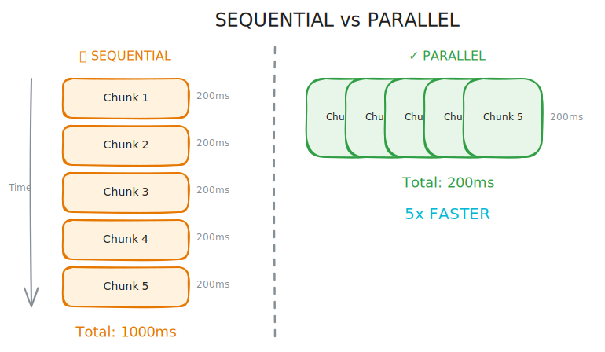
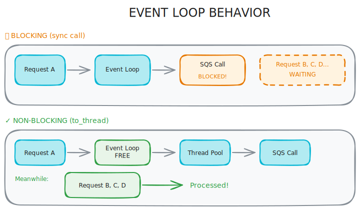
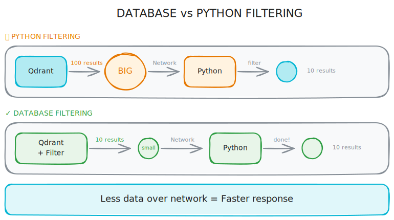

# 3 Python Fixes That Made My RAG System 10x Faster

My RAG document ingestion was painfully slow. A 20-page PDF took over a minute to process. Users complained. I blamed the embedding model. Turns out, the model wasn't the problem - my code was.

Three small fixes cut processing time by 10x. None of them required changing models, adding hardware, or rewriting the architecture. Just better use of async Python.

<!-- more -->

## Why Slow Ingestion Hurts

Before diving into the fixes, here's why this matters. Slow ingestion means users wait longer to search their documents. It means higher cloud costs because workers run longer. It means you hit rate limits faster because requests pile up. And it means scaling becomes expensive - you need more workers to handle the same load.

The good news: most slow RAG code has the same handful of problems. Fix those, and performance jumps.

## Fix 1: Parallel Embedding Processing

This was the biggest win. My embedding code looked like this:

```python
async def embed_texts(self, texts: list[str]) -> list[list[float]]:
    embeddings = []
    for text in texts:
        embedding = await self.embed_text(text)
        embeddings.append(embedding)
    return embeddings
```

See the problem? Each embedding waits for the previous one to finish. With 100 chunks, that's 100 sequential API calls. If each call takes 200ms, you're waiting 20 seconds.

The fix is one line:

```python
async def embed_texts(self, texts: list[str]) -> list[list[float]]:
    embeddings = await asyncio.gather(*[
        self.embed_text(text) for text in texts
    ])
    return list(embeddings)
```

`asyncio.gather()` runs all the embedding calls at once. Same 100 chunks, same 200ms per call, but now they run in parallel. Total time: 200ms instead of 20 seconds.



The embedding provider handles the concurrency. Most APIs (OpenAI, Cohere, local Ollama) can process multiple requests at once. You're just not taking advantage of it with a sequential loop.

Think of it this way: sequential means 100 trips to the coffee shop, one at a time. Parallel means sending 100 people to get coffee at the same time. Same work, fraction of the time.

## Fix 2: Non-blocking SQS Enqueue

This one was sneaky. My queue code looked async but wasn't:

```python
async def enqueue(self, job_type: str, payload: dict) -> str:
    response = self._client.send_message(
        QueueUrl=self._queue_url,
        MessageBody=json.dumps({"job_type": job_type, "payload": payload})
    )
    return response["MessageId"]
```

The function has `async` in front. The `_client.send_message()` is boto3's synchronous method. It blocks the event loop while waiting for AWS to respond.

This matters because while SQS responds (50-100ms), your entire Python process is frozen. No other requests can be handled. In a FastAPI app, this means one slow enqueue blocks all other users.

The fix uses `asyncio.to_thread()`:

```python
async def enqueue(self, job_type: str, payload: dict) -> str:
    response = await asyncio.to_thread(
        self._client.send_message,
        QueueUrl=self._queue_url,
        MessageBody=json.dumps({"job_type": job_type, "payload": payload})
    )
    return response["MessageId"]
```

`asyncio.to_thread()` runs the synchronous boto3 call in a thread pool. Your event loop stays free to handle other requests. The API doesn't freeze while waiting for AWS.



This pattern applies to any synchronous library you're using inside async code. Database drivers without async support, file I/O, third-party SDKs - wrap them in `asyncio.to_thread()`.

## Fix 3: Re-enabled Vector Store Filters

This one was embarrassing. I found this in my Qdrant search code:

```python
async def search(self, query_vector: list[float], filters: dict = None):
    # TEMPORARY: Disabling filters to test...
    # if filters:
    #     conditions = [
    #         FieldCondition(key=f"payload.{key}", match=MatchValue(value=value))
    #         for key, value in filters.items()
    #     ]
    #     qdrant_filter = Filter(must=conditions)

    results = await self._client.search(
        collection_name=self._collection,
        query_vector=query_vector,
        limit=100  # Get more, filter in Python later
    )

    # Filter in Python
    if filters:
        results = [r for r in results if all(
            r.payload.get(k) == v for k, v in filters.items()
        )]

    return results[:10]
```

"Temporary" had been there for months. The code fetched 100 results from Qdrant, then filtered them in Python. This is slow for two reasons: more data transferred over the network, and Python filtering is slower than database filtering.

The fix was uncommenting the filter code and fixing the key path:

```python
async def search(self, query_vector: list[float], filters: dict = None):
    qdrant_filter = None
    if filters:
        conditions = [
            FieldCondition(key=key, match=MatchValue(value=value))
            for key, value in filters.items()
        ]
        qdrant_filter = Filter(must=conditions)

    results = await self._client.search(
        collection_name=self._collection,
        query_vector=query_vector,
        query_filter=qdrant_filter,
        limit=10
    )

    return results
```

The key insight: `payload.` prefix was wrong. Qdrant stores metadata directly, so the key is just `key`, not `payload.key`. That bug was why I disabled filters in the first place.



Let the database do the filtering. It's faster, uses less bandwidth, and scales better.

## When to Apply These Patterns

These three fixes share a theme: stop doing things sequentially when they can be parallel, and stop doing things in Python when the database can do them.

Use `asyncio.gather()` when you have multiple independent async operations. Embedding multiple texts, fetching from multiple APIs, reading multiple files - anything where one result doesn't depend on another.

Use `asyncio.to_thread()` when you're calling synchronous code from async code. Boto3, some database drivers, file operations, CPU-heavy computations - anything that would block the event loop.

Use database-level filtering when your database supports it. Qdrant, Pinecone, Postgres with pgvector - they're all faster at filtering than Python loops.

## The Results

Before these fixes: 20-page PDF took 65 seconds to ingest.

After: Same PDF takes 6 seconds.

No model changes. No infrastructure changes. No architecture rewrites. Just better async patterns.

Check your RAG code for sequential loops in async functions, synchronous calls pretending to be async, and filters that should be in the database. The fixes are usually small, but the speedups are real.
