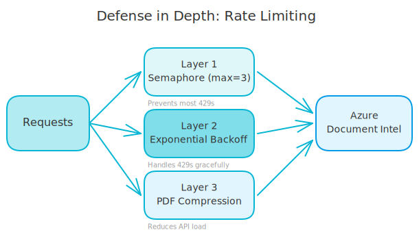
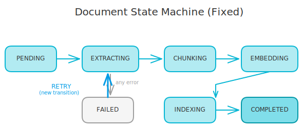

# When Your Document Pipeline Breaks at 3 AM

The alert woke me at 3 AM. A 200-page PDF had broken our document ingestion pipeline in three different ways. Lambda timeout. Azure throttling. State machine crash. Each failure exposed a gap in our architecture.

Here's how we fixed all three - and why the solutions weren't the obvious patches.

<!-- more -->

## The System

Quick context: our RAG system ingests PDFs by extracting text with Azure Document Intelligence, chunking the content, generating embeddings, and indexing to a vector store. A Lambda function handles the processing, triggered by SQS messages.

Most documents worked fine. Then someone uploaded a 200-page PDF.

## Problem 1: Lambda Timeout

### What Broke

Lambda functions have a 15-minute (900 second) maximum timeout. Our 200-page PDF needed 20+ minutes to process. The function timed out, the document stayed half-processed, and retries started from scratch - only to time out again.

The original code treated ingestion as atomic:

```python
async def process_document(document_id: str) -> None:
    document = await repository.get(document_id)
    document.status = DocumentStatus.EXTRACTING

    # Extract all pages (this takes forever for big PDFs)
    pages = await extractor.extract_all_pages(document.file_path)

    document.status = DocumentStatus.CHUNKING
    chunks = await chunker.chunk_pages(pages)

    document.status = DocumentStatus.EMBEDDING
    embeddings = await embedder.embed_chunks(chunks)

    document.status = DocumentStatus.INDEXING
    await vector_store.index(embeddings)

    document.status = DocumentStatus.COMPLETED
    await repository.save(document)
```

No progress saved. If Lambda times out at page 150, you start over at page 1.

### The Bad Patch We Avoided

Increase Lambda timeout to maximum. Hope documents finish in time. This just kicks the problem down the road. What happens with 300-page PDFs?

### The Solution: Checkpointed Progress

We added an `IngestionProgress` domain model that tracks exactly where processing stopped:

```python
class IngestionProgress(BaseModel):
    document_id: str
    current_phase: ProcessingPhase
    pages_extracted: int
    total_pages: int | None
    chunks_processed: int
    total_chunks: int | None
    last_checkpoint: datetime

    def can_resume(self) -> bool:
        return self.current_phase != ProcessingPhase.COMPLETED
```

The processing code now saves checkpoints and can resume:

```python
async def process_document(document_id: str) -> None:
    # Load existing progress or create new
    progress = await progress_repo.get(document_id)
    if not progress:
        progress = IngestionProgress(
            document_id=document_id,
            current_phase=ProcessingPhase.EXTRACTING,
            pages_extracted=0,
            total_pages=None,
            chunks_processed=0,
            total_chunks=None,
            last_checkpoint=datetime.utcnow()
        )

    # Resume from last checkpoint
    if progress.current_phase == ProcessingPhase.EXTRACTING:
        pages = await extract_with_progress(
            document_id,
            start_page=progress.pages_extracted
        )
        progress.pages_extracted = len(pages)
        progress.current_phase = ProcessingPhase.CHUNKING
        await progress_repo.save(progress)

    # Continue with chunking, embedding, indexing...
```

When Lambda times out, the next invocation picks up where we left off. A 200-page PDF might take 3 Lambda invocations instead of 1, but it completes.

## Problem 2: Azure 429 Throttling

### What Broke

Azure Document Intelligence has rate limits. When we processed multiple documents at once, requests piled up and Azure returned 429 (Too Many Requests). Our code logged errors and moved on, leaving documents half-extracted.

```
ERROR: Azure returned 429: Rate limit exceeded
ERROR: Azure returned 429: Rate limit exceeded
ERROR: Azure returned 429: Rate limit exceeded
```

The thundering herd problem. Ten documents start processing, all hit Azure at once, all get throttled.

### The Bad Patch We Avoided

Add fixed sleep delays between requests. This works until you get more traffic, then you're back to throttling. It also wastes time when Azure isn't busy.

### The Solution: Defense in Depth

We added three layers of protection:



**Layer 1: Semaphore for Concurrency**

Limit how many Azure calls can happen at once:

```python
class AzureExtractor:
    def __init__(self, max_concurrent: int = 3):
        self._semaphore = asyncio.Semaphore(max_concurrent)

    async def extract_page(self, page: bytes) -> str:
        async with self._semaphore:
            # Only 3 concurrent calls to Azure
            return await self._call_azure(page)
```

**Layer 2: Exponential Backoff with Tenacity**

When Azure does return 429, retry with increasing delays:

```python
from tenacity import retry, stop_after_attempt, wait_exponential, retry_if_exception

@retry(
    stop=stop_after_attempt(5),
    wait=wait_exponential(multiplier=1, min=4, max=60),
    retry=retry_if_exception(is_rate_limit_error)
)
async def _call_azure(self, page: bytes) -> str:
    response = await self._client.analyze(page)
    return response.content
```

First retry waits 4 seconds, then 8, then 16, up to 60. Most 429s resolve after one or two retries.

**Layer 3: PDF Compression**

Large images in PDFs caused Azure to take longer and use more quota. We compress oversized images before sending:

```python
async def prepare_for_extraction(self, pdf_bytes: bytes) -> bytes:
    if len(pdf_bytes) > MAX_SIZE_BYTES:
        return await self._compress_images(pdf_bytes)
    return pdf_bytes
```

Smaller payload = faster processing = fewer rate limit hits.

## Problem 3: State Machine Crash

### What Broke

Our document has a status that follows a state machine: PENDING → EXTRACTING → CHUNKING → EMBEDDING → INDEXING → COMPLETED. We also have a FAILED state for errors.

When a document failed and the worker retried, it tried to transition from FAILED back to EXTRACTING. Our state machine rejected this:

```python
class DocumentStatus(Enum):
    PENDING = "pending"
    EXTRACTING = "extracting"
    CHUNKING = "chunking"
    EMBEDDING = "embedding"
    INDEXING = "indexing"
    COMPLETED = "completed"
    FAILED = "failed"

VALID_TRANSITIONS = {
    DocumentStatus.PENDING: [DocumentStatus.EXTRACTING, DocumentStatus.FAILED],
    DocumentStatus.EXTRACTING: [DocumentStatus.CHUNKING, DocumentStatus.FAILED],
    DocumentStatus.CHUNKING: [DocumentStatus.EMBEDDING, DocumentStatus.FAILED],
    DocumentStatus.EMBEDDING: [DocumentStatus.INDEXING, DocumentStatus.FAILED],
    DocumentStatus.INDEXING: [DocumentStatus.COMPLETED, DocumentStatus.FAILED],
    DocumentStatus.COMPLETED: [],  # Terminal
    DocumentStatus.FAILED: [],     # Terminal - THIS WAS THE BUG
}
```

FAILED was a terminal state. Once a document failed, it could never be retried.

### The Bad Patch We Avoided

Bypass the state machine validation for retries. Just force the status to EXTRACTING. This defeats the purpose of having a state machine. You lose track of what's happening with documents.

### The Solution: Update Valid Transitions



FAILED shouldn't be terminal. Documents fail for transient reasons (rate limits, timeouts, network issues). They should be retryable:

```python
VALID_TRANSITIONS = {
    DocumentStatus.PENDING: [DocumentStatus.EXTRACTING, DocumentStatus.FAILED],
    DocumentStatus.EXTRACTING: [DocumentStatus.CHUNKING, DocumentStatus.FAILED],
    DocumentStatus.CHUNKING: [DocumentStatus.EMBEDDING, DocumentStatus.FAILED],
    DocumentStatus.EMBEDDING: [DocumentStatus.INDEXING, DocumentStatus.FAILED],
    DocumentStatus.INDEXING: [DocumentStatus.COMPLETED, DocumentStatus.FAILED],
    DocumentStatus.COMPLETED: [],  # Terminal
    DocumentStatus.FAILED: [DocumentStatus.EXTRACTING],  # Can retry from failed
}
```

Now when the worker retries a failed document, the state machine accepts the transition. We also added a retry counter to prevent infinite loops:

```python
class Document(BaseModel):
    id: str
    status: DocumentStatus
    retry_count: int = 0
    max_retries: int = 3

    def can_retry(self) -> bool:
        return (
            self.status == DocumentStatus.FAILED
            and self.retry_count < self.max_retries
        )
```

## Why These Are Solutions, Not Patches

Each fix addresses the root cause:

**Checkpointing** accepts that big documents take time. Instead of fighting Lambda's timeout, we work within it. The system becomes resilient to interruptions from any source - timeouts, crashes, deployments.

**Defense in depth** acknowledges that rate limits are normal. The semaphore prevents most 429s. Backoff handles the ones that slip through. Compression reduces load on the external service. No single layer needs to be perfect.

**State machine updates** recognize that FAILED isn't always permanent. The state machine still enforces valid paths - you can't go from COMPLETED to EXTRACTING. But it now models reality: failed documents can be retried.

The bad patches would have hidden the problems temporarily. These solutions make the system handle them gracefully.

## Key Takeaways

**For long-running processes:** Save progress frequently. Design for interruption. Let the process resume from checkpoints instead of starting over.

**For external services:** Expect rate limits. Limit concurrency before hitting limits. Add exponential backoff for when you do hit them. Reduce payload size when possible.

**For state machines:** Model real-world transitions. Terminal states should only be truly terminal. Add retry counters to prevent infinite loops.

**For production systems:** The first failure shows you what's missing. Each of these problems only appeared with real-world data that our tests didn't cover. Production is the final test environment.

## The 200-Page PDF Now Works

That PDF that broke everything? It processes in about 4 Lambda invocations, handles Azure rate limits gracefully, and recovers from failures automatically. Users don't notice any of this - they just see their document appear in the search results.

The 3 AM alert taught us more about our system than months of normal operation. That's the thing about production failures - they're excellent teachers if you let them be.
