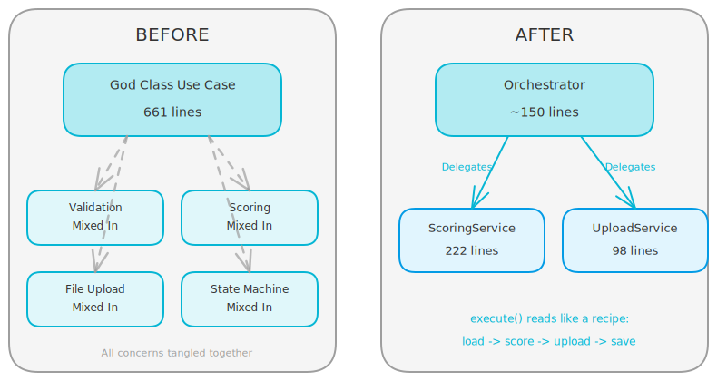
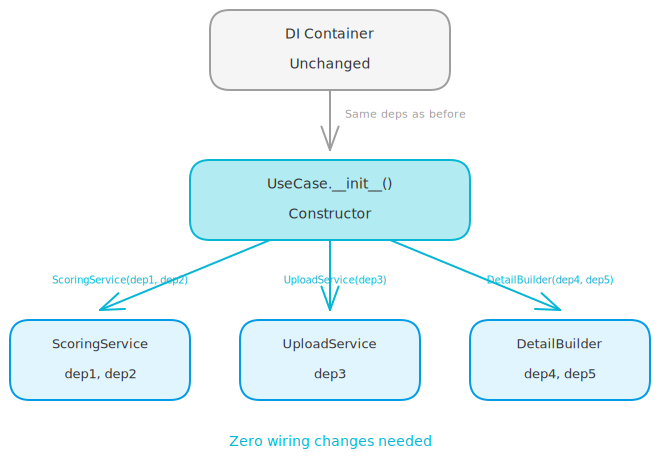

# Five Questions Before You Extract a Service

## The Score That Made Me Rethink Everything

I ran a code quality audit on a production Python app. The score: **F (-257)**.

Not a typo. Negative two hundred and fifty-seven. The main offenders? Four use cases between 430 and 660 lines each, mixing business logic, file uploads, scoring algorithms, and database queries in one giant `execute()` method.

<!-- more -->

The usual reaction is "just extract services." But I've seen that go wrong too many times. You end up with 20 tiny services that are harder to follow than the original god class. Or you extract the wrong things and create circular dependencies.

So before touching any code, I built a checklist. Five questions. If a block of code doesn't pass at least three, it stays in the use case.

Six weeks later, the same audit scored **B+ (82/100)**. A 339-point swing. Here's the framework that got us there.

## The Problem With "Just Extract It"

Every refactoring guide says the same thing: if a class is too big, extract smaller classes. True enough. But which parts do you extract? And where do you draw the boundaries?

I had a use case - 661 lines - that handled submission processing. It validated assessment status, ran scoring algorithms (sync and async), decoded base64 files, uploaded them to cloud storage, and updated state machines. All in one file.

The temptation was to rip out everything into separate services. But not every block of code deserves to be a service. Some logic is glue. Some is orchestration. Extracting glue into its own class just moves the mess around.

I needed a decision filter.

<!-- excalidraw:diagram
id: decomp-before-after-god-class
title: God Class vs Decomposed Use Case
type: layered
components:
  - name: "God Class Use Case"
    type: backend
    technologies: ["661 lines"]
    position: left
  - name: "Validation"
    type: backend
    technologies: ["Mixed In"]
    position: left
  - name: "Scoring"
    type: backend
    technologies: ["Mixed In"]
    position: left
  - name: "File Upload"
    type: backend
    technologies: ["Mixed In"]
    position: left
  - name: "State Machine"
    type: backend
    technologies: ["Mixed In"]
    position: left
  - name: "Orchestrator"
    type: backend
    technologies: ["~150 lines"]
    position: right
  - name: "ScoringService"
    type: backend
    technologies: ["222 lines"]
    position: right
  - name: "UploadService"
    type: backend
    technologies: ["98 lines"]
    position: right
connections:
  - from: "God Class Use Case"
    to: "Validation"
    label: "All tangled"
  - from: "God Class Use Case"
    to: "Scoring"
    label: "All tangled"
  - from: "God Class Use Case"
    to: "File Upload"
    label: "All tangled"
  - from: "God Class Use Case"
    to: "State Machine"
    label: "All tangled"
  - from: "Orchestrator"
    to: "ScoringService"
    label: "Delegates"
  - from: "Orchestrator"
    to: "UploadService"
    label: "Delegates"
description: |
  Left: a 661-line god class mixing all concerns together.
  Right: a thin orchestrator delegating to focused services.
excalidraw:diagram-end -->



## The Five Questions

Before extracting any block of code, I ask these five questions. If a block passes at least three, it becomes its own service. If not, it stays put.

### Question 1: Do These Methods Share a Distinct Sub-Concern?

This is the cohesion test. Look for a group of methods that only talk to each other and share a specific domain concept.

In my 661-line use case, scoring had its own world: plugin selection, sync vs async decision, fallback logic, customer context building. These methods called each other but never touched the assessment status checks or the file upload code.

Attachment upload was even more obvious. Base64 decoding, content type detection, cloud storage resize and push. A self-contained pipeline that happened to live inside a bigger class.

**The signal:** if you can draw a circle around 3-5 methods and that circle doesn't overlap with the rest, you have a cohesive unit.

### Question 2: Does This Logic Need Different Dependencies?

This is the dependency test. Look at what each block of code actually imports and injects.

The scoring block needed a grading engine service and a customer repository. The file upload block needed a storage service. But the orchestrator only needed assessment and entry repositories.

When a block of code requires dependencies that the rest of the use case doesn't touch, that's a strong signal. It means the constructor is bloated because it's serving multiple masters.

**The signal:** if your use case constructor has 8+ dependencies but a specific block only uses 2 of them, extract it.

### Question 3: Could Another Use Case Need This Logic?

This is the reuse test. Not hypothetical "maybe someday" reuse. Actual, concrete reuse you can point to right now.

Score aggregation appeared in three places: results display, export generation, and peer review. Detail building showed up in results and exports. Every time someone added a new feature that needed scores, they copied and pasted the aggregation code.

**The signal:** if you've already copy-pasted this logic or you can name another use case that needs it today, extract it.

### Question 4: Can I Unit-Test This Logic Without Mocking Everything?

This is the testability test. Count the mocks in your test setup.

The original use case needed 8 mocked repositories to test scoring logic. After extraction, the scoring service needs 2. The upload service needs 1. Tests went from 50-line setup functions to 10-line ones.

**The signal:** if testing one behavior requires mocking dependencies for a completely different behavior, those behaviors should live in separate classes.

### Question 5: After Extraction, Does execute() Read Like a Recipe?

This is the orchestrator-only rule. It's the exit criteria. After you extract, the remaining `execute()` method should be a simple sequence of steps: load data, delegate to service, save result.

No business logic inline. No conditional trees. Just coordination.

```python
async def execute(self, command: SubmitEntryCommand) -> EntryResult:
    # Step 1: Load and validate context
    ctx = await self._load_context(command)

    # Step 2: Score the submission
    scoring = await self._scoring.score(
        rule_code=ctx.rule_code,
        raw_data=command.raw_data,
        customer_id=ctx.assessment.customer_id,
        requires_async=ctx.requires_async,
    )

    # Step 3: Upload attachment if present
    await self._attachment.upload_if_present(
        command.raw_data, entry_id
    )

    # Step 4: Save and return
    return await self._save_entry(ctx, scoring)
```

**The signal:** can a new team member read `execute()` and understand the flow in 30 seconds? If yes, you're done.

## The Safe Extraction Pattern

Once you decide to extract, the question becomes: how do you do it without breaking the dependency injection container?

The answer is composition-via-constructor. The use case builds the new service from its existing dependencies. No wiring changes needed.

```python
class SubmitEntryUseCase:
    def __init__(
        self,
        assessment_repo: AssessmentRepository,
        entry_repo: EntryRepository,
        grading_engine: GradingEngineService,
        storage: StorageService,
        customer_repo: CustomerRepository,
    ):
        self._assessment_repo = assessment_repo
        self._entry_repo = entry_repo

        # Compose extracted services from existing deps
        self._scoring = EntryScoringService(
            grading_engine, customer_repo
        )
        self._attachment = AttachmentUploadService(storage)
```

The constructor signature stays identical. The DI container doesn't change. The use case just internally builds the service from dependencies it already had.

This is the key safety property: **zero wiring changes**. You can extract, test, and ship without touching a single config file or DI registration.

<!-- excalidraw:diagram
id: decomp-composition-pattern
title: Composition via Constructor Pattern
type: layered
components:
  - name: "DI Container"
    type: external
    technologies: ["Unchanged"]
    position: top
  - name: "UseCase.__init__()"
    type: backend
    technologies: ["Constructor"]
    position: center
  - name: "ScoringService"
    type: backend
    technologies: ["dep1, dep2"]
    position: bottom
  - name: "UploadService"
    type: backend
    technologies: ["dep3"]
    position: bottom
  - name: "DetailBuilder"
    type: backend
    technologies: ["dep4, dep5"]
    position: bottom
connections:
  - from: "DI Container"
    to: "UseCase.__init__()"
    label: "Same deps as before"
  - from: "UseCase.__init__()"
    to: "ScoringService"
    label: "self._scoring = ScoringService(dep1, dep2)"
  - from: "UseCase.__init__()"
    to: "UploadService"
    label: "self._upload = UploadService(dep3)"
  - from: "UseCase.__init__()"
    to: "DetailBuilder"
    label: "self._builder = DetailBuilder(dep4, dep5)"
description: |
  The DI container injects the same dependencies as before.
  The use case constructor composes extracted services internally.
  Zero wiring changes needed.
excalidraw:diagram-end -->



## The Framework in Action: Three Extractions

Let me show how the five questions play out on real code.

### Extraction 1: Scoring Service (661 to 380 lines)

The 661-line submission use case mixed three concerns: validation, scoring, and file uploads.

| Question | Scoring block | Result |
|----------|--------------|--------|
| Shared sub-concern? | Sync/async decision, plugin execution, fallback logic | Yes |
| Different dependencies? | Needs grading engine + customer repo (rest doesn't) | Yes |
| Reuse potential? | Scoring logic needed in export generation too | Yes |
| Testable in isolation? | Original needed 8 mocks, extracted needs 2 | Yes |
| Recipe-shaped after? | execute() becomes load-score-upload-save | Yes |

**Score: 5/5.** Clear extraction. The scoring service ended up at 222 lines. The upload service at 98 lines. The use case dropped to 380 lines and reads like a recipe.

### Extraction 2: Detail Builder (521 to 189 lines, -64%)

The results use case had two entirely separate sub-problems living in one file:

- **Detail building** (per-entry): fetch rule definitions, build scores with edit overlays, resolve attachment URLs
- **Aggregate calculation** (across-entries): recalculate scores on the fly, classify performance patterns

These blocks shared zero methods. They needed different repositories. And the detail builder had an N+1 query hiding inside it - a definition cache that still called `get_by_id()` per entry instead of batch-fetching.

After extraction, the use case dropped from 521 to 189 lines. The biggest reduction in the whole codebase. And the N+1 fix came free with the extraction because the new `build()` method naturally collected all definition IDs upfront.

```python
# Before: N+1 hidden in a cache dict
for entry in entries:
    if entry.rule_id not in definition_cache:
        definition_cache[entry.rule_id] = (
            await self._definition_repo.get_by_id(entry.rule_id)
        )

# After: batch fetch in the extracted service
definition_ids = {e.rule_id for e in entries}
definitions = await self._definition_repo.list_by_ids(definition_ids)
```

### Extraction 3: Performance Profile Builder (431 to 407 lines)

This one is interesting because the line reduction was small - only 24 lines. But it still passed the framework.

The performance profile builder had its own constants (`TIER_COLORS`, `HIGH_PERCENTILE_THRESHOLD`), its own helper functions, and it only needed an aggregate score plus a localization service. It didn't touch any assessment repository.

| Question | Profile builder | Result |
|----------|----------------|--------|
| Shared sub-concern? | Category scores to visual profile (colors, levels, labels) | Yes |
| Different dependencies? | Only needs localization service | Yes |
| Reuse potential? | Used in results AND peer review | Yes |
| Testable in isolation? | Pure computation, no mocks needed | Yes |
| Recipe-shaped after? | Marginal improvement | Partial |

**Score: 4.5/5.** The extraction was right even though the line count barely moved. The win was testability and reuse, not size.

## What NOT to Extract

The framework also tells you what to leave alone.

Validation checks that inspect assessment status and rule configuration? Those stay. They're glue logic that's specific to the orchestration flow. They don't have separate dependencies. No other use case needs them. Extracting them would create a "ValidationService" that's just a wrapper around three if-statements.

State machine transitions? Stay. They're the core flow of `execute()`. Pulling them out would make the recipe harder to read, not easier.

**The rule:** if a block fails 3 or more questions, it's orchestration glue. Leave it where it is.

## The Results

After applying this framework across four use cases:

| Use Case | Before | After | Reduction |
|----------|--------|-------|-----------|
| Submit Entry | 661 lines | 380 lines | -42% |
| Get Results | 521 lines | 189 lines | -64% |
| Generate Export | 482 lines | 382 lines | -21% |
| Get Peer Review | 431 lines | 407 lines | -6% |

Six new services extracted. Each with 1-2 dependencies instead of 8. Each independently testable.

The audit went from F (-257) to B+ (82). Not because of magic. Because of a repeatable decision filter that kept us from extracting the wrong things.

## The Checklist

Next time you're staring at a 500-line use case, run through these before you touch anything:

1. **Cohesion** - Can you circle a group of methods that only talk to each other?
2. **Dependencies** - Does this block use different dependencies than the rest?
3. **Reuse** - Can you name another use case that needs this logic today?
4. **Testability** - Would extracting this cut your mock count in half?
5. **Orchestrator** - After extraction, does execute() read like a recipe?

Three or more "yes" answers: extract it. Fewer than three: leave it alone.

Then use composition-via-constructor so you don't have to touch your DI wiring.

That's it. No architecture astronautics. Just five questions and a safe extraction pattern.
