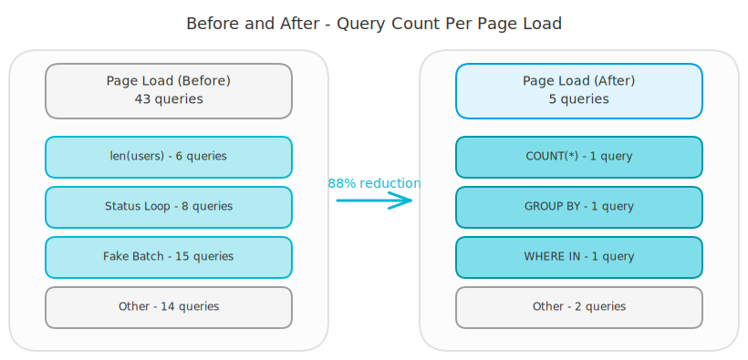
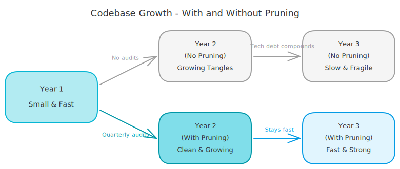

# Prune Your Codebase: 4 Database Patterns That Silently Kill Performance

## 40 Queries for One Page

I ran a performance audit on a FastAPI dashboard last week. One page load triggered **43 database queries**. The page showed a summary with a few counts, a table with statuses, and some metadata. Nothing fancy. Five queries would have been plenty.

The dashboard worked fine in development. Ten users, fifty records - no one noticed. But in production, with real data and real traffic, every page load hammered the database with redundant work.

<!-- more -->

This is what happens when code grows without pruning. Every pattern I found made sense when it was written. A simple loop here, a method reuse there. Small decisions that compound over time until your system is doing ten times the work it needs to.

Codebases grow like trees. Without pruning, branches tangle and compete for resources. Dead wood stays attached. The tree looks full, but most of that growth is waste. Cut the dead branches, and the tree grows faster and stronger.

Here are four dead branches I found. You probably have them too.

## Pattern 1: Loading Everything Just to Count

The dashboard needed to show totals: "15 active users," "238 completed tasks." Simple counters. But the code fetched every record from the database, pulled it into Python, and counted the list.

```python
# Before: load all records, count in Python
users = db.query(User).filter(User.active == True).all()
total = len(users)
```

This loaded 15 user objects with all their columns into memory just to get the number 15. Multiply that by every counter on the page and you're transferring megabytes of data you never read.

The fix is obvious once you see it. Let SQL do the counting.

```python
# After: let the database count
total = db.query(func.count(User.id)).filter(User.active == True).scalar()
```

The database returns a single integer instead of hundreds of rows. The query runs faster, uses less memory, and moves almost no data over the wire.

**Why does this happen?** ORMs make it easy to think in objects instead of queries. You write `get_all()` because the method exists and `len()` feels natural. It works. It passes code review. Nobody questions it until the table has a million rows and the page takes eight seconds to load.

## Pattern 2: One Query Per Item in a Loop

The dashboard displayed a table with status badges. To show them, the code looped through a list of status names and fired one query for each.

```python
# Before: one query per status
for status in ["pending", "active", "completed", "failed"]:
    count = db.query(Item).filter(Item.status == status).count()
    results[status] = count
```

Four statuses, four round trips to the database. With eight statuses, eight round trips. Every round trip has network overhead - connection handshake, query parsing, result marshalling. It adds up fast.

The fix: ask for everything in one shot.

```python
# After: one query for all statuses
rows = (
    db.query(Item.status, func.count(Item.id))
    .filter(Item.status.in_(["pending", "active", "completed", "failed"]))
    .group_by(Item.status)
    .all()
)
results = {status: count for status, count in rows}
```

Eight queries become one. One round trip, one parse, one result set.

**A note about async:** If you're using async Python, you might think "just gather the queries in parallel." That doesn't work well with shared database sessions. Most ORMs tie a session to a single connection, so parallel queries on the same session still run one at a time. The real fix is fewer queries, not parallel queries.

## Pattern 3: The Fake Batch

This one is sneaky. I found a repository method called `get_items_batch()`. The name suggested it was already doing the right thing. It wasn't.

```python
# Before: "batch" that's really a loop
def get_items_batch(self, ids: list[int]):
    return [self.get_by_id(id) for id in ids]
```

Each call to `get_by_id()` fired a separate database query. Pass in 15 IDs, get 15 queries. The method name created a false sense of security. It looked batched from the outside. Inside, it was the classic N+1 problem wearing a trench coat.

Think of it like this: you need the names of 15 people in an office building. The N+1 approach walks to the building, asks for one name, walks back, then walks to the building again for the next name. Fifteen round trips. A real batch walks to the building once and asks for all 15 names.

```python
# After: actual batch query
def get_items_batch(self, ids: list[int]):
    items = db.query(Item).filter(Item.id.in_(ids)).all()
    return {item.id: item for item in items}
```

One query. One round trip. The lookup dict makes it easy to map results back to the original order.

**Impact:** 15 queries dropped to 1. Across the full page load, this pattern alone cut query count by a third.

## Pattern 4: Dev Defaults in Production

The first three patterns were about query count. This one is about infrastructure. The database connection pool was still running with default settings.

```python
# Default: fine for local dev, risky in production
engine = create_engine("postgresql://...")
```

No pool size configured. No connection timeout. No recycling. Defaults are designed for local development where you have one user and a database on localhost. In production, with dozens of concurrent users, defaults cause problems you can't see in your logs.

Connections go stale. The pool runs out under load. Requests hang waiting for a free connection but there's no timeout, so they wait forever.

```python
# After: tuned for production
engine = create_engine(
    "postgresql://...",
    pool_size=10,
    max_overflow=20,
    pool_timeout=30,
    pool_recycle=1800,
)
```

This sets clear boundaries. Ten persistent connections, up to twenty during spikes. Thirty-second timeout so requests fail fast instead of hanging. Connections recycle every 30 minutes so stale ones get replaced.

**Why is this invisible?** Because it works fine until it doesn't. Your staging environment has three users. Your production has three hundred. The failure mode isn't errors - it's slowness that builds gradually until someone notices the dashboard "feels sluggish."

<!-- excalidraw:diagram
id: prune-before-after-queries
title: Before and After - Query Count Per Page Load
type: system-overview
components:
  - name: "Page Load (Before)"
    type: backend
    technologies: ["43 queries"]
    position: left
  - name: "len(users)"
    type: backend
    technologies: ["Pattern 1: 6 queries"]
    position: left
  - name: "Status Loop"
    type: backend
    technologies: ["Pattern 2: 8 queries"]
    position: left
  - name: "Fake Batch"
    type: backend
    technologies: ["Pattern 3: 15 queries"]
    position: left
  - name: "Other Queries"
    type: backend
    technologies: ["14 queries"]
    position: left
  - name: "Page Load (After)"
    type: backend
    technologies: ["5 queries"]
    position: right
  - name: "COUNT(*)"
    type: database
    technologies: ["Pattern 1: 1 query"]
    position: right
  - name: "GROUP BY"
    type: database
    technologies: ["Pattern 2: 1 query"]
    position: right
  - name: "WHERE IN"
    type: database
    technologies: ["Pattern 3: 1 query"]
    position: right
  - name: "Other"
    type: database
    technologies: ["2 queries"]
    position: right
connections:
  - from: "Page Load (Before)"
    to: "Page Load (After)"
    label: "88% reduction"
excalidraw:diagram-end -->



## The Pruning Habit

None of these patterns were bugs. Every one passed code review. Every one worked correctly with small data sets. They only became problems when the system grew.

That's the thing about dead branches. They don't look dead until the tree is big enough that they start stealing resources from the healthy parts. A `len()` call on 50 records takes milliseconds. On 50,000 records, it takes seconds. The code didn't change. The data did.

The fix isn't just knowing these four patterns. It's building a habit of regular pruning. Schedule a performance audit once a quarter. Pick one page or endpoint. Count the queries. Look at the connection pool. Check what data moves between the database and your application.

You'll almost always find dead wood. Not because anyone wrote bad code, but because code that was right at one scale becomes wrong at another. The patterns that got you to your first hundred users will hold you back at a thousand.

<!-- excalidraw:diagram
id: prune-codebase-growth-metaphor
title: Codebase Growth - With and Without Pruning
type: layered
components:
  - name: "Year 1"
    type: backend
    technologies: ["Small & Fast"]
    position: left
  - name: "Year 2 (No Pruning)"
    type: backend
    technologies: ["Growing Tangles"]
    position: center-top
  - name: "Year 3 (No Pruning)"
    type: backend
    technologies: ["Slow & Fragile"]
    position: right-top
  - name: "Year 2 (With Pruning)"
    type: backend
    technologies: ["Clean & Growing"]
    position: center-bottom
  - name: "Year 3 (With Pruning)"
    type: backend
    technologies: ["Fast & Strong"]
    position: right-bottom
connections:
  - from: "Year 1"
    to: "Year 2 (No Pruning)"
    label: "No audits"
  - from: "Year 2 (No Pruning)"
    to: "Year 3 (No Pruning)"
    label: "Tech debt compounds"
  - from: "Year 1"
    to: "Year 2 (With Pruning)"
    label: "Quarterly audits"
  - from: "Year 2 (With Pruning)"
    to: "Year 3 (With Pruning)"
    label: "Stays fast"
excalidraw:diagram-end -->



## Start With One Page

You don't need a week-long audit. Pick your slowest dashboard page. Add query logging. Count the queries per request. The number will surprise you.

Then look for these four patterns: counting in Python instead of SQL, loops that fire one query per iteration, "batch" methods that are really loops in disguise, and connection pools still running on default settings.

Forty-three queries became five. The dashboard went from sluggish to instant. And the best part? Each fix was small. A `COUNT(*)` here, a `WHERE IN` there, a few pool settings. No rewrites. No new frameworks. Just pruning the dead branches so the tree can grow.
