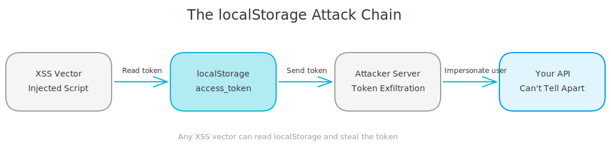
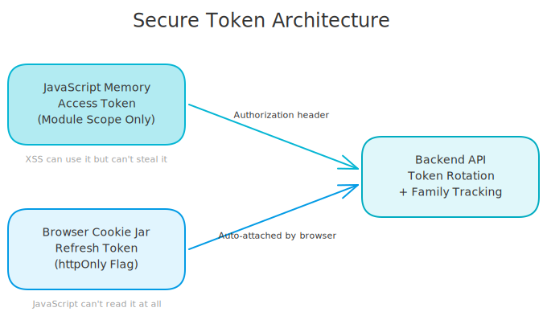
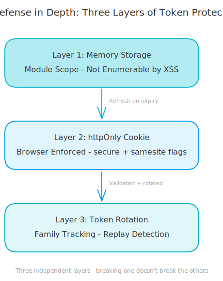

# Stop Storing Tokens in localStorage - A Lesson I Keep Re-Learning

Every app I build with AI assistance starts the same way. I describe the auth flow, the AI scaffolds a login system, and somewhere in the generated code there's a line like `localStorage.setItem('access_token', token)`. It works. The app feels fast. Refreshing the page keeps you logged in. And every single time, I ship it without thinking twice.

Then a few weeks later, I actually look at the security model. And every single time, I get the same gut punch: any JavaScript running on my page can steal that token with one line of code.

<!-- more -->

## The Convenience Trap

Here's why this keeps happening. localStorage is the easiest persistence mechanism in the browser. It's synchronous, it survives page refreshes, and every framework tutorial uses it for token storage. When you're building fast, especially with AI-generated code, you reach for what works. And localStorage *works* - it just works for attackers too.

The problem is simple. localStorage is a global, same-origin key-value store. Any JavaScript running on your domain can read every key. Your app code, a third-party analytics script, a compromised npm package, a browser extension with page access, all of them share the same localStorage.

So if an attacker finds any XSS vector on your site, they can read your users' tokens and send them anywhere. One line is all it takes. The stolen JWT lets them impersonate your user from any machine, any location, until that token expires. Your backend can't tell the difference between the real user and the attacker.

<!-- excalidraw:diagram
id: token-theft-attack-chain
title: The localStorage Attack Chain
type: custom
components:
  - name: "XSS Vector"
    type: external
    technologies: ["Injected Script", "Compromised Dep"]
    position: left
  - name: "localStorage"
    type: frontend
    technologies: ["access_token", "Globally Readable"]
    position: center
  - name: "Attacker Server"
    type: external
    technologies: ["Token Exfiltration"]
    position: right
  - name: "Your API"
    type: backend
    technologies: ["Can't Tell the Difference"]
    position: right
connections:
  - from: "XSS Vector"
    to: "localStorage"
    label: "Read token"
  - from: "localStorage"
    to: "Attacker Server"
    label: "Send token"
  - from: "Attacker Server"
    to: "Your API"
    label: "Impersonate user"
description: |
  Any XSS vector can read localStorage, steal the token, and impersonate the user.
excalidraw:diagram-end -->

## Why AI-Assisted Code Makes This Worse

This is the pattern I keep bumping into. When you build with AI assistance, you move fast. The AI generates working code based on common patterns it's seen in training data - and localStorage token storage is one of the most common patterns in tutorials, Stack Overflow answers, and open-source projects.

The AI isn't wrong. The code works. But "works" and "secure" are two different things.

I've built three apps now where this exact scenario played out. The AI scaffolds the auth flow, localStorage stores the token, everything runs great. Then during a security review, I realize the same vulnerability exists again. Every time I think "I know this already" and every time I let the convenience slip through.

The real lesson isn't about localStorage. It's about the gap between working code and production-ready code. AI tools are amazing at getting you to "it works" fast. But they optimize for the happy path. Security, edge cases, defense-in-depth, those are your job to catch.

## The Fix: Memory + httpOnly Cookies

The solution is surprisingly simple once you understand the threat model.

**Access tokens go in memory.** Not localStorage, not sessionStorage, just a regular JavaScript variable. A module-scoped `let` that lives only as long as the page is open. XSS scripts can't enumerate or read variables inside another module's scope.

**Refresh tokens go in httpOnly cookies.** The backend sets a cookie with the `httpOnly` flag, which means the browser will send it with requests automatically, but JavaScript literally cannot read it. `document.cookie` won't show it. No script can access it. The browser enforces this boundary at the engine level.

<!-- excalidraw:diagram
id: secure-token-architecture
title: Secure Token Architecture
type: layered
components:
  - name: "JavaScript Memory"
    type: frontend
    technologies: ["Access Token", "Module Scope Only"]
    position: left
  - name: "Browser Cookie Jar"
    type: frontend
    technologies: ["Refresh Token", "httpOnly Flag"]
    position: center
  - name: "Backend API"
    type: backend
    technologies: ["Token Rotation", "Family Tracking"]
    position: right
connections:
  - from: "JavaScript Memory"
    to: "Backend API"
    label: "Authorization header"
  - from: "Browser Cookie Jar"
    to: "Backend API"
    label: "Auto-attached by browser"
description: |
  Access token in memory (JS can use it but XSS can't steal it from another module).
  Refresh token in httpOnly cookie (browser manages it, JS can't read it at all).
excalidraw:diagram-end -->

## The Trade-Off You're Actually Making

There's one downside: page refreshes. When you store tokens in localStorage, a page refresh is instant because the token is right there. When you store the access token in memory, it disappears on refresh. The app needs to call a refresh endpoint to get a new access token using the httpOnly cookie.

That costs about 200ms. That's it. 200ms on page refresh versus "any XSS can steal your users' sessions."

This is the correct trade-off every time, and it's not close. If someone ever tells you "but localStorage is faster on refresh," they're comparing a convenience feature to a security boundary. Those aren't in the same category.

## Three Layers, Not One

What makes this pattern strong isn't any single piece. It's the layers working together.

**Layer 1: In-memory tokens.** XSS can't read module-scoped variables from other modules. Even if an attacker runs code on your page, they can't enumerate what's inside your token service.

**Layer 2: httpOnly cookies.** The browser enforces this. It's not a JavaScript convention or a library feature. The browser engine itself excludes httpOnly cookies from `document.cookie`. Combined with `secure` (HTTPS only) and `samesite` (no cross-site requests), the cookie is locked down at three levels.

**Layer 3: Token rotation with family tracking.** Every time a refresh token is used, it gets revoked and replaced. If someone somehow obtains a refresh token (physical access to the machine, for example) and tries to use it after the real user already rotated it, the backend detects the reuse and kills the entire token family. All sessions invalidated. The attacker and the user both get logged out, which is the safe thing to do.

Any one of these layers might have a gap. All three together make token theft very difficult.

<!-- excalidraw:diagram
id: defense-in-depth-layers
title: Defense in Depth - Three Layers of Token Protection
type: layered
components:
  - name: "Layer 1: Memory Storage"
    type: frontend
    technologies: ["Module Scope", "Not Enumerable"]
    position: left
  - name: "Layer 2: httpOnly Cookie"
    type: frontend
    technologies: ["Browser Enforced", "secure + samesite"]
    position: center
  - name: "Layer 3: Token Rotation"
    type: backend
    technologies: ["Family Tracking", "Replay Detection"]
    position: right
connections:
  - from: "Layer 1: Memory Storage"
    to: "Layer 2: httpOnly Cookie"
    label: "Refresh on expiry"
  - from: "Layer 2: httpOnly Cookie"
    to: "Layer 3: Token Rotation"
    label: "Validated + rotated"
description: |
  Three independent layers. Breaking one doesn't break the others.
excalidraw:diagram-end -->

## The Checklist I Now Follow

After making the same mistake across multiple projects, I wrote down six rules. They're simple, but I clearly need them written down because knowing them intellectually didn't stop me from shipping the vulnerability.

1. **Never store secrets in localStorage or sessionStorage.** Both are readable by any JS on the same origin.
2. **Access tokens go in memory only.** Module-scoped variables, React state, or non-persisted store state.
3. **Refresh tokens go in httpOnly cookies.** Set by the backend, never touched by frontend code.
4. **Use the refresh flow for persistence.** The 200ms cost on page refresh is always worth it.
5. **Audit your state persistence.** If you use Zustand, Redux Persist, or similar, make sure tokens are excluded from what gets persisted.
6. **Question every `localStorage.setItem` call.** Ask "is this value sensitive?" before persisting anything.

## The Bigger Lesson

This isn't really a post about localStorage. It's about a pattern I see in AI-assisted development.

AI tools generate code that works on the happy path. They're trained on millions of examples, and the most common examples prioritize getting things running over getting things secure. That's not a flaw. That's what you want when you're prototyping.

But at some point, you have to switch from "make it work" to "make it safe." And that switch requires you to actually understand the security model of what you're building. You can't outsource that to the AI. You need to know *why* localStorage is dangerous, not just that someone told you to use cookies instead.

Every project teaches me this lesson again in a slightly different way. This time it was auth tokens. Next time it'll be something else. The pattern stays the same: the code that feels easy and obvious is often the code that's missing a critical security boundary.

Build fast, then check your boundaries. That's the rhythm that works.
