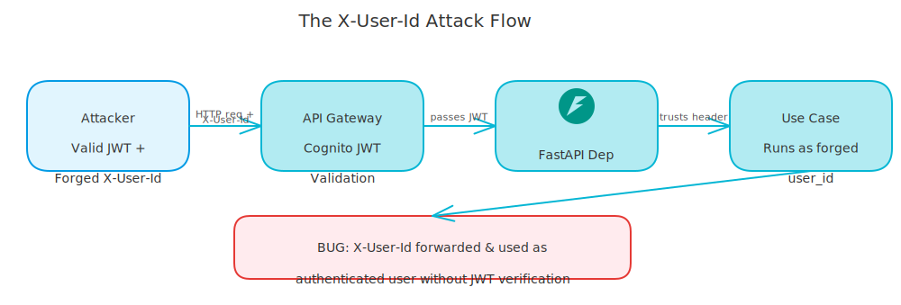
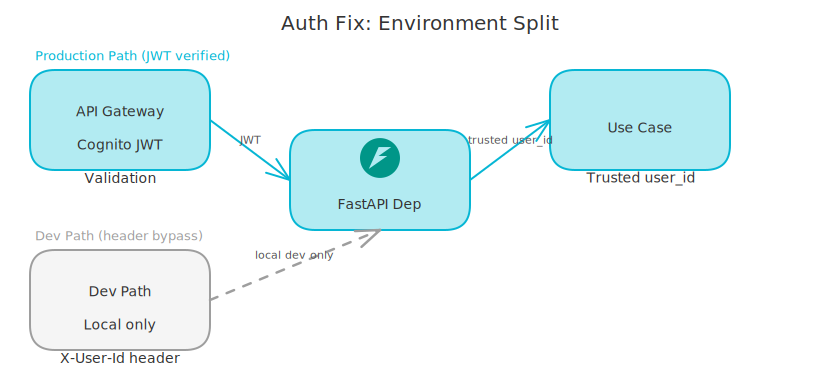

# The Auth Bug That Let Any User Read Any Document

*How a dev shortcut shipped to production and gave every user access to every document.*

---

For weeks, my RAG backend had a critical security flaw in production. Any authenticated user could read any other user's documents, just by setting a single HTTP header. The bug wasn't in the auth library or a JWT misconfiguration. It was a development convenience I forgot to gate.

I'm writing this down because the pattern is more common than you'd think. The fix is dead simple once you know what you're looking for.

<!-- more -->

## How It Happened

When I was building the project locally, I needed a way to test requests without wiring up the full Cognito authentication stack. So I added a simple convention: send an `X-User-Id` header with your user ID, and the API will trust it.

The FastAPI dependency looked like this:

```python
async def get_request_context(
    x_user_id: str | None = Header(None, alias="X-User-Id"),
) -> RequestContext:
    if not x_user_id:
        raise HTTPException(status_code=400, detail="X-User-Id header required")
    return RequestContext(user_id=UserId(UUID(x_user_id)))
```

This worked great for local development. You spin up the server, send `X-User-Id: <your-uuid>`, done.

The problem: I deployed it to production with the same logic.

In production, requests go through API Gateway with a Cognito JWT authorizer. The token is validated. But nothing stopped an authenticated user, one whose token was perfectly valid, from also sending `X-User-Id: <someone-else-uuid>`. The API would use the header value, not the JWT.

So the authorization check in every use case:

```python
if collection.created_by != ctx.user_id:
    raise AuthorizationError("You do not have access to this document")
```

...was comparing the right thing to the wrong thing. The `ctx.user_id` came from a header, not from the verified JWT. Any user who knew (or guessed) another user's UUID had full read access to their collections and documents.

<!-- excalidraw:diagram
id: auth-bypass-attack-flow
title: The X-User-Id Attack Flow
type: custom
components:
  - name: "Attacker"
    type: external
    technologies: ["Valid JWT", "Forged X-User-Id"]
    position: left
  - name: "API Gateway"
    type: backend
    technologies: ["Cognito JWT Validation", "Token is valid"]
    position: center
  - name: "FastAPI Dependency"
    type: backend
    technologies: ["Reads X-User-Id header", "Ignores JWT sub"]
    position: center
  - name: "Use Case"
    type: backend
    technologies: ["Compares wrong identity", "Access granted"]
    position: right
connections:
  - from: "Attacker"
    to: "API Gateway"
    label: "Sends valid JWT + X-User-Id: victim-uuid"
  - from: "API Gateway"
    to: "FastAPI Dependency"
    label: "Passes request through"
  - from: "FastAPI Dependency"
    to: "Use Case"
    label: "ctx.user_id = victim-uuid"
description: |
  JWT is validated at the gateway but the identity used downstream came from
  a client-controlled header, not the JWT claims.
excalidraw:diagram-end -->



## Why This Pattern Is Dangerous

The mistake follows a predictable pattern: build a dev shortcut, intend to remove it, forget.

HTTP headers are controlled by the client. Any header you accept and trust is a header that can be forged. `X-User-Id`, `X-Admin`, `X-Internal-Request`,  I've seen all of these used as trust signals in production APIs. They feel authoritative because they look like real headers. They aren't.

**The only trusted user identity in a JWT-protected API is what's in the JWT claims.** API Gateway validates the signature and expiry. The `sub` claim inside is what you validated. Everything else is client-controlled noise.

## The Fix

The fix was splitting the dependency on `settings.is_production`. In production, extract from JWT claims. In local dev, fall back to the header with a clear warning.

```python
def _extract_user_id_from_jwt(request: Request) -> str | None:
    """Extract the verified user ID from the JWT claims injected by the authorizer."""
    claims = _get_jwt_claims(request)
    return claims.get("sub")


async def get_request_context(
    request: Request,
    x_user_id: str | None = Header(None, alias="X-User-Id"),
) -> RequestContext:
    if settings.is_production:
        jwt_user_id = _extract_user_id_from_jwt(request)
        if not jwt_user_id:
            raise HTTPException(status_code=401, detail="Valid JWT required")
        user_id = jwt_user_id
    else:
        if not x_user_id:
            raise HTTPException(status_code=400, detail="X-User-Id required for local dev")
        user_id = x_user_id

    return RequestContext(user_id=UserId(UUID(user_id)))
```

In production, the `X-User-Id` header is read but never used. Even if you send it, the code ignores it and goes straight to the JWT claims. The `is_production` branch doesn't even reach the header variable.

## Authorization Lives in the Use Case

The JWT fix only solves authentication - confirming who you are. Authorization - what you're allowed to do - was already there in every use case, but it was checking the wrong identity.

Once `ctx.user_id` comes from the validated JWT, the ownership check works correctly:

```python
# From IngestDocumentUseCase
if collection.created_by != ctx.user_id:
    raise AuthorizationError("You do not have access to this document")
```

The key design decision: **authorization lives in the use case, not the route.** Routes are thin - they extract context and call use cases. The business rule "you can only access resources you own" belongs in application logic, where it gets enforced consistently regardless of which route triggered it.

If you put authorization in routes, you'll miss cases. Internal jobs, background workers, admin endpoints - they all eventually call the same use cases. If authorization is in the use case, those paths are all protected by default.

I added a dedicated `AuthorizationError` exception in the shared domain layer. It carries `resource_type` and `resource_id` for security logging, but those details are never sent to the client in production. That's filtered at the API layer - structured errors for logging, generic messages for clients.

<!-- excalidraw:diagram
id: auth-fix-environment-split
title: Corrected Auth Flow - JWT vs Dev Header
type: custom
components:
  - name: "Production Path"
    type: backend
    technologies: ["settings.is_production = True", "JWT claims only"]
    position: left
  - name: "API Gateway"
    type: backend
    technologies: ["Cognito JWT Authorizer", "Token validated"]
    position: left
  - name: "FastAPI Dependency"
    type: backend
    technologies: ["Reads JWT sub claim", "Ignores X-User-Id"]
    position: center
  - name: "Dev Path"
    type: external
    technologies: ["settings.is_production = False", "X-User-Id header"]
    position: right
  - name: "Use Case"
    type: backend
    technologies: ["ctx.user_id from JWT", "Ownership check correct"]
    position: center
connections:
  - from: "API Gateway"
    to: "FastAPI Dependency"
    label: "JWT sub claim"
  - from: "FastAPI Dependency"
    to: "Use Case"
    label: "Trusted identity"
  - from: "Dev Path"
    to: "FastAPI Dependency"
    label: "Local dev only"
description: |
  In production, identity comes exclusively from JWT claims.
  The X-User-Id header is only read in local development.
excalidraw:diagram-end -->



## What I'd Do Differently

Ship with environment-aware identity extraction from day one. The pattern is simple:

1. In production: identity from JWT claims only
2. In dev: identity from a trusted header (document this explicitly as dev-only)
3. Never mix both in the same code path

The dev header is fine as a mechanism. The mistake was letting the production code path even look at it.

Also: write a test that explicitly verifies that `X-User-Id` in a production request doesn't affect the identity used for authorization. If that test had existed, a CI run would have caught this before deployment. That's the version of this I keep on my security review checklist now.

## The Broader Pattern

This class of bug - "dev convenience that ships to production" - is incredibly common. SQL query logging that includes sensitive data. Debug endpoints left accessible. Feature flags that default to enabled. Unauthenticated admin routes "for testing."

The fix is the same in every case: explicitly gate behavior on an environment check, and make the environment distinction clear in code. Don't rely on "we'll remember to change this before production."

`settings.is_production` in the dependency makes the intention obvious: one path for production, one for local dev. The boundary is explicit, auditable, and easy to test for both cases. If the check is there in code, it can't slip through a deploy.
