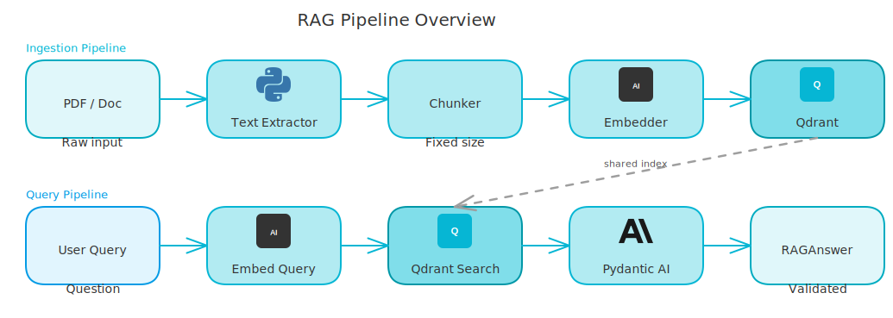
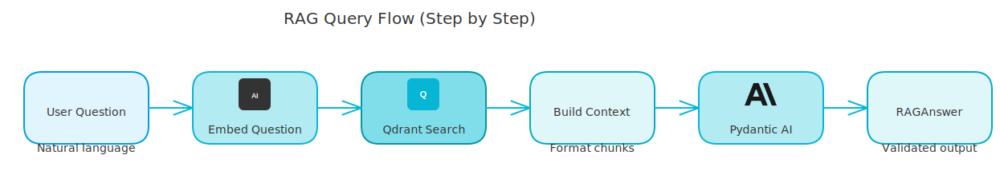

# Build a RAG Pipeline from Scratch in Python - No Magic

*Every step explicit, every abstraction visible, zero framework magic.*

---

Most RAG tutorials hide the details behind framework wrappers. You call `vector_store.from_documents()` and something happens. You don't know what. When it breaks in production, you have no idea where to look.

This isn't that tutorial. I'm going to build the core RAG pipeline manually: extract text, chunk it, embed it, store it in Qdrant, then retrieve and answer. Every piece explicit, no hidden abstraction.

<!-- more -->

The code here is extracted from a production RAG system I built. Simplified for clarity, but the patterns are real. By the end, you'll understand what those wrappers actually do - and why it matters.

## What I'm Building

```
Document → Extract text → Chunk → Embed → Store in Qdrant
                                              ↓
User question → Embed question → Search Qdrant → Feed chunks to LLM → Structured answer
```

Six steps. Let's do each one.

<!-- excalidraw:diagram
id: rag-pipeline-overview
title: RAG Pipeline - Ingestion and Query
type: ai-pipeline
components:
  - name: "PDF / Document"
    type: external
    technologies: ["pypdf", "Any format"]
    position: left
  - name: "Text Extractor"
    type: backend
    technologies: ["pypdf", "Plain text output"]
    position: left
  - name: "Chunker"
    type: backend
    technologies: ["1000 chars", "200 overlap"]
    position: center
  - name: "Embedder"
    type: backend
    technologies: ["Ollama nomic-embed-text", "768-dim vectors"]
    position: center
  - name: "Qdrant"
    type: backend
    technologies: ["Vector DB", "Cosine similarity"]
    position: center
  - name: "User Query"
    type: external
    technologies: ["Plain question"]
    position: left
  - name: "LLM (Pydantic AI)"
    type: backend
    technologies: ["ollama:llama3.2", "Structured output"]
    position: right
  - name: "RAGAnswer"
    type: backend
    technologies: ["answer_text", "citations", "confidence"]
    position: right
connections:
  - from: "PDF / Document"
    to: "Text Extractor"
    label: "read file"
  - from: "Text Extractor"
    to: "Chunker"
    label: "raw text"
  - from: "Chunker"
    to: "Embedder"
    label: "chunks"
  - from: "Embedder"
    to: "Qdrant"
    label: "vectors + payload"
  - from: "User Query"
    to: "Embedder"
    label: "embed question"
  - from: "Qdrant"
    to: "LLM (Pydantic AI)"
    label: "top-k chunks"
  - from: "LLM (Pydantic AI)"
    to: "RAGAnswer"
    label: "validated output"
description: |
  Top path: ingestion. Bottom path: query.
  Both share the same embedding step.
excalidraw:diagram-end -->



## Step 1: Extract Text from a PDF

Text extraction is the least glamorous part. You need to get raw text out of a PDF without losing structure. The simplest approach that works without an API:

```python
import pypdf

def extract_text_from_pdf(file_path: str) -> str:
    """Extract all text from a PDF file."""
    with open(file_path, "rb") as f:
        reader = pypdf.PdfReader(f)
        pages = []
        for page in reader.pages:
            text = page.extract_text()
            if text:
                pages.append(text.strip())
    return "\n\n".join(pages)
```

PyPDF handles simple text-based PDFs. For scanned PDFs, tables, or complex layouts, you'd need Azure Document Intelligence or Docling - but for getting started, this works fine.

## Step 2: Chunk the Text

You can't embed an entire document in one vector - context windows have limits, and you'd lose retrieval precision. Chunking splits the text into overlapping segments.

Overlap matters: if a relevant sentence sits at the boundary between two chunks, overlap ensures it appears in at least one chunk with full context around it.

```python
def chunk_text(text: str, chunk_size: int = 1000, chunk_overlap: int = 200) -> list[str]:
    """Split text into overlapping chunks."""
    chunks = []
    start = 0
    while start < len(text):
        end = start + chunk_size
        chunks.append(text[start:end].strip())
        start = end - chunk_overlap
    return [c for c in chunks if c]
```

In production, I use LangChain's `RecursiveCharacterTextSplitter` which handles separator-aware splitting (tries `\n\n`, then `\n`, then `.`, then space). The concept is identical - it's just smarter about where to cut.

## Step 3: Generate Embeddings with Ollama

Embeddings convert text into dense vectors where semantically similar texts land close together in the vector space. This is what makes semantic search possible - you're searching by meaning, not keywords.

I'll use Ollama running locally with `nomic-embed-text`. Call `ollama.AsyncClient().embed()` on each chunk and collect the results. `nomic-embed-text` produces 768-dimensional vectors - that number matters when you create your Qdrant collection. For production, swap for Azure OpenAI (`text-embedding-ada-002`, 1536 dimensions) or Anthropic's embedding API. The interface - text in, list of floats out - stays the same regardless of provider.

## Step 4: Store in Qdrant

Qdrant is a vector database. You store points (vectors + payload metadata), and later search for the closest points to a query vector.

First, create a collection with `VectorParams` matching your embedding dimensions (768 for `nomic-embed-text`). Then store the chunks:

```python
from qdrant_client import QdrantClient
from qdrant_client.models import PointStruct
import uuid

def store_chunks(
    client: QdrantClient,
    collection_name: str,
    chunks: list[str],
    embeddings: list[list[float]],
    document_id: str,
) -> None:
    points = [
        PointStruct(
            id=str(uuid.uuid4()),
            vector=embedding,
            payload={"content": chunk, "document_id": document_id, "chunk_index": i},
        )
        for i, (chunk, embedding) in enumerate(zip(chunks, embeddings))
    ]
    client.upsert(collection_name=collection_name, points=points)
```

The payload is arbitrary JSON - attach whatever metadata helps at retrieval time. In production I store `collection_id`, `document_id`, `page_number`, and `chunk_index`. At minimum, you need the content and something to identify where it came from.

## Step 5: Search for Relevant Chunks

Given a user's question, embed it and find the closest stored chunks:

```python
def search_chunks(
    client: QdrantClient,
    collection_name: str,
    query_embedding: list[float],
    top_k: int = 5,
) -> list[dict]:
    results = client.query_points(
        collection_name=collection_name,
        query=query_embedding,
        limit=top_k,
        with_payload=True,
    )
    return [
        {"content": point.payload["content"], "score": point.score}
        for point in results.points
    ]
```

You can add `query_filter` to scope results to a specific document using Qdrant's `Filter` and `FieldCondition` - useful in multi-document collections.

Cosine similarity scores run from -1 to 1. In practice, retrieval usually returns scores above 0.7 for relevant content. Below 0.5 is usually noise - the model is stretching to find anything even vaguely related.

## Step 6: Generate a Structured Answer

The retrieved chunks become context for the LLM. The key decision here: ask for structured output, not free text. That way you get the answer, the citations, and a confidence score as typed data - not a string you have to parse.

The system prompt tells the model to answer only from the provided chunks, cite them by number, and admit when the context is insufficient.

```python
from pydantic import BaseModel, Field
from pydantic_ai import Agent

class RAGAnswer(BaseModel):
    answer_text: str = Field(description="The answer based on the provided context")
    cited_chunk_indices: list[int] = Field(
        default_factory=list,
        description="Which chunks (1-indexed) support this answer"
    )
    confidence_score: float = Field(
        ge=0.0, le=1.0,
        description="How confident the model is (0=not confident, 1=very confident)"
    )

agent = Agent("ollama:llama3.2", output_type=RAGAnswer, retries=2, system_prompt=SYSTEM_PROMPT)

async def answer_question(query: str, chunks: list[dict]) -> RAGAnswer:
    context = "\n\n".join(f"[{i+1}] {chunk['content']}" for i, chunk in enumerate(chunks))
    result = await agent.run(f"Context:\n{context}\n\nQuestion: {query}")
    return result.data  # Typed as RAGAnswer - no JSON parsing needed
```

`output_type=RAGAnswer` tells Pydantic AI to instruct the model to return valid JSON matching the schema, validate it, and retry up to twice if validation fails. You get back a proper Python object. If the model returns malformed JSON or misnames a field, Pydantic AI catches it and retries with the error as feedback.

Wiring it together is straightforward: call `extract_text_from_pdf`, pipe into `chunk_text`, embed with `embed_texts`, store with `store_chunks`. For queries, embed the question with the same model, call `search_chunks`, and pass the results to `answer_question`. Each function is independent - you can test and swap them individually.

<!-- excalidraw:diagram
id: rag-query-flow
title: RAG Query Flow - Question to Structured Answer
type: ai-pipeline
components:
  - name: "User Question"
    type: user
    technologies: ["Plain text query"]
    position: left
  - name: "Embed Question"
    type: backend
    technologies: ["nomic-embed-text", "768-dim vector"]
    position: left
  - name: "Qdrant Search"
    type: database
    technologies: ["Cosine similarity", "top-k chunks"]
    position: center
  - name: "Build Context"
    type: backend
    technologies: ["Format chunks", "Add indices"]
    position: center
  - name: "Pydantic AI Agent"
    type: ai
    technologies: ["ollama:llama3.2", "output_type=RAGAnswer"]
    position: right
  - name: "RAGAnswer"
    type: backend
    technologies: ["answer_text", "citations", "confidence"]
    position: right
connections:
  - from: "User Question"
    to: "Embed Question"
    label: "same model as ingestion"
  - from: "Embed Question"
    to: "Qdrant Search"
    label: "query vector"
  - from: "Qdrant Search"
    to: "Build Context"
    label: "scored chunks"
  - from: "Build Context"
    to: "Pydantic AI Agent"
    label: "context + question"
  - from: "Pydantic AI Agent"
    to: "RAGAnswer"
    label: "validated output"
description: |
  Query path: embed the question, search Qdrant, build context,
  generate structured answer with citations via Pydantic AI.
excalidraw:diagram-end -->



## What You Need Running

Before running this, you need three things:

1. **Qdrant**: `docker run -p 6333:6333 qdrant/qdrant`
2. **Ollama**: Install from `ollama.com`, then `ollama pull nomic-embed-text` and `ollama pull llama3.2`
3. **Python packages**: `uv add pypdf qdrant-client pydantic-ai ollama`

That's the complete local RAG stack. No API keys. No paid services. Everything runs on your machine.

## What Production Adds on Top

The production version of this pipeline adds several layers to the same core pattern:

- **Azure Document Intelligence** instead of PyPDF - handles scanned docs, tables, complex layouts
- **Checkpointed ingestion** - resumes if Lambda times out mid-pipeline (the state machine I wrote about [separately](../2026-02-24-rag-ingestion-pipeline-checkpointing))
- **Per-collection configuration** - chunk size, embedding model, LLM model per collection
- **Authorization** - JWT-based user authentication, ownership checks at every use case
- **Multi-provider support** - swap Ollama for Anthropic or Azure OpenAI via DI container

The core pattern - extract, chunk, embed, store, retrieve, generate - is identical across dev and prod. Every production addition solves a specific operational problem, not a new conceptual problem.

## The Key Insight

**RAG isn't magic. It's a retrieval problem dressed as an AI problem.** You store document knowledge as vectors, find the relevant ones at query time, and use them as context for an LLM that generates a response.

The LLM doesn't learn from your documents. It reads the retrieved chunks like a reference - just much faster than you can.

Once you understand that, the rest is engineering: making retrieval accurate, ingestion reliable, and answers structured enough to be useful. Building it manually first means you know exactly which part to fix when retrieval quality drops or ingestion slows down. And it always does.