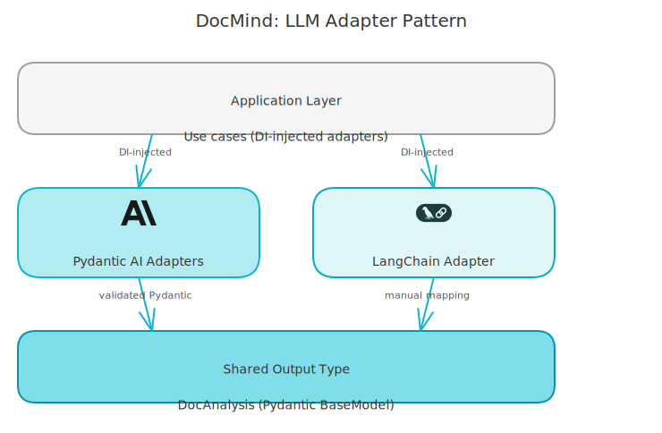
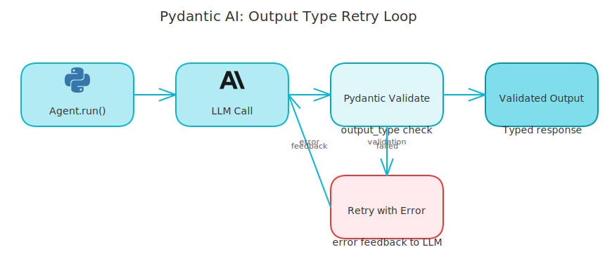

# Pydantic AI vs LangChain for RAG: My Honest Production Review

*Both frameworks in the same codebase, producing the same output, with very different trade-offs.*

---

My RAG backend uses both Pydantic AI and LangChain. Not by design - by evolution. The RAG answer generation uses Pydantic AI. The Azure OpenAI agent integration originally used LangChain. Having them side by side in production for months taught me more than any benchmark could.

Here's my honest take, with the actual production code. Both approaches produce the exact same `RAGAnswerOutput` - that's the interesting part.

<!-- more -->

## The Setup

The project is a RAG backend with two main LLM-facing components:

1. **RAG answer generation** - takes a user query and retrieved document chunks, returns a structured answer with citations and a confidence score
2. **Agent conversation** - a tool-use agent that calls `rag_search` as a tool and maintains multi-turn context

For (1), both the Anthropic (Claude) and Ollama adapters use Pydantic AI. For (2), there are two implementations: an older `AzureOpenAIAgentLLMAdapter` using LangChain, and a newer `PydanticAgentService` using Pydantic AI's native AzureProvider.

Both (1) approaches produce the exact same `RAGAnswerOutput`. That's the interesting part.

<!-- excalidraw:diagram
id: docmind-llm-adapters
title: LLM Adapter Layout
type: layered
components:
  - name: "Application Layer"
    type: backend
    technologies: ["LLMService interface", "AgentService interface"]
    position: left
  - name: "Pydantic AI Adapters"
    type: backend
    technologies: ["AnthropicLLMAdapter", "OllamaLLMAdapter", "PydanticAgentService"]
    position: center
  - name: "LangChain Adapter"
    type: backend
    technologies: ["AzureOpenAIAgentLLMAdapter"]
    position: center
  - name: "Shared Output"
    type: backend
    technologies: ["RAGAnswerOutput", "AgentLLMResponse"]
    position: right
connections:
  - from: "Application Layer"
    to: "Pydantic AI Adapters"
    label: "DI-injected"
  - from: "Application Layer"
    to: "LangChain Adapter"
    label: "DI-injected"
  - from: "Pydantic AI Adapters"
    to: "Shared Output"
    label: "validated Pydantic models"
  - from: "LangChain Adapter"
    to: "Shared Output"
    label: "manual mapping"
description: |
  Both framework families produce the same output types.
  The application layer doesn't care which adapter is active.
excalidraw:diagram-end -->



## The Pydantic AI Side

The Anthropic RAG adapter looks like this:

```python
class RAGAnswerOutput(BaseModel):
    answer_text: str = Field(description="The answer based on the provided context")
    cited_chunk_indices: list[int] = Field(
        default_factory=list,
        description="List of chunk indices (1-based) used in the answer"
    )
    confidence_score: float = Field(ge=0.0, le=1.0, description="Confidence in the answer (0-1)")


class AnthropicLLMAdapter:
    def __init__(self, api_key: str) -> None:
        self._agent = Agent(
            "anthropic:claude-sonnet",
            output_type=RAGAnswerOutput,
            retries=2,
            system_prompt=self.DEFAULT_SYSTEM_PROMPT,
        )

    async def generate_answer(self, query, context_chunks, ...) -> RAGAnswerOutput:
        result = await self._agent.run(user_prompt)
        return result.data  # Already typed as RAGAnswerOutput
```

The Ollama adapter is structurally identical - same `Agent`, same `output_type=RAGAnswerOutput`, same `retries=2`. It imports `RAGAnswerOutput` from the Anthropic module and reuses it directly. Two different providers, one shared output schema.

What `output_type` actually does: Pydantic AI instructs the model to produce JSON matching the schema, validates it, and retries up to `retries` times if validation fails. You never parse JSON manually. You never write `json.loads()`. The return type from `agent.run()` is already a validated `RAGAnswerOutput`.

## The LangChain Side

The older Azure OpenAI agent adapter uses LangChain's `AzureChatOpenAI`:

```python
class AzureOpenAIAgentLLMAdapter:
    async def generate_with_tools(self, messages, tools, ...) -> AgentLLMResponse:
        langchain_messages = self._convert_messages_to_langchain_format(messages)
        if tools:
            openai_tools = self._convert_tools_to_openai_format(tools)
            llm_with_tools = self._client.bind_tools(openai_tools)
        response: AIMessage = await llm_with_tools.ainvoke(langchain_messages, ...)
        content = response.content
        tool_calls = self._extract_tool_calls(response)
        return AgentLLMResponse(content=content, tool_calls=tool_calls, ...)
```

Notice the surface area: explicit message type conversion (`_convert_messages_to_langchain_format`), manual tool extraction (`_extract_tool_calls`), manual field assignment to `AgentLLMResponse`. This isn't bad code - it's clear and explicit - but it's a lot of plumbing to maintain.

The newer Pydantic AI version uses `@agent.tool` to register the `rag_search` tool and injects dependencies through `RunContext`. No manual message conversion. No `bind_tools()`. No `_extract_tool_calls()`.

## What Pydantic AI Gets Right

**The mental model is simpler.** An Agent has a model, a system prompt, optional tools, and an output type. You call `agent.run()`. You get back typed data. The framework handles the retry-on-validation-failure loop, the tool call loop, and the message history management. The surface area is small.

**`output_type` is the killer feature for RAG.** Getting structured output from LLMs reliably is hard. Models hallucinate JSON fields. They add markdown fences. They misname keys. Pydantic AI's `output_type` + `retries=2` handles all of this - it validates the output, catches Pydantic validation errors, and retries with the error as feedback. The model learns from its own failure and self-corrects. You eliminate an entire category of parsing bugs.

**Dependency injection via `RunContext` is clean.** In the agent service, the `rag_service` is injected through `AgentDependencies` and accessed inside tools via `ctx.deps.rag_service`. Tools have full access to the application layer without global state or closures. This is the pattern that makes agents actually testable.

## What LangChain Still Does Better

**Streaming tool calls.** LangChain's `astream` gives you granular tool call chunks - you can yield `tool_call_start`, `tool_call_delta`, `tool_call_end` events as the model streams its tool invocations. Pydantic AI's streaming (`run_stream()`) streams the final text response, but tool events are retrospective - emitted after the response text, from `result.all_messages()`. If you need real-time tool call streaming in your UI, that's a meaningful difference.

**Ecosystem breadth.** LangChain has adapters for everything. If you're integrating with an obscure vector store, a niche embedding provider, or an enterprise-specific API, there's probably a LangChain adapter. Pydantic AI is younger and more opinionated.

**Explicit is sometimes better.** The LangChain `_convert_messages_to_langchain_format` method is verbose, but every message type conversion is visible. You know exactly what's happening. With Pydantic AI, the framework is doing more for you - which is usually good, but requires trusting the abstraction.

## The Decision I'd Make Today

For RAG answer generation - the use case with structured output requirements - Pydantic AI wins clearly. The `output_type` + `retries` combination is exactly the right abstraction for "call an LLM, get back validated data."

For agent tool use without strict output requirements, both are reasonable. If I were starting fresh today, I'd use Pydantic AI for both. The unified mental model and the native Azure provider support make it a clean choice. The LangChain adapter remains in the codebase as a functional legacy; migrating it to Pydantic AI is on the list but not urgent.

One thing I'd warn against: using LangChain's `RecursiveCharacterTextSplitter` for chunking and then assuming you need the rest of LangChain. Text splitting is one good LangChain utility. It doesn't obligate you to LangChain for LLM calls, memory management, or agents. Use what's best for each component, not what's in the same package.

<!-- excalidraw:diagram
id: pydantic-ai-output-type-loop
title: Pydantic AI output_type Validation Retry Loop
type: custom
components:
  - name: "Agent.run()"
    type: backend
    technologies: ["User prompt", "System prompt"]
    position: left
  - name: "LLM Call"
    type: ai
    technologies: ["JSON schema in prompt", "Generate response"]
    position: center
  - name: "Pydantic Validate"
    type: backend
    technologies: ["RAGAnswerOutput.model_validate()", "Type check"]
    position: center
  - name: "Validated Output"
    type: backend
    technologies: ["RAGAnswerOutput", "Typed Python object"]
    position: right
  - name: "Retry with Error"
    type: external
    technologies: ["Validation error as feedback", "Up to retries=2"]
    position: center
connections:
  - from: "Agent.run()"
    to: "LLM Call"
    label: "prompt + schema"
  - from: "LLM Call"
    to: "Pydantic Validate"
    label: "raw JSON response"
  - from: "Pydantic Validate"
    to: "Validated Output"
    label: "valid"
  - from: "Pydantic Validate"
    to: "Retry with Error"
    label: "validation failed"
  - from: "Retry with Error"
    to: "LLM Call"
    label: "error feedback"
description: |
  Pydantic AI sends the schema to the LLM, validates the response,
  and retries with the validation error as feedback if it fails.
excalidraw:diagram-end -->



## The Same Output, Two Paths

Both the Anthropic and Ollama adapters produce the same `RAGAnswerOutput`. If I swap the configured LLM provider, the application layer never knows. The use case calls `llm_service.generate_answer()`, gets back a `RAGAnswerOutput`, and proceeds. The DI container decides which adapter runs.

That's the real win: the adapter boundary lets you choose tools per provider without contaminating business logic. Pydantic AI made that boundary cleaner for the adapters I wrote with it. LangChain worked fine for the one I built before I switched. Both can live in the same codebase without drama.