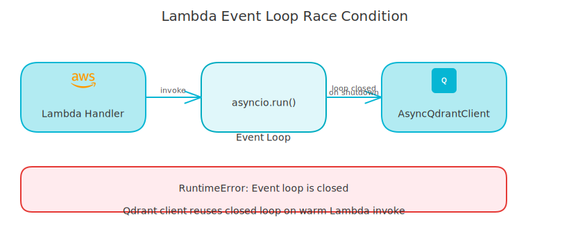
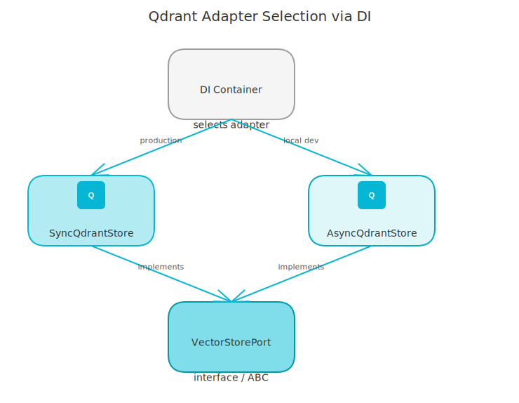

# Sync vs. Async Qdrant Client on Lambda: A Production Bug Story

*When your async client works everywhere except the one place that matters.*

---

My async Qdrant client worked perfectly on localhost, passed every test, and ran smoothly in Docker. Then I deployed to AWS Lambda and the ingestion pipeline started crashing with `RuntimeError: Event loop is closed` on every vector upsert.

That combination - works everywhere except prod - is exactly the kind of bug that takes longer to fix than it should. Here's what causes it and the fix that solved it.

<!-- more -->

## The Setup

The project's ingestion pipeline ends with indexing document chunks to Qdrant. The Lambda function handles the async FastAPI app via Mangum, and the Qdrant client was the standard `AsyncQdrantClient`.

The upsert call looked like this:

```python
await self._client.upsert(
    collection_name=collection_name,
    points=points,
)
```

Standard async call. No issues anywhere - except production Lambda.

## Why Lambda Is Different

When a Lambda function finishes, the runtime signals cleanup. Mangum, handling the ASGI lifecycle, starts winding down the event loop. The problem: Qdrant's async client maintains an underlying HTTP connection via `httpx` with an async transport, and it tries to close that connection during cleanup.

The race condition: Mangum closes the event loop. Then Qdrant tries to close its async HTTP transport. But the loop is already gone. Result: `RuntimeError: Event loop is closed`.

On localhost with uvicorn, the server stays running. The event loop is persistent. Cleanup happens gracefully. The issue never appears.

With Mangum in Lambda mode (`lifespan="off"`), each request effectively goes through a complete startup/shutdown cycle from the perspective of async lifespan. The event loop cleanup timing is different, and async clients that hold open connections are at risk.

<!-- excalidraw:diagram
id: lambda-event-loop-race
title: Event Loop Race Condition on Lambda Shutdown
type: custom
components:
  - name: "Lambda Handler"
    type: backend
    technologies: ["Mangum ASGI wrapper", "Request complete"]
    position: left
  - name: "Event Loop"
    type: backend
    technologies: ["asyncio loop", "Starts closing"]
    position: center
  - name: "AsyncQdrantClient"
    type: backend
    technologies: ["httpx async transport", "Tries to close connection"]
    position: right
connections:
  - from: "Lambda Handler"
    to: "Event Loop"
    label: "Signals shutdown"
  - from: "Event Loop"
    to: "AsyncQdrantClient"
    label: "Loop already closed when client tries cleanup"
description: |
  Mangum closes the event loop before AsyncQdrantClient can close
  its async HTTP transport. Result: RuntimeError: Event loop is closed.
excalidraw:diagram-end -->



## The Fix: Sync Client + asyncio.to_thread

The solution was switching to the sync `QdrantClient` wrapped in `asyncio.to_thread()`:

```python
import asyncio
from qdrant_client import QdrantClient  # Sync client

class SyncQdrantStore:
    """Sync Qdrant implementation using thread-wrapped sync client.

    This implementation is suitable for Lambda production environments where
    native async operations can cause event loop cleanup race conditions.
    All operations are executed in thread pools via asyncio.to_thread.
    """

    def __init__(self, url: str, api_key: str | None = None) -> None:
        # Use sync client to avoid event loop cleanup race conditions
        # with Mangum when async client tries to close HTTP connections
        # after response is sent
        self._client = QdrantClient(url=url, api_key=api_key, timeout=30.0)

    async def upsert_vectors(self, collection_name, vectors, ...) -> None:
        # Wrap sync call in thread to maintain async interface
        await asyncio.to_thread(
            self._client.upsert,
            collection_name=collection_name,
            points=points,
        )
```

The sync client uses standard synchronous `httpx` connections with no async lifecycle. There's nothing for the event loop to clean up. Wrapping in `asyncio.to_thread()` keeps the async interface intact - callers use `await` as normal - but the actual Qdrant I/O happens on a thread pool thread, not in the event loop.

## Two Adapters, One Interface

The DI container selects the adapter based on environment:

```python
# In rag_container.py
if settings.is_production:
    self._vector_store = SyncQdrantStore(url=settings.qdrant_url, ...)
else:
    self._vector_store = AsyncQdrantStore(url=settings.qdrant_url, ...)
```

Both implement the same `VectorStorePort` protocol. The rest of the application doesn't know which one is running. Search, upsert, collection creation - all the same interface, different internals.

The async store (`AsyncQdrantClient`) stays for local development because it's cleaner and has no thread overhead. In production on Lambda, the sync client with thread wrapping is the right call.

<!-- excalidraw:diagram
id: qdrant-adapter-selection
title: DI Container Adapter Selection - Sync vs Async
type: system-overview
components:
  - name: "DI Container"
    type: backend
    technologies: ["settings.is_production", "RAGContainer"]
    position: left
  - name: "SyncQdrantStore"
    type: backend
    technologies: ["QdrantClient (sync)", "asyncio.to_thread()"]
    position: right
  - name: "AsyncQdrantStore"
    type: backend
    technologies: ["AsyncQdrantClient", "Native async"]
    position: right
  - name: "VectorStorePort"
    type: backend
    technologies: ["Protocol interface", "upsert, search, create"]
    position: center
connections:
  - from: "DI Container"
    to: "SyncQdrantStore"
    label: "production (Lambda)"
  - from: "DI Container"
    to: "AsyncQdrantStore"
    label: "local dev (uvicorn)"
  - from: "SyncQdrantStore"
    to: "VectorStorePort"
    label: "implements"
  - from: "AsyncQdrantStore"
    to: "VectorStorePort"
    label: "implements"
description: |
  The DI container picks sync or async adapter based on environment.
  Both implement the same VectorStorePort protocol.
excalidraw:diagram-end -->



The same `asyncio.to_thread()` pattern applies to every Qdrant operation - search, hybrid search with RRF fusion, collection creation, payload indexing. Every call goes through the thread pool, regardless of complexity. The thread pool handles the blocking I/O while the async interface stays clean for the callers.

## What This Tells You About Lambda and Async

Lambda isn't a persistent server. The event loop lifecycle doesn't match what async client libraries expect. Any client that holds open async connections - HTTP, WebSocket, database - is at risk if it tries to clean up those connections during Lambda shutdown.

Three approaches work:

1. **Sync client + thread wrapping** - Keeps the I/O off the async event loop entirely. Works well for libraries with good sync support. This is what I use for Qdrant.
2. **Connection pooling with explicit cleanup** - If you need async, manage the lifecycle explicitly and close connections before the response is sent, not after.
3. **Mangum `lifespan="on"`** - Enables proper ASGI lifespan events, which some async clients hook into for cleanup. But this has its own issues: CORS middleware incompatibility in earlier versions, cold start overhead.

For Qdrant on Lambda: sync client with `asyncio.to_thread()` is the right call. The thread overhead is negligible compared to the network latency of the Qdrant call itself, and it eliminates the race condition entirely.