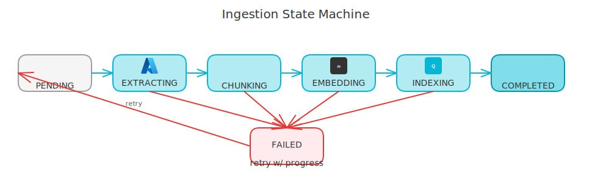
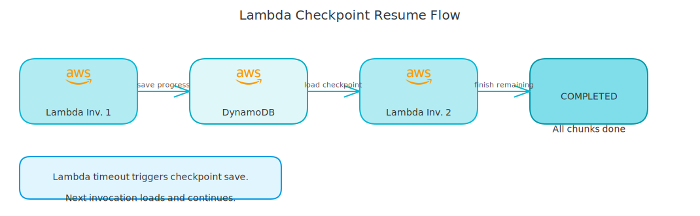

# The 5-Stage RAG Ingestion Pipeline with Checkpoint Resume

*A resumable state machine that survives Lambda timeouts mid-document.*

---

Most RAG tutorials show a clean linear pipeline: upload PDF, extract text, chunk, embed, index. Done. What they don't show is what happens when a 200-page document hits a 15-minute Lambda timeout at page 150.

The ingestion pipeline is a resumable state machine with 5 stages. Each stage checkpoints progress to DynamoDB, so the next Lambda invocation picks up exactly where the last one stopped.

<!-- more -->

## The 5 Stages

The pipeline follows a strict state progression:

```
PENDING → EXTRACTING → CHUNKING → EMBEDDING → INDEXING → COMPLETED
             ↓               ↓           ↓          ↓
           FAILED          FAILED      FAILED     FAILED
             ↓
           PENDING (retry)
```

Each status is tracked on the document entity and persisted to DynamoDB. If processing stops at any stage, the next Lambda invocation checks the current status and picks up where it left off.

<!-- excalidraw:diagram
id: ingestion-state-machine
title: Document Ingestion State Machine
type: ai-pipeline
components:
  - name: "PENDING"
    type: backend
    technologies: ["Python"]
  - name: "EXTRACTING"
    type: cloud
    technologies: ["Azure"]
  - name: "CHUNKING"
    type: backend
    technologies: ["Python"]
  - name: "EMBEDDING"
    type: ai
    technologies: ["OpenAI"]
  - name: "INDEXING"
    type: database
    technologies: ["Qdrant"]
  - name: "COMPLETED"
    type: backend
    technologies: ["Python"]
  - name: "FAILED"
    type: external
    technologies: []
connections:
  - from: "PENDING"
    to: "EXTRACTING"
    label: "start"
  - from: "EXTRACTING"
    to: "CHUNKING"
    label: "pages done"
  - from: "CHUNKING"
    to: "EMBEDDING"
    label: "chunks ready"
  - from: "EMBEDDING"
    to: "INDEXING"
    label: "embeddings ready"
  - from: "INDEXING"
    to: "COMPLETED"
    label: "indexed"
  - from: "EXTRACTING"
    to: "FAILED"
    label: "error"
  - from: "FAILED"
    to: "PENDING"
    label: "retry"
description: |
  Each state persisted to DynamoDB. On Lambda timeout the next
  invocation resumes from the last saved checkpoint.
excalidraw:diagram-end -->



## Stage 1: EXTRACTING

The extractor converts raw files (PDF, DOCX, images) into structured pages. In production, this is Azure Document Intelligence.

```python
async def _extract_document(
    self,
    document: Document,
    progress: IngestionProgress,
) -> list[ExtractedPage]:
    # Resume from where we left off
    start_page = progress.pages_extracted

    pages = await self._extractor.extract(
        file_path=document.file_path,
        document_format=document.format,
        start_page=start_page,
    )

    # Save checkpoint after each page batch
    progress = progress.model_copy(update={
        "pages_extracted": start_page + len(pages),
        "current_phase": ProcessingPhase.EXTRACTING,
        "last_checkpoint": datetime.utcnow(),
    })
    await self._progress_repo.save(progress)

    return pages
```

The `start_page` parameter tells the extractor to skip already-processed pages. If Lambda times out after page 100, the next invocation knows to start at page 101. The progress model is the checkpoint - it tells the orchestrator exactly where the document is in the pipeline.

Azure DI has a 4MB per page limit, so the extractor compresses large images in PDFs before sending. For rate limiting, it uses `tenacity` for exponential backoff on 429 responses, with a semaphore to cap concurrent Azure DI calls at 3. These are standard production concerns - the checkpoint logic is what makes this pipeline interesting.

## Stage 2: CHUNKING

Chunking splits extracted text into overlapping segments that fit in an LLM context window. The pipeline uses recursive character chunking:

```python
class RecursiveChunker:
    def __init__(self, chunk_size: int = 1000, chunk_overlap: int = 200) -> None:
        self._splitter = RecursiveCharacterTextSplitter(
            chunk_size=chunk_size,
            chunk_overlap=chunk_overlap,
            separators=["\n\n", "\n", ". ", " ", ""],
        )

    async def chunk(self, pages: list[ExtractedPage]) -> list[DocumentChunk]:
        chunks = []
        for page in pages:
            texts = self._splitter.split_text(page.content)
            for i, text in enumerate(texts):
                chunks.append(DocumentChunk(
                    content=text,
                    page_number=page.page_number,
                    chunk_index=i,
                    metadata=page.metadata,
                ))
        return chunks
```

The `chunk_size` and `chunk_overlap` are configurable per collection. API documentation chunks differently than legal contracts - different document types benefit from different chunking strategies.

## Stage 3: EMBEDDING

Embeddings convert text chunks into dense vectors. The collection's configured embedding model determines which adapter runs:

The embedding step is a batch call to the configured embedding service - Azure OpenAI's `text-embedding-ada-002` in production, Ollama's `nomic-embed-text` locally. The interesting part is the `IngestionProgress` model that tracks where we are across all stages:

```python
class IngestionProgress(BaseModel):
    document_id: DocumentId
    current_phase: ProcessingPhase
    pages_extracted: int = 0
    chunks_created: int = 0
    chunks_embedded: int = 0
    chunks_indexed: int = 0
    last_checkpoint: datetime
    retry_count: int = 0
```

## Stage 4: INDEXING

Chunks go to Qdrant as point structs with payload metadata (`collection_id`, `document_id`, `content`, `page_number`, `chunk_index`). Both `collection_id` and `document_id` have Qdrant payload indexes, making filtered search fast - "search only in this collection" or "delete all chunks for this document" are indexed operations, not full scans.

## Stage 5: COMPLETED

The orchestrator updates the document status to `COMPLETED`, saves the final chunk count, and stores an idempotency cache entry so retriggers of the same job return the cached result without re-processing.

## The State Machine in Practice

The state machine matters most in failure scenarios. Here's how the use case handles different document states on retry:

```python
# IngestDocumentUseCase.execute()

if document.status == IngestionStatus.FAILED:
    # Reset to PENDING but preserve progress for checkpointing
    document = document.model_copy(update={
        "status": IngestionStatus.PENDING,
        "error_message": None,
        "updated_at": datetime.utcnow(),
    })
    await self._document_repo.save(document)

elif document.status == IngestionStatus.COMPLETED:
    # Already done, return existing result
    return IngestionResult(job_id=job_id, document_id=document.id, status=COMPLETED)

elif document.status in {EXTRACTING, CHUNKING, EMBEDDING, INDEXING}:
    # Interrupted mid-pipeline - orchestrator will resume from progress
    logger.info("Resuming interrupted document processing", data={
        "current_status": document.status.value,
        "pages_extracted": document.progress.pages_extracted,
    })
```

The `FAILED → PENDING` transition with preserved `progress` is the key design: the document resets to a retriable state, but the checkpoint data tells the orchestrator which stage it left off at. A 200-page document that failed at page 180 resumes from page 180, not page 1.

## Why State Machine Transitions Are Explicit

The valid transitions are hardcoded:

```python
VALID_TRANSITIONS = {
    IngestionStatus.PENDING: [IngestionStatus.EXTRACTING, IngestionStatus.FAILED],
    IngestionStatus.EXTRACTING: [IngestionStatus.CHUNKING, IngestionStatus.FAILED, IngestionStatus.EXTRACTING],
    IngestionStatus.CHUNKING: [IngestionStatus.EMBEDDING, IngestionStatus.FAILED],
    IngestionStatus.EMBEDDING: [IngestionStatus.INDEXING, IngestionStatus.FAILED],
    IngestionStatus.INDEXING: [IngestionStatus.COMPLETED, IngestionStatus.FAILED],
    IngestionStatus.COMPLETED: [],  # Terminal
    IngestionStatus.FAILED: [IngestionStatus.EXTRACTING],  # Retryable
}
```

`COMPLETED` is terminal. You can't re-ingest a completed document by accident - it requires an explicit delete + re-upload. `FAILED` is retryable, but only to `EXTRACTING` (start of the pipeline), not to an arbitrary mid-pipeline state. The orchestrator handles skipping already-completed stages via the `progress` model.

`EXTRACTING` self-loops because a resumed extraction might update the stage multiple times as it processes pages in batches.

<!-- excalidraw:diagram
id: checkpoint-resume-flow
title: Lambda Checkpoint Resume Flow
type: cloud
components:
  - name: "Lambda Inv 1"
    type: cloud
    technologies: ["AWS Lambda"]
  - name: "DynamoDB"
    type: database
    technologies: ["DynamoDB"]
  - name: "Lambda Inv 2"
    type: cloud
    technologies: ["AWS Lambda"]
  - name: "COMPLETED"
    type: backend
    technologies: ["Python"]
connections:
  - from: "Lambda Inv 1"
    to: "DynamoDB"
    label: "save progress"
  - from: "DynamoDB"
    to: "Lambda Inv 2"
    label: "load checkpoint"
  - from: "Lambda Inv 2"
    to: "COMPLETED"
    label: "resume & finish"
description: |
  When Lambda times out, progress is saved to DynamoDB.
  The next invocation reads the checkpoint and resumes from page 151.
excalidraw:diagram-end -->



## The Practical Result

A document that would time out on Lambda in a single invocation now processes across multiple invocations, each picking up exactly where the last one left off. Users see the document status move from `extracting` to `chunking` to `embedding` to `indexing` to `completed` in the UI. What looked like a hard Lambda constraint became a non-issue once the pipeline was designed for interruption.

The key insight: don't treat processing as atomic when it can't be. Instead, make the intermediate states durable and the resume logic explicit. A state machine with persisted checkpoints is more resilient than any amount of retry logic on top of a monolithic processing function.