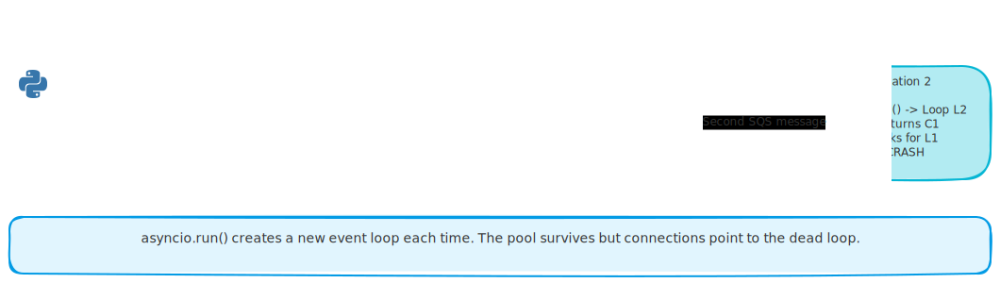
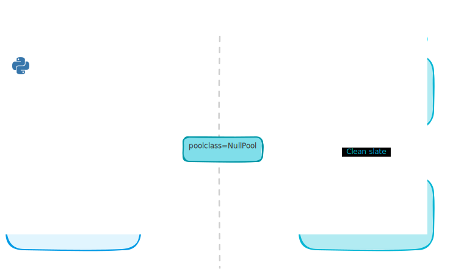

# The Zombie Connection Bug: asyncio, Lambda Warm Starts, and NullPool

*A Lambda worker that works perfectly on cold starts silently crashes on every warm invocation.*

---

You open the ticketing app. You create a ticket. It sits there. Status: New. Forever. No error in the UI, no indication anything went wrong. The ticket just never gets processed. The Worker Lambda was crashing on every second invocation with `RuntimeError: Task got Future attached to a different loop`, SQS kept retrying, kept crashing, and eventually gave up.

The root cause is a collision between three things that each work correctly on their own: asyncio event loops, connection pooling, and Lambda warm starts. The fix is one line of config. Getting there takes you through one of the most confusing debugging sessions in serverless Python.

<!-- more -->

## The Setup

The ticketing system has two Lambda functions. The **API Lambda** handles HTTP requests: create ticket, list tickets. The **Worker Lambda** processes tickets through an AI pipeline: classify, extract, route, generate response.

When a ticket is created, the API Lambda drops a message onto an SQS queue. The Worker Lambda picks that message up, runs the four AI steps, and updates the ticket status. Simple architecture. Except the Worker Lambda was crashing on every invocation after the first one.

```
RuntimeError: Task got Future attached to a different loop
```

And on SQS retries:

```
InterfaceError: cannot perform operation: another operation is in progress
```

## Three Moving Parts

To understand the crash, you need to understand three things that interact badly.

**asyncio** is Python's async runtime. It uses an event loop, a scheduler that manages all async operations. When you write `await session.get(...)`, the event loop tracks that pending operation and wakes up the right coroutine when it completes. The event loop is not a global singleton. You create it, run things in it, and destroy it.

**asyncpg** is the Postgres driver that powers SQLAlchemy's async support. When asyncpg opens a connection to the database, it registers that connection with the current event loop. It tells the OS: "when bytes arrive from Postgres on this socket, wake up loop L1." The connection is physically tied to that specific loop object. Not by reference. Physically - the OS file descriptor is registered on a specific loop's internal selector.

**Lambda warm starts** are Lambda's way of saving time. After your function runs, Lambda freezes the process and reuses it for the next invocation. Code at module level, outside the handler function, runs once and persists. The module-level container with its DB engine and connection pool stays alive between invocations.

<!-- excalidraw:diagram
id: lambda-warm-start-event-loop-lifecycle
title: Event Loop Lifecycle Across Lambda Invocations
type: custom
components:
  - name: "Cold Start"
    type: backend
    technologies: ["Module-level code runs once", "Container created", "Pool initialized (empty)"]
  - name: "Invocation 1"
    type: backend
    technologies: ["asyncio.run() creates L1", "C1 opens on L1", "Session closes, C1 stays in pool", "asyncio.run() destroys L1"]
  - name: "Zombie State"
    type: backend
    technologies: ["L1 is gone", "C1 still in pool", "C1 still holds TCP socket", "C1 still registered to L1"]
  - name: "Invocation 2"
    type: backend
    technologies: ["asyncio.run() creates L2", "Pool returns C1", "C1 looks for L1", "CRASH"]
connections:
  - from: "Cold Start"
    to: "Invocation 1"
    label: "First SQS message arrives"
  - from: "Invocation 1"
    to: "Zombie State"
    label: "L1 destroyed, C1 orphaned"
  - from: "Zombie State"
    to: "Invocation 2"
    label: "Second SQS message arrives"
description: |
  Lambda reuses the process between invocations. asyncio.run() creates
  a new event loop each time. The connection pool survives across
  invocations but the connections still point to the destroyed loop.
excalidraw:diagram-end -->



## The Collision

The Worker Lambda's code looked like this:

```python
# Module level - runs ONCE on cold start
container = TicketingContainer()  # creates DB engine, connection pool

def handler(event, context):
    for record in event["Records"]:
        asyncio.run(_process_record(record))
```

Here's what happens step by step.

**Cold start:** The container is created. The DB connection pool is empty but ready.

**Invocation 1:** `asyncio.run()` creates event loop L1. The first DB query opens a connection C1 and registers it with L1. The query succeeds. The session closes, but the pool keeps C1 alive for reuse. `asyncio.run()` finishes and destroys L1.

The connection is now a zombie: it has an open TCP socket to Postgres, but the event loop it's registered with no longer exists.

**Invocation 2:** `asyncio.run()` creates event loop L2. The first DB query asks the pool for a connection. The pool cheerfully hands out C1. C1 tries to start a transaction - it needs the event loop to handle the response from Postgres. It looks for L1. L1 is gone. Crash.

The pool was doing exactly what it was designed to do: reuse connections to save on handshakes. The problem is that the pool was built for long-running servers where one event loop lives forever. Lambda's execution model breaks that assumption completely.

## Why This Is So Hard to Spot

The crash only happens on warm invocations, the second call onwards. Cold starts work fine because the pool is empty and creates a fresh connection on the current loop.

In local development, you typically run the worker with a single `asyncio.run()` wrapping the whole test, so you never hit warm starts. Tests pass. Everything looks fine. You deploy. First invocation works. Second invocation: silent crash, ticket stuck forever.

There's no application-level error message. No stack trace pointing at your code. Just a cryptic asyncpg error buried in CloudWatch.

## The Fix: NullPool

The solution is one concept: `NullPool`.

`NullPool` tells SQLAlchemy: don't keep any connections alive between sessions. Open one when you need it, close it the moment you're done.

```python
from sqlalchemy.pool import NullPool

engine = create_async_engine(database_url, poolclass=NullPool)
```

With `NullPool`, the zombie problem disappears completely:

- **Invocation 1:** Creates loop L1. DB query opens connection C1 on L1. Query done, C1 immediately closed. L1 destroyed. Nothing survives.
- **Invocation 2:** Creates loop L2. DB query opens connection C2 on L2. Fresh connection, correct loop. Works perfectly.

There's a small cost: a new TCP handshake to Postgres on every handler invocation, around 5-15ms. For a worker running AI pipelines that take seconds, this is completely irrelevant.

<!-- excalidraw:diagram
id: nullpool-lambda-invocation-flow
title: NullPool Eliminates Zombie Connections
type: custom
components:
  - name: "Standard Pool (broken)"
    type: backend
    technologies: ["Invocation 1: C1 created on L1", "C1 returned to pool", "L1 destroyed", "Invocation 2: pool gives C1", "C1 bound to dead L1 = CRASH"]
  - name: "NullPool (fixed)"
    type: backend
    technologies: ["Invocation 1: C1 created on L1", "C1 closed immediately", "L1 destroyed", "Invocation 2: C2 created on L2", "Works perfectly"]
connections:
  - from: "Standard Pool (broken)"
    to: "NullPool (fixed)"
    label: "poolclass=NullPool"
description: |
  Standard pool keeps connections alive, creating zombies when
  the event loop is replaced. NullPool closes connections immediately,
  so each invocation starts fresh.
excalidraw:diagram-end -->



## When to Use Which Pool

The pattern generalizes cleanly:

| Situation | Pool strategy |
|-----------|---------------|
| Long-running server (FastAPI, Django) | Standard pool, one loop forever |
| Lambda API (Mangum wraps your ASGI app) | Standard pool, Mangum preserves the loop |
| Lambda worker (`asyncio.run()` per invocation) | NullPool |
| Any script that calls `asyncio.run()` multiple times | NullPool |

The mental model: connection pools assume one event loop for the lifetime of the process. The moment you call `asyncio.run()` more than once in a process and share a connection pool across those calls, you will hit this bug.

For Lambda API functions using Mangum, you're safe with a standard pool. Mangum wraps your whole ASGI app and reuses the same event loop across warm invocations. The assumption holds. For Lambda workers where you call `asyncio.run()` per message, the assumption breaks.

## What This Teaches About Serverless

This is a bug where both frameworks do exactly what they promise. Pooling connections is correct and smart. asyncpg binding to a specific event loop is correct and precise. But the environment assumption underneath has silently changed.

Lambda re-invented what "process lifetime" means. asyncpg was built for traditional servers where one process means one event loop. Neither is wrong. They just don't know about each other.

When you move to serverless, any resource that binds to an event loop must be rethought. Connection pools, async HTTP clients with internal state, background task runners. All of them carry the question: "what happens when my event loop dies between invocations?"

For database connections in Lambda workers, `NullPool` is the answer. Be explicit that you want no reuse. If you need actual connection pooling, put it at the infrastructure layer with RDS Proxy or PgBouncer, not inside the application process.
