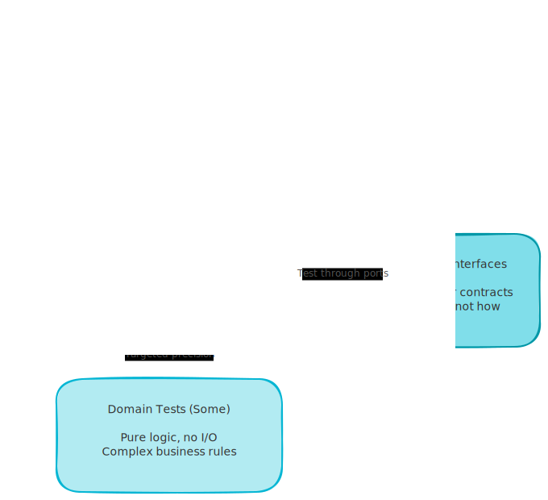
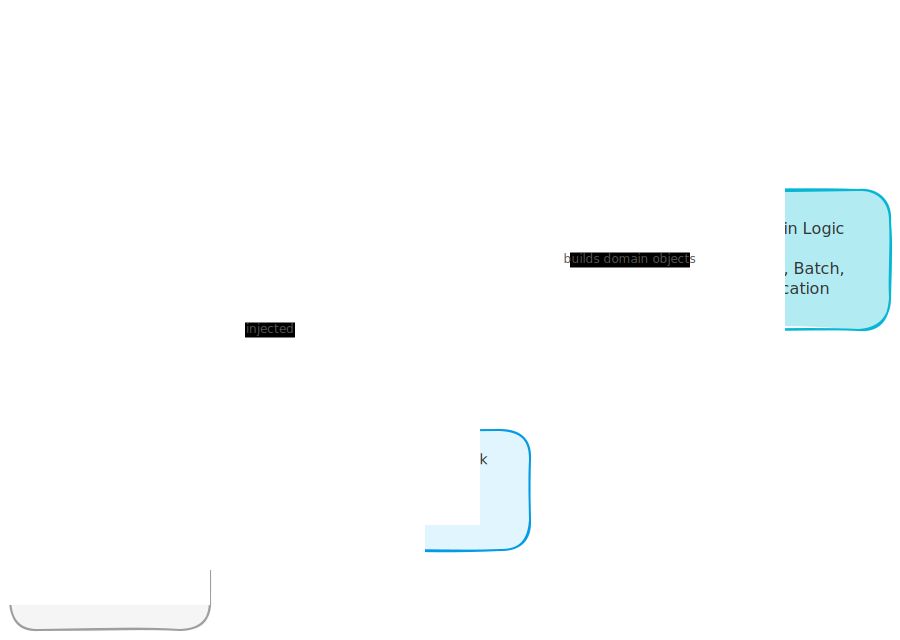

# Tests Are Contracts: How to Write Tests You Can Blindly Trust

*Write tests that define behavior so clearly you never need to read the implementation again.*

---

In hexagonal architecture, you trust a new adapter without reading it. You know what the port contract says. If the adapter passes the tests, it works. You move on. This is the same mental model you need for tests.

Most people can't trust their tests because they write them wrong. They test how something works instead of what it produces. The result is tests that break when you refactor, tests that require reading the implementation to understand, and tests that give you no confidence at all.

<!-- more -->

I've been handing tests to AI-generated code and not checking the implementation. This works because I structure tests as behavior contracts, not as implementation verifiers. If you learn three things about testing, you can do the same thing. Here they are.

## Tests Are Contracts, Not Implementation Checks

Here's the mental model shift you need to make.

A port in hexagonal architecture defines what an adapter must do. Not how. You write the interface, someone builds the adapter, and if it satisfies the interface you're done. You don't care about the internals.

Tests work the same way when you write them right. A test says: "given this input, I expect this output." It doesn't say "call this method with these arguments in this order." The first is a contract. The second is a script.

When you write contracts, you can swap the entire implementation. The tests still pass or fail based on behavior. You can hand those tests to an AI, get an implementation back, run the tests, and know whether it works. You never open the file.

When you write scripts, you're testing implementation details. Refactoring breaks tests. Changing the internal call order breaks tests. You end up spending more time fixing tests than writing features.

The question to ask for every test: "If I completely rewrote the internals tomorrow, would this test still be valid?" If yes, it's a contract. If no, it's a script.

## The Test Pyramid (In Terms You Already Know)

If you work with hexagonal architecture, you already understand this. Let me translate.

<!-- excalidraw:diagram
id: test-pyramid-hexagonal
title: Test Pyramid in Hexagonal Architecture Terms
type: layered
components:
  - name: "E2E Tests (very few)"
    type: external
    technologies: ["Real API", "Real DB"]
  - name: "Service-Layer Tests (most)"
    type: backend
    technologies: ["Fakes", "Primitives"]
  - name: "Domain Tests (some)"
    type: backend
    technologies: ["Pure Logic", "No I/O"]
connections:
  - from: "E2E Tests (very few)"
    to: "Service-Layer Tests (most)"
    label: "prove wiring"
  - from: "Service-Layer Tests (most)"
    to: "Domain Tests (some)"
    label: "prove behavior"
excalidraw:diagram-end -->



**Service-layer tests are your money tests.** This is the bulk of your test suite. You call service functions with primitives (strings, ints, dicts), assert on primitives out, and use fakes for infrastructure. Real example: "when I allocate 10 units of SKU X, I get back the correct batch reference and available quantity drops by 10." No domain objects passed in. No internals inspected. Just: I send this, I get that.

**Domain tests are for complex business rules.** You only write these when the business logic is so involved that testing it through the service layer would feel indirect. Pure functions, no I/O, no fakes needed. These should be a minority. If most of your tests are domain tests, your service layer is too thin.

**E2E tests are for wiring.** One or two happy-path tests that hit a real API with a real database. These prove the pieces are connected correctly. They don't test logic. Logic is tested in service-layer tests. E2E tests catch "I forgot to register the router" mistakes, not "the calculation is wrong" mistakes.

The ratio: many service tests, some domain tests, very few E2E tests.

## Fakes, Not Mocks

This is the one that most people get wrong. And it's non-negotiable if you want tests you can trust.

A mock verifies interactions. It checks that you called `.save()` with these arguments in this order. A fake behaves like the real thing. You add an item, you retrieve it, you get the same item back.

```python
# This is a mock - tests interactions
mock_repo = Mock(spec=Repository)
mock_repo.save.assert_called_once_with(some_order)

# This is a fake - tests behavior
class FakeRepository:
    def __init__(self):
        self._store = {}

    def add(self, entity):
        self._store[entity.id] = entity

    def get(self, entity_id):
        return self._store.get(entity_id)
```

The mock test breaks the moment you rename the method or change the argument order. The fake test survives any refactoring as long as the behavior stays the same.

Here's the insight: fakes are just test-time adapters for your infrastructure ports. If you already have a `RepositoryPort` interface, the `FakeRepository` is the in-memory adapter. Same pattern you use everywhere else in hexagonal architecture. You're not doing anything new.

```python
class FakeUnitOfWork:
    def __init__(self):
        self.batches = FakeBatchRepository()
        self.committed = False

    async def __aenter__(self):
        return self

    async def __aexit__(self, *args):
        pass

    async def commit(self):
        self.committed = True

    async def rollback(self):
        pass
```

`FakeUnitOfWork` with `FakeBatchRepository` is an in-memory adapter for your entire persistence layer. Your service tests run fast, with no database, and they test real behavior.

If a fake doesn't behave like the real thing (`.get()` doesn't return what `.add()` stored), it's a broken adapter. Fix it. This is the same discipline you apply to real adapters.

## Service Functions Take Primitives, Return Primitives

This is the structural rule that makes everything else work.

```python
# This is right
async def allocate(
    order_id: str,
    sku: str,
    qty: int,
    uow: UnitOfWork,
) -> str:
    ...

# This is wrong
async def allocate(
    order: Order,
    batch: Batch,
) -> AllocationResult:
    ...
```

When service functions take domain objects as input, your tests have to construct those domain objects to call the function. Now your tests know about domain internals. Now they're coupled to the structure of `Order` and `Batch`. Change the domain model, and tests break - even if the behavior is identical.

When service functions take primitives, your tests pass the same things a real HTTP handler would pass. The service function's signature IS the contract. The test can't reach inside and assert on implementation details because it never touches domain objects directly.

<!-- excalidraw:diagram
id: service-contract-boundary
title: Service Layer as the Contract Boundary
type: system-overview
components:
  - name: "HTTP Handler"
    type: frontend
    technologies: ["str", "int", "dict"]
  - name: "Test"
    type: backend
    technologies: ["str", "int", "dict"]
  - name: "Service Function"
    type: backend
    technologies: ["allocate(order_id, sku, qty, uow)"]
  - name: "Domain Logic"
    type: backend
    technologies: ["Order", "Batch", "Allocation"]
  - name: "FakeUnitOfWork"
    type: backend
    technologies: ["In-memory adapter"]
  - name: "Real UnitOfWork"
    type: database
    technologies: ["SQLAlchemy", "Postgres"]
connections:
  - from: "HTTP Handler"
    to: "Service Function"
    label: "primitives in"
  - from: "Test"
    to: "Service Function"
    label: "same primitives"
  - from: "Service Function"
    to: "Domain Logic"
    label: "builds domain objects"
  - from: "Test"
    to: "FakeUnitOfWork"
    label: "injected"
  - from: "HTTP Handler"
    to: "Real UnitOfWork"
    label: "injected"
excalidraw:diagram-end -->



The test and the HTTP handler call the service function through the same interface. Both pass primitives. Both get primitives back. The service function translates those primitives into domain objects internally. The caller never knows.

This is what makes the test a real contract: the test exercises the same interface as the actual caller.

## The 4-Question Checklist

Before trusting a test, I run through four questions. If any fail, the test is too coupled to the implementation.

**1. Does this test use only primitives at the boundary?**

If you're constructing domain objects to pass into a service function, your test knows too much. It's testing through a different interface than real callers use. Rewrite the service function signature to take primitives.

**2. If I completely rewrote the internals, would this test still be valid?**

Read the test. Now imagine a completely different implementation that produces the same behavior. Would the test pass? If yes, it's a contract. If not, it's testing implementation details.

**3. Does the fake actually behave like the real thing?**

Your `FakeRepository.get()` should return what `.add()` stored. Your `FakeUnitOfWork` should track whether `.commit()` was called. Run a quick mental simulation: does the fake's behavior match what the real adapter would do?

**4. Can you read just the test name and assertion and understand the business rule?**

```python
async def test_allocates_to_first_available_batch():
    ...
    assert result == "batch-001"
    assert batch.available_quantity == 10
```

Read the name. Read the assertion. Do you know what business rule this tests? If yes, the test is a good contract. If you need to read the setup to understand what's happening, the test is hiding its intent.

## What This Looks Like in Practice

Here's a complete service-layer test using a fake:

```python
async def test_allocate_returns_batch_reference():
    uow = FakeUnitOfWork()
    await uow.batches.add(
        Batch(reference="batch-001", sku="CHAIR", purchased_quantity=20)
    )

    result = await allocate(
        order_id="order-001",
        sku="CHAIR",
        qty=10,
        uow=uow,
    )

    assert result == "batch-001"
    assert uow.committed is True
```

No mocks. No `assert_called_once_with`. No domain objects passed into the service. The test creates a fake, pre-loads it with data, calls the service with primitives, and asserts on the output.

If I hand this test to an AI and the AI produces an implementation that passes it, I know:
- The service returns the correct batch reference
- The service commits the unit of work
- The logic works with the given input

I don't need to read the implementation. The contract is clear and the fake validates behavior, not calls.

## Why This Matters Right Now

AI writes code fast. The bottleneck is trust.

If your tests are behavior contracts, you can define the spec, generate the implementation, and run the tests. Green means done. You review the tests, not the implementation. You trust the output without reading it - just like you trust a new hexagonal adapter without reading it.

If your tests are interaction scripts, you're stuck. You can't trust them. A green test suite might just mean the AI called the right methods in the right order, not that the behavior is correct. You have to read every line.

Write the tests first. Make them behavior contracts. Use fakes instead of mocks. Take primitives in, return primitives out. Then generate the implementation. If it passes, ship it.

Tests are the specification. Fakes are the test-time adapters. The pattern is the same one you already use everywhere.
