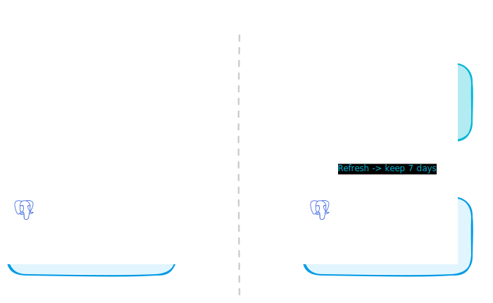
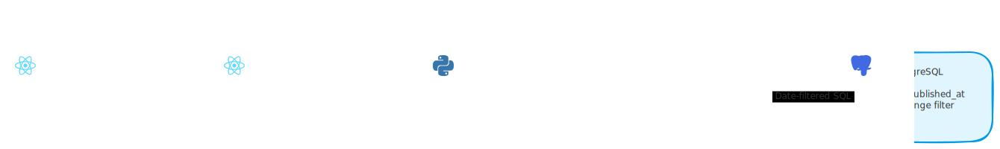

# Stop Deleting Yesterday's Feed: TTL Retention and Date Navigation

*Your feed refresh shouldn't destroy content you already paid to generate.*

---

I was building a personal project to stay on top of the latest AI trends. Every refresh cycle, it fetched new items and processed them - each one costs real compute to generate. Then the next refresh ran and deleted everything that wasn't saved. Yesterday's content? Gone forever.

The fix was embarrassingly simple. The backend already had a TTL-based prune function sitting unused, and the API already supported date filtering end-to-end. We just needed to connect the dots: one line on the backend, one component on the frontend.

<!-- more -->

## The Problem: Aggressive Purge

The feed refresh use case had a straightforward lifecycle: fetch new articles, purge old ones, save the top results. The purge step was the issue.

```python
# RefreshNewsFeedUseCase.execute()
pruned = await self._article_repo.purge_non_bookmarked(command.user_id)
# ↑ Deletes EVERYTHING that isn't bookmarked
```

Every refresh wiped the slate clean. Items that were fetched and processed at real cost got thrown away after roughly 24 hours. If you missed Monday's feed, those articles were gone by Tuesday morning.

The feed was a snapshot of the latest refresh only. No history, no way to browse what was relevant yesterday.

<!-- excalidraw:diagram
id: feed-purge-before-after
title: Aggressive Purge vs TTL Retention
type: custom
components:
  - name: "Aggressive Purge"
    type: backend
    technologies: ["purge_non_bookmarked()", "Deletes ALL non-bookmarked"]
    position: left
  - name: "Day 1 Articles"
    type: database
    technologies: ["Fetched and processed", "DELETED on Day 2 refresh"]
    position: left
  - name: "TTL Retention"
    type: backend
    technologies: ["prune_old_articles(max_age_days=7)", "Keeps 7 days"]
    position: right
  - name: "Day 1-7 Articles"
    type: database
    technologies: ["Preserved", "Browsable via date nav"]
    position: right
connections:
  - from: "Aggressive Purge"
    to: "Day 1 Articles"
    label: "Refresh → delete all"
  - from: "TTL Retention"
    to: "Day 1-7 Articles"
    label: "Refresh → keep 7 days"
description: |
  Before: every refresh deletes all non-bookmarked articles.
  After: articles survive for 7 days, creating a browsable archive.
excalidraw:diagram-end -->



## The Backend Fix: One Line

The repository already had a `prune_old_articles(user_id, max_age_days)` method. It deletes non-bookmarked articles where `published_at` is older than the specified number of days. It just wasn't being called.

```python
# BEFORE
pruned = await self._article_repo.purge_non_bookmarked(command.user_id)

# AFTER
pruned = await self._article_repo.prune_old_articles(
    command.user_id, max_age_days=7
)
```

No new code. No migration. The method existed, was tested, and was waiting to be used.

One detail worth noting: the `purge_non_bookmarked()` call in the profile update use case stays as-is. When a user changes their interests, old articles ranked against old interests should be cleared. That aggressive purge makes sense in that context.

## The API: Already Wired

Here's the part that surprised me. The entire date filtering stack was already built. The API accepted a `feed_date` query parameter. The use case passed it to the repository. The SQL filtered by date. The full pipeline was wired, tested, and deployed.

Nobody on the frontend was using it.

```
GET /api/feed?feed_date=2026-03-02  # ← already works
```

This happens more often than you'd think in growing codebases. Someone builds the backend capability for a future feature, but the frontend never catches up. The plumbing is there, hidden behind an unused parameter.

## The Frontend: Date Navigation Bar

The frontend needed a simple date navigation component. Nothing fancy, just "Previous Day" / "Today" / "Next Day" buttons above the feed grid.

```tsx
const [feedDate, setFeedDate] = useState<string>(
  new Date().toISOString().split('T')[0]  // "YYYY-MM-DD"
)

const today = new Date().toISOString().split('T')[0]
const isToday = feedDate === today

function shiftDate(delta: number) {
  const d = new Date(feedDate)
  d.setDate(d.getDate() + delta)
  handleDateChange(d.toISOString().split('T')[0])
}
```

The date bar sits between the filter row and the feed grid. "Previous" steps back one day, "Next" steps forward, and the button is disabled when you're on today. When the date changes, the page resets to 1 and the feed re-fetches with the new `feed_date` parameter.

```tsx
<div className="flex items-center gap-2">
  <Button variant="ghost" size="sm" onClick={() => shiftDate(-1)}>
    ← Prev
  </Button>
  <span className="text-sm font-medium w-28 text-center">
    {isToday ? 'Today' : feedDate}
  </span>
  <Button variant="ghost" size="sm" onClick={() => shiftDate(1)} disabled={isToday}>
    Next →
  </Button>
</div>
```

The feed repository already mapped `feedDate` to the `feed_date` query param. Zero backend changes needed for the API call.

<!-- excalidraw:diagram
id: feed-date-navigation-flow
title: Date Navigation Data Flow
type: system-overview
components:
  - name: "Date Bar UI"
    type: frontend
    technologies: ["React state", "feedDate: YYYY-MM-DD"]
    position: left
  - name: "useFeed Hook"
    type: frontend
    technologies: ["React Query", "Adds feed_date param"]
    position: center
  - name: "Feed API"
    type: backend
    technologies: ["GET /api/feed", "?feed_date=YYYY-MM-DD"]
    position: center
  - name: "GetFeedUseCase"
    type: backend
    technologies: ["FeedQuery.feed_date", "Filters by date"]
    position: right
  - name: "PostgreSQL"
    type: database
    technologies: ["WHERE published_at", "Date range filter"]
    position: right
connections:
  - from: "Date Bar UI"
    to: "useFeed Hook"
    label: "feedDate state change"
  - from: "useFeed Hook"
    to: "Feed API"
    label: "GET with feed_date"
  - from: "Feed API"
    to: "GetFeedUseCase"
    label: "FeedQuery"
  - from: "GetFeedUseCase"
    to: "PostgreSQL"
    label: "Date-filtered SQL"
description: |
  The date navigation flows from the UI through React Query to the API,
  which was already wired to filter by date. No new backend endpoints needed.
excalidraw:diagram-end -->



## A Bonus Fix: Archived Article Snippets

While working on this, I noticed a small issue with archived articles. The feed card snippet logic gated on `summary.content_available`:

```python
# BEFORE — archived articles fall back to raw RSS snippet
snippet = (
    summary.profile_relevance_note
    if summary and summary.content_available and summary.profile_relevance_note
    else a.snippet
)

# AFTER — show relevance note even for archived articles
snippet = (
    summary.profile_relevance_note
    if summary and summary.profile_relevance_note
    else a.snippet
)
```

Archived articles might have `content_available=False` (the full text is no longer cached), but the `profile_relevance_note` is still there. It's pre-generated metadata that's still present even when the full content is no longer cached. Showing that instead of a raw snippet makes archived feed cards more useful.

## What This Pattern Teaches

Three lessons from this feature:

**Check your codebase before building.** The backend had both the TTL method and the date filter fully wired. The entire "feature" was connecting existing pieces. Always search for unused capabilities before writing new code.

**TTL beats aggressive deletion.** If you're paying to process or enrich data, don't throw it away after one use. Keep it for a reasonable window. Seven days is a good default for daily content.

**Simple navigation beats fancy pickers.** A date picker widget with a calendar popup is overkill for daily feeds. Previous/Today/Next covers the real use case: "what did I miss yesterday?" Keep the UI as simple as the behavior it supports.

The whole change was three files, zero migrations, zero new dependencies. Sometimes the best feature is the one your codebase already supports.
