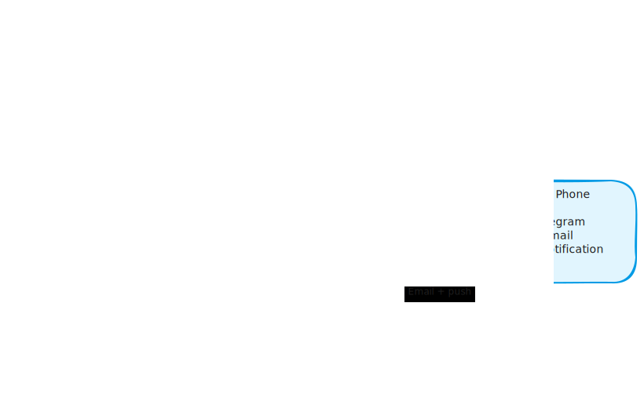

# Production Goes Down and Nobody Notices: Three Layers That Fix That

*Sentry installed, errors silently collected, service dead for three days, nobody alerted.*

---

Our Railway worker crashed on a Friday. The process died, SQS messages piled up, and users saw their tickets stuck in "New" status forever. We found out on Monday. Sentry had captured every error. Nobody had configured alert rules. Three days of silent failure.

The fix was not more logging or better dashboards. It was building three independent monitoring layers that each catch a different failure mode and send a notification to your phone. If one layer misses something, another one catches it.

<!-- more -->

## Why One Layer Is Never Enough

Most teams install Sentry and call it done. The problem is that application monitoring only works when the application is running. If the process crashes, the container dies, or the deployment fails, Sentry never fires because there is no running code to capture the error.

You need three layers:

| Layer | What it catches | How it notifies |
|-------|----------------|-----------------|
| **Sentry Alerts** | Errors in running code (5xx, worker failures) | Email + Telegram |
| **Health Checks** | Partial failures (DB down, Redis down) | Via Layer 3 |
| **UptimeRobot** | Service completely dead (process crashed) | Email + push notification |

Each layer covers a blind spot of the others. Sentry cannot tell you the service is dead. UptimeRobot cannot tell you about handled exceptions. Health checks cannot tell you about errors in business logic. Together, they cover everything.

<!-- excalidraw:diagram
id: monitoring-three-layers-defense
title: Three Layers of Production Monitoring
type: layered
components:
  - name: "Layer 1: Sentry Alerts"
    type: backend
    technologies: ["Application errors", "5xx, worker failures", "Alert rules required"]
  - name: "Layer 2: Health Checks"
    type: backend
    technologies: ["/health endpoint", "Probes DB and Redis", "Returns 503 on failure"]
  - name: "Layer 3: UptimeRobot"
    type: external
    technologies: ["External pinger", "Hits /health every 5 min", "Independent of your infra"]
  - name: "Your Phone"
    type: user
    technologies: ["Telegram bot", "UptimeRobot app", "Email"]
connections:
  - from: "Layer 1: Sentry Alerts"
    to: "Your Phone"
    label: "Code error → alert"
  - from: "Layer 2: Health Checks"
    to: "Layer 3: UptimeRobot"
    label: "503 detected"
  - from: "Layer 3: UptimeRobot"
    to: "Your Phone"
    label: "Down → push notification"
excalidraw:diagram-end -->


## Layer 1: Sentry Alerts (Not Just Sentry Installed)

Most teams have Sentry installed. Few have alert rules configured. There is a big difference between collecting errors and being notified about them.

Having Sentry without alert rules is like having a smoke detector that logs "fire detected" to a filing cabinet without making any noise. The data is there. Nobody heard it.

Two alert rules cover 90% of cases:

**Rule 1: "When an issue is first seen"** - Send email and Telegram notification. This catches new bugs the moment they appear in production.

**Rule 2: "When an event count exceeds 10 in 1 hour"** - This catches error spikes. A single 500 error might be a fluke. Ten in an hour means something is broken.

### Adding Telegram Notifications

Why Telegram instead of WhatsApp or Slack? WhatsApp Business API needs paid Twilio ($15+/month). Slack needs workspace setup. Telegram Bot API is free, instant, supports group chats, and gives you the same phone buzz.

The alert adapter follows the hexagonal pattern. A port defines the contract:

```python
class AlertService(Protocol):
    async def send_alert(self, alert: AlertMessage) -> None: ...
```

The data model is explicit:

```python
class AlertMessage(BaseModel):
    severity: Literal["info", "warning", "critical"]
    title: str
    message: str
    source: str
    environment: str
    timestamp: datetime = Field(default_factory=datetime.utcnow)
```

The Telegram adapter calls the Bot API directly:

```python
class TelegramAlertService:
    def __init__(self, bot_token: str, chat_id: str):
        self._url = f"https://api.telegram.org/bot{bot_token}/sendMessage"
        self._chat_id = chat_id
        self._last_sent: dict[str, datetime] = {}

    async def send_alert(self, alert: AlertMessage) -> None:
        # Rate limit: same alert within 5 minutes → skip
        key = f"{alert.title}:{alert.source}"
        if self._is_rate_limited(key):
            return

        async with httpx.AsyncClient() as client:
            await client.post(self._url, json={
                "chat_id": self._chat_id,
                "text": self._format_message(alert),
                "parse_mode": "HTML",
            })
```

Rate limiting matters. When something breaks, it usually breaks repeatedly. Without rate limiting, you get 50 Telegram messages in 5 minutes about the same error. An in-memory dict tracking `(title, source) → last_sent_time` with a 5-minute window keeps the noise down.

### Hooking Into Exception Handlers

The alert fires from the existing unhandled exception handler, right after Sentry:

```python
# In exception_handlers.py, after sentry_sdk.capture_exception(exc)
try:
    await alert_notifier.send_alert(AlertMessage(
        severity="critical",
        title="Unhandled 500 Error",
        message=str(exc),
        source="api",
        environment=settings.environment,
    ))
except Exception:
    logger.warning("Alert delivery failed", exc_info=True)
```

The `try/except` wrapper is critical. Alert failures must never affect the error response. If Telegram is down, the user still gets their 500 response and Sentry still captures the exception. Alerting is fire-and-forget.

## Layer 2: Health Checks That Actually Check Things

Most health check endpoints look like this:

```python
@app.get("/health")
async def health():
    return {"status": "ok"}
```

This tells you the process is running. It tells you nothing about whether the app actually works. If the database is down or Redis is unreachable, this endpoint still returns 200.

A real health check probes every critical dependency:

```python
@app.get("/health")
async def health_check():
    checks = {}

    # Database check
    try:
        start = time.monotonic()
        async with db_session_factory() as session:
            await session.execute(text("SELECT 1"))
        checks["database"] = {
            "status": "ok",
            "latency_ms": round((time.monotonic() - start) * 1000),
        }
    except Exception as e:
        checks["database"] = {"status": "error", "detail": type(e).__name__}

    # Redis check
    try:
        start = time.monotonic()
        redis = Redis.from_url(settings.redis_url)
        await redis.ping()
        checks["redis"] = {
            "status": "ok",
            "latency_ms": round((time.monotonic() - start) * 1000),
        }
    except Exception as e:
        checks["redis"] = {"status": "error", "detail": type(e).__name__}

    all_ok = all(c["status"] == "ok" for c in checks.values())
    status_code = 200 if all_ok else 503

    return JSONResponse(
        status_code=status_code,
        content={"status": "healthy" if all_ok else "degraded", "checks": checks},
    )
```

Two design decisions matter here:

**Add timeouts per check (2 seconds max).** If the database is slow but not dead, the health check should still return quickly. Wrap each `asyncio.wait_for(check(), timeout=2.0)` so a hanging connection does not hang the whole endpoint.

**Keep the root `/` endpoint simple.** Railway (and most PaaS providers) use the root path for their own health checks. That needs to be fast and always return 200. The detailed `/health` is for your monitoring tools.

A healthy response looks like:

```json
{
  "status": "healthy",
  "checks": {
    "database": {"status": "ok", "latency_ms": 5},
    "redis": {"status": "ok", "latency_ms": 2}
  }
}
```

A degraded response returns 503:

```json
{
  "status": "degraded",
  "checks": {
    "database": {"status": "error", "detail": "OperationalError"},
    "redis": {"status": "ok", "latency_ms": 2}
  }
}
```

Layer 3 picks this up automatically.

## Layer 3: UptimeRobot (The External Pinger)

UptimeRobot is a free external service that hits your URL every 5 minutes and alerts you when it goes down. The free tier gives you 50 monitors with 5-minute check intervals.

Point it at your `/health` endpoint. When the endpoint returns 503 (partial failure) or times out (total failure), UptimeRobot sends you an email and a push notification through their mobile app.

This is the layer that catches what the other two cannot: when the entire service is dead. If your process crashed, there is no running code to send Sentry events or respond to health checks. UptimeRobot notices because nobody answered.

Setup takes 10 minutes:

1. Sign up at uptimerobot.com (free tier covers 50 monitors)
2. Add an HTTP monitor pointing to your `/health` endpoint
3. Set the expected status to 200
4. Install the UptimeRobot mobile app for push notifications

<!-- excalidraw:diagram
id: monitoring-alert-flow
title: Alert Flow for Each Failure Type
type: custom
components:
  - name: "Code Bug (500 error)"
    type: backend
    technologies: ["Unhandled exception", "Logic error in running code"]
  - name: "DB or Redis Down"
    type: database
    technologies: ["Connection refused", "Health check returns 503"]
  - name: "Process Crashed"
    type: backend
    technologies: ["OOM kill, deploy failure", "No response to HTTP"]
  - name: "Sentry"
    type: external
    technologies: ["Catches code bugs", "Fires alert rules"]
  - name: "Health Check /health"
    type: backend
    technologies: ["Probes dependencies", "Returns 200 or 503"]
  - name: "UptimeRobot"
    type: external
    technologies: ["External pinger", "Detects 503 and timeouts"]
  - name: "Your Phone"
    type: user
    technologies: ["Telegram, email, push"]
connections:
  - from: "Code Bug (500 error)"
    to: "Sentry"
    label: "Captured + alerted"
  - from: "DB or Redis Down"
    to: "Health Check /health"
    label: "Returns 503"
  - from: "Health Check /health"
    to: "UptimeRobot"
    label: "503 detected"
  - from: "Process Crashed"
    to: "UptimeRobot"
    label: "No response"
  - from: "Sentry"
    to: "Your Phone"
    label: "Email + Telegram"
  - from: "UptimeRobot"
    to: "Your Phone"
    label: "Email + push notification"
excalidraw:diagram-end -->



## Worker Monitoring

Web API monitoring is straightforward because you have HTTP endpoints to check. Workers are harder because they run behind a queue.

For Celery workers, hook into the `task_failure` signal:

```python
from celery.signals import task_failure

@task_failure.connect
def handle_task_failure(sender, task_id, exception, **kwargs):
    # Sync context, use httpx sync client
    send_telegram_alert_sync(
        title=f"Worker Task Failed: {sender.name}",
        message=str(exception),
        source="worker",
    )
```

This fires whenever a Celery task raises an unhandled exception. Combined with Sentry's automatic Celery integration, you get both error tracking and an immediate phone notification.

The Friday crash that hit us was exactly this scenario. The worker failed silently because we had Sentry capturing the exception, but no signal hook and no alert rule. The task failure signal with a Telegram alert would have pinged us within seconds.

## Setup Checklist

The full setup takes about an hour:

**Sentry (15 minutes):**

1. Create alert rule: "When an issue is first seen" with email and Telegram notification
2. Create alert rule: "When event count exceeds 10 in 1 hour" for spike detection

**Telegram Bot (10 minutes):**

1. Message @BotFather on Telegram, create a bot, save the token
2. Create a group chat, add the bot, get the chat ID from the Bot API
3. Set `ALERT_TELEGRAM_BOT_TOKEN` and `ALERT_TELEGRAM_CHAT_ID` in your environment

**Health Check Endpoint (20 minutes):**

1. Add a probing check for each critical dependency (database, Redis, any external service)
2. Return 503 on any failure, 200 only when all are healthy
3. Add per-check timeouts (2 seconds max)
4. Keep root `/` as a dumb fast endpoint for PaaS health checks

**UptimeRobot (10 minutes):**

1. Sign up (free tier: 50 monitors, 5-minute check intervals)
2. Add HTTP monitor pointing to your `/health` endpoint
3. Install the mobile app for push notifications

## What You Get

After this setup, here is what happens for each failure mode:

- **Code bug (500 error):** Sentry captures it, Telegram bot pings your phone within seconds
- **Database goes down:** Health check returns 503, UptimeRobot detects it within 5 minutes, push notification
- **Process crashes:** UptimeRobot detects no response within 5 minutes, push notification and email
- **Error spike:** Sentry threshold rule fires, email notification

No single point of failure in the monitoring itself. Three independent systems, each with its own notification path. If Telegram is down, you still get emails. If Sentry misses it, UptimeRobot catches it. The monitoring watches itself through redundancy.

That is how you sleep well on weekends. Not by hoping nothing breaks, but by knowing you will hear about it within 5 minutes if it does.
