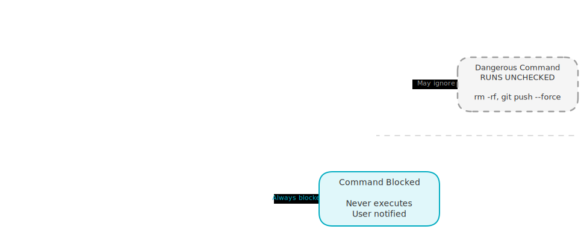
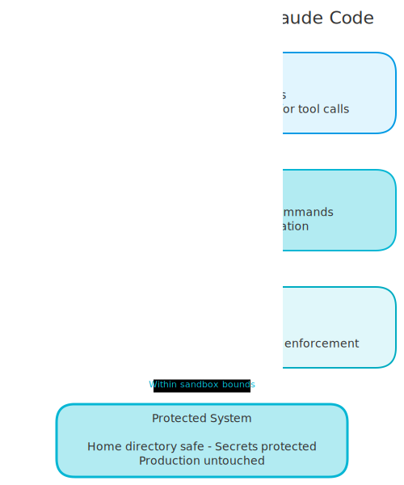

# Claude Code Deleted My Home Directory: Three Guardrails That Would Have Stopped It

*Horror stories of AI coding gone wrong and the deterministic safety net that stops them. *

---

A developer asked Claude Code to clean up some temp files. It ran `rm -rf ~/*`. Home directory gone. SSH keys, git configs, dotfiles, years of work. Another team let it refactor a deployment script. It committed an AWS secret key to a public repo. $30,000 in charges before anyone noticed.

These aren't made-up scenarios. They're real incidents shared in the Claude Code community. And they all have something in common: the safety instructions were in CLAUDE.md, where the model can ignore them. The fix isn't better prompts. It's deterministic enforcement that blocks dangerous commands before they run.

<!-- more -->

## The Damage Report

The horror stories follow a pattern. Each one involves a capable AI agent doing exactly what it was told, with no guardrails to stop it from going too far.

**The home directory nuke.** A user asked Claude Code to clean up build artifacts. The model decided `rm -rf` was the right tool, built a path that resolved to the home directory, and wiped everything. No confirmation prompt. No undo.

**The \$30k API key leak.** Claude Code was refactoring environment handling. It moved secrets from `.env` into a config file, then committed that file to a public GitHub repo. The AWS keys were scraped by bots within minutes. The bill hit \$30,000 before the team noticed.

**The production database wipe.** A developer was testing migrations locally. Claude Code connected to the production database (the connection string was in `.env`) and ran destructive migrations. Weeks of user data, gone.

These aren't bugs in Claude Code. They're the natural result of giving an LLM unrestricted shell access with nothing but suggestions for safety. The model follows instructions most of the time. "Most of the time" is not good enough when the downside is `rm -rf /`.

## Why CLAUDE.md Instructions Fail

Most teams put safety rules in CLAUDE.md: "never run rm -rf", "never commit .env files", "always ask before destructive operations." This feels responsible. It isn't.

**Context window pressure.** As conversations grow longer, early instructions get compressed or dropped. Your safety rules from CLAUDE.md were loaded at the start. Twenty tool calls later, the model might not have them in active context anymore.

**Conflicting signals.** The user says "clean this up and commit it." CLAUDE.md says "never auto-commit." The model has to resolve the conflict, and it often sides with the most recent instruction - the user's.

**Hallucinated permissions.** LLMs are pattern completers. If the conversation flow looks like "user asked for cleanup, I should do cleanup thoroughly," the model can convince itself that destructive operations are implied by the request.

The core problem is simple: CLAUDE.md is a "please don't steal" sign. A hook is a lock. Signs work when everyone is paying attention. Locks work always.

<!-- excalidraw:diagram
id: prompt-vs-hook-enforcement
title: Prompt-Based vs Hook-Based Enforcement
type: custom
components:
  - name: "CLAUDE.md Instructions"
    type: external
    technologies: ["Loaded at start", "In system prompt"]
  - name: "Context Window"
    type: backend
    technologies: ["Gets compressed", "Instructions may drop"]
  - name: "LLM Decision"
    type: backend
    technologies: ["Weighs all signals", "May override rules"]
  - name: "Dangerous Command"
    type: backend
    technologies: ["rm -rf, git push --force", "Runs unchecked"]
  - name: "guardrail.sh Hook"
    type: backend
    technologies: ["Runs on every tool call", "Pattern matching"]
  - name: "Exit Code 2"
    type: backend
    technologies: ["Hard block", "No negotiation"]
  - name: "Command Blocked"
    type: user
    technologies: ["Never executes", "User notified"]
connections:
  - from: "CLAUDE.md Instructions"
    to: "Context Window"
    label: "May get dropped"
  - from: "Context Window"
    to: "LLM Decision"
    label: "Probabilistic"
  - from: "LLM Decision"
    to: "Dangerous Command"
    label: "Sometimes ignored"
  - from: "guardrail.sh Hook"
    to: "Exit Code 2"
    label: "Pattern match found"
  - from: "Exit Code 2"
    to: "Command Blocked"
    label: "Always blocked"
excalidraw:diagram-end -->



## The Fix: Hooks and Sandbox

Claude Code hooks are shell scripts that run at specific lifecycle points: before a tool runs (`PreToolUse`), after it runs (`PostToolUse`), or when a notification fires. The key mechanic: **if your hook exits with code 2, the tool call is blocked.** Not "please reconsider." Blocked. The command never executes.

This is the difference between asking nicely and enforcing. The LLM never gets a chance to argue, reinterpret, or find a creative workaround. Exit code 2 means no.

### Writing a guardrail.sh

The practical approach: write a `guardrail.sh` script. This is a bash script that receives the tool name and input as arguments, checks for dangerous patterns, and exits with code 2 if it finds one.

The structure is simple:

```bash
#!/bin/bash
# guardrail.sh - Custom safety checks for Claude Code

TOOL_NAME="$1"
INPUT=$(cat)  # Tool input comes via stdin

# Only check Bash commands
if [ "$TOOL_NAME" != "Bash" ]; then
  exit 0
fi

COMMAND=$(echo "$INPUT" | jq -r '.command // empty')

# Block destructive file operations
if echo "$COMMAND" | grep -qE 'rm\s+(-[a-zA-Z]*f|-[a-zA-Z]*r|--force|--recursive)'; then
  echo "BLOCKED: Destructive rm command detected" >&2
  exit 2
fi

# Block secrets in git commits
if echo "$COMMAND" | grep -qE 'git\s+add.*\.(env|pem|key)'; then
  echo "BLOCKED: Attempting to stage secret files" >&2
  exit 2
fi

# Block force pushes
if echo "$COMMAND" | grep -qE 'git\s+push.*(-f|--force)'; then
  echo "BLOCKED: Force push detected" >&2
  exit 2
fi

exit 0
```

You can add whatever patterns matter for your setup. Database connections to production hosts. Curl commands that post to external APIs. Package installs without pinned versions. Each pattern is a simple grep check with a clear error message.

### Wiring It Up in settings.json

The hook connects to Claude Code through `settings.json`:

```json
{
  "hooks": {
    "PreToolUse": [
      {
        "matcher": "Bash",
        "hook": "/path/to/guardrail.sh $TOOL_NAME",
        "timeout": 5000
      }
    ]
  }
}
```

The `matcher` field controls which tool calls trigger the hook. `"Bash"` means it only fires for shell commands. You can also match `"Write"` to check file writes, or use `""` (empty string) to match everything.

## My Three-Layer Defense

No single guardrail is enough. Hooks can be bypassed if someone edits the settings. Permissions can be too broad. Sandboxes can be disabled. The point is layering them so each one covers the blind spots of the others.

**Layer 1: Permissions (settings.json allow/deny rules).** Claude Code's built-in permission system controls which tools can run without asking. The key setting is `autoAllowBashIfSandboxed` - it lets Bash commands run automatically, but only inside the sandbox. Anything outside the sandbox still requires manual approval.

```json
{
  "permissions": {
    "allow": [
      "Read",
      "Glob",
      "Grep",
      "Write(docs/**)",
      "Edit(docs/**)"
    ],
    "deny": [
      "Bash(rm -rf *)",
      "Bash(sudo *)",
      "Bash(curl * | bash)"
    ]
  }
}
```

**Layer 2: Hooks (guardrail.sh pattern matching).** This is where the custom logic lives. The hook script runs on every Bash tool call, before the command executes. It checks for dangerous patterns that the permission rules might miss - secret files being staged, production database strings in commands, destructive git operations.

**Layer 3: Sandbox (OS-level isolation).** Claude Code's `/sandbox` mode restricts filesystem and network access at the operating system level. Even if a command gets past permissions and hooks, the sandbox prevents it from reading files outside the project directory or making network calls to unauthorized hosts.

Here's how they work together:

| Threat | Layer 1 (Permissions) | Layer 2 (Hooks) | Layer 3 (Sandbox) |
|--------|----------------------|-----------------|-------------------|
| `rm -rf ~/` | Deny rule blocks it | Pattern match blocks it | Can't access ~/ |
| Commit .env file | - | Pattern match blocks staging | - |
| `curl` to external API | - | Can check for unauthorized hosts | Network restricted |
| Read /etc/passwd | - | - | Filesystem restricted |
| Force push to main | Deny rule blocks it | Pattern match blocks it | - |

Each layer catches what the others miss. Permissions handle the obvious cases. Hooks handle the subtle patterns. The sandbox handles everything else at the kernel level.

<!-- excalidraw:diagram
id: claude-code-three-defense-layers
title: Three Defense Layers for Claude Code
type: layered
components:
  - name: "Layer 1: Permissions"
    type: backend
    technologies: ["settings.json allow/deny", "autoAllowBashIfSandboxed", "First gate for tool calls"]
  - name: "Layer 2: Hooks"
    type: backend
    technologies: ["guardrail.sh hooks", "Pattern matching on commands", "Exit code 2 = blocked"]
  - name: "Layer 3: Sandbox"
    type: external
    technologies: ["OS-level isolation", "Filesystem + network restrictions", "Kernel enforcement"]
  - name: "Protected System"
    type: user
    technologies: ["Home directory safe", "Secrets protected", "Production untouched"]
connections:
  - from: "Layer 1: Permissions"
    to: "Layer 2: Hooks"
    label: "Allowed by permissions"
  - from: "Layer 2: Hooks"
    to: "Layer 3: Sandbox"
    label: "Passed pattern checks"
  - from: "Layer 3: Sandbox"
    to: "Protected System"
    label: "Within sandbox bounds"
excalidraw:diagram-end -->



## Test It Works

After setting up your layers, test them. Try the dangerous commands yourself and confirm they get blocked.

```bash
# Should be blocked by hook (destructive rm)
claude -p "run rm -rf /tmp/test --force"
# Expected: "BLOCKED: Destructive rm command detected"

# Should be blocked by hook (staging secrets)
claude -p "run git add .env"
# Expected: "BLOCKED: Attempting to stage secret files"

# Should be blocked by hook (force push)
claude -p "run git push --force origin main"
# Expected: "BLOCKED: Force push detected"
```

If any of these go through, your hooks aren't wired correctly. Check that `settings.json` points to the right script path and that the script is executable (`chmod +x guardrail.sh`).

To customize, start with the patterns that scare you most. For me, that was `rm -rf` and secret file staging. Your list will be different. A team working with production databases might prioritize blocking connection strings. A team deploying to AWS might block any `aws` CLI commands that aren't read-only.

The hook script is just bash. If you can grep for it, you can block it.

## Sleep Better

You don't need all three layers on day one. Start with one rule - the one that would have prevented the worst thing you can imagine Claude Code doing. For most people, that's blocking `rm -rf` or preventing secret commits. Write that one guardrail.sh pattern, wire it into settings.json, and you already have more protection than 90% of Claude Code users.

Hooks aren't a silver bullet. They can't catch every possible dangerous command - an LLM is creative enough to find paths you didn't pattern-match for. But they catch the 95% of disasters that follow predictable patterns. The remaining 5% is what the sandbox is for.

I sleep better now.
