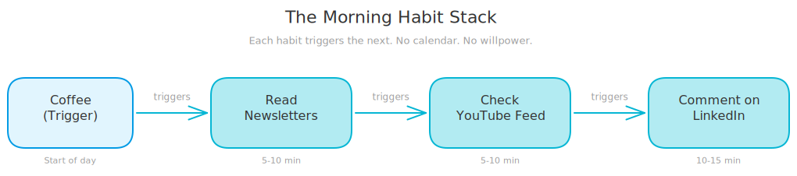
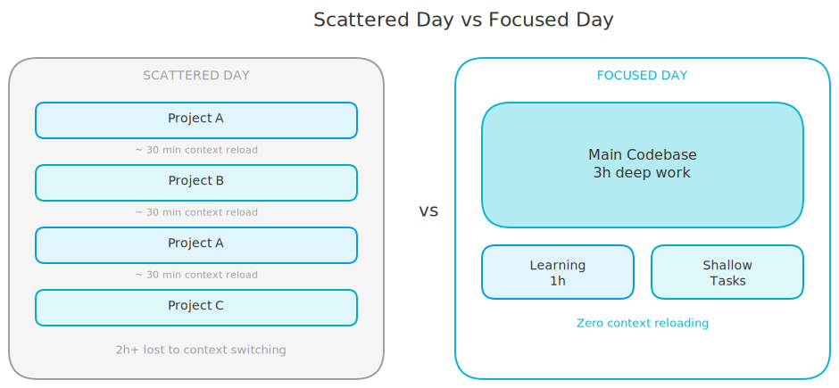

# Three Productivity Rules That Actually Stuck

*Most productivity advice fades in a week. These survived because they removed willpower from the equation.*

---

I've tried Pomodoro timers, time-blocking apps, and color-coded Notion dashboards. All abandoned within two weeks. The problem wasn't discipline. The problem was that every system required me to make decisions, and decisions drain energy before you even start working.

Then I stopped looking for systems and started looking for rules. Simple, non-negotiable rules that run on autopilot. Three of them stuck. They've been running for months now, and I barely think about them. Here's what works for me.

<!-- more -->

## Stack Habits, Don't Schedule Them

I picked this up from *Atomic Habits* by James Clear. The idea is simple: instead of scheduling a new habit at a specific time, you chain it to something you already do. The existing habit becomes the trigger.

Here's my morning stack. Every day when I sit down at my desk with coffee, I read a couple of newsletters to catch up on trends. That's five to ten minutes. When I close the last newsletter, I open YouTube and scroll my feed for new videos from creators I follow. Another five to ten minutes. When I close YouTube, I open LinkedIn, check what the people I follow are posting, and leave a few comments.

**The key is the chain.** I don't have "check LinkedIn" on my calendar at 9:15 AM. I do it because I just finished YouTube, which I did because I just finished newsletters, which I did because I sat down with coffee. One triggers the next.

Before this, my social media presence was random. Some weeks I'd post and comment daily. Other weeks, nothing. Stacking these three habits onto my morning coffee made it automatic. No calendar reminders. No willpower required.

<!-- excalidraw:diagram
id: morning-habit-stack
title: The Morning Habit Stack
type: custom
components:
  - name: "Coffee"
    type: user
    technologies: ["Trigger"]
    position: left
  - name: "Read Newsletters"
    type: backend
    technologies: ["5-10 min"]
    position: center
  - name: "Check YouTube Feed"
    type: backend
    technologies: ["5-10 min"]
    position: center
  - name: "Comment on LinkedIn"
    type: backend
    technologies: ["10-15 min"]
    position: right
connections:
  - from: "Coffee"
    to: "Read Newsletters"
    label: "triggers"
  - from: "Read Newsletters"
    to: "Check YouTube Feed"
    label: "triggers"
  - from: "Check YouTube Feed"
    to: "Comment on LinkedIn"
    label: "triggers"
description: |
  Horizontal flow showing how each habit triggers the next in the morning routine chain.
excalidraw:diagram-end -->

## Batch the Creative Work

If you leave content creation to goodwill, it won't happen. You'll tell yourself you'll write that LinkedIn post after lunch, but then a Slack thread explodes, a deploy breaks, and suddenly it's 6 PM. The post never gets written.

My rule: **every Sunday, I schedule all my LinkedIn content for the week.** I sit down for a couple of hours, write the posts, create the visuals, and schedule everything. When Monday hits, my content is already queued. I don't think about it during the work week at all.

This works because it removes the daily context switch between "creative mode" and "builder mode." Writing a post takes ten minutes if you're already in writing mode. It takes forty minutes if you first need to stop coding, switch mental gears, come up with an idea, write it, make a visual, and then try to remember where you were in the codebase. Batching cuts the switching cost to zero.

The same idea applies beyond content. Design reviews, documentation, planning sessions. Anything that requires a different mental mode works better when you batch it into one block instead of sprinkling it across the week.

## One Codebase Per Day

This is the rule that changed the most for me. When I'm working on multiple projects (personal projects, client work, side experiments), I used to jump between codebases within the same day. Project A in the morning, Project B after lunch, back to Project A for a quick fix before dinner.

The problem is **loading cost.** Every time you open a codebase, you need to remember the file structure, the patterns, the naming conventions, where you left off. Think of it like loading a program into RAM. That loading takes thirty to forty minutes of real focus. If you switch codebases three times a day, you've burned over an hour just on reloading context.

My rule now: **one main codebase per day.** Monday is Project A. Tuesday is Project B. Wednesday back to Project A. I pick the codebase in the morning and stay there.

But there's a caveat. If I tell myself "I'll spend the whole day on this personal project," Parkinson's Law kicks in. The work expands to fill the eight hours. A feature that should take three hours eats the entire day because there's no deadline pushing me.

So I **time-block within the day.** Three hours on the main feature, one hour on learning something related to that project, then I can handle smaller tasks like emails, code reviews, or quick Slack replies. The time blocks create artificial deadlines, and deadlines make me sharper.

This doesn't mean I ignore everything else. Small tasks from other projects are fine. A quick code review, answering a question, merging a PR. But the deep work, the real building, that stays in one codebase.

<!-- excalidraw:diagram
id: scattered-vs-focused-day
title: Scattered Day vs Focused Day
type: custom
components:
  - name: "Scattered Day"
    type: external
    technologies: ["Project A", "Project B", "Project C"]
    position: left
  - name: "Context Reload"
    type: user
    technologies: ["~30 min per switch"]
    position: center
  - name: "Focused Day"
    type: backend
    technologies: ["One codebase", "Time blocks"]
    position: right
  - name: "Deep Work"
    type: backend
    technologies: ["3h feature", "1h learning", "Shallow tasks"]
    position: right
connections:
  - from: "Scattered Day"
    to: "Context Reload"
    label: "3-4 switches = 2h lost"
  - from: "Focused Day"
    to: "Deep Work"
    label: "zero reloading"
description: |
  Two-panel comparison. Left: scattered day with constant project switching and context reload cost. Right: focused day with one codebase and time-blocked deep work.
excalidraw:diagram-end -->

## Why These Stuck

I've tried dozens of productivity techniques. Most faded within weeks. These three survived because they share one thing: **they remove decisions.**

You don't decide *if* you do the morning stack. It's chained to your coffee. You don't decide *when* to create content. It's Sunday, period. You don't decide *which* codebase to work on at 2 PM. You decided that in the morning.

Rules that stick are rules that take choices away from you. Not rules that require discipline. Discipline runs out. Autopilot doesn't.

## Try One

You don't need all three. Pick the one that solves your biggest pain. If your online presence is inconsistent, try the habit stack. If content creation keeps falling off your plate, try batching on Sundays. If you feel scattered across projects, try one codebase per day. Give it two weeks. That's enough to know if it fits.

This is what works for me. Your setup might look different. But the pattern is the same: make the rule so simple that following it takes less effort than breaking it.
